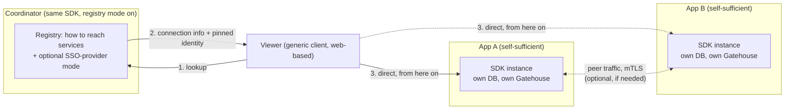

# Archipelago: Overview

## 1. Why this exists

Lighthouse centralized identity, permissions, naming, and distribution
behind one agent serving many apps. That worked, and several of its
subsystems (the alias system's "never load-bearing, opaque value" design,
the transport layer's delivery-class taxonomy, the security-policy
pointer mechanism) are genuinely architecture-agnostic and carry forward
into Archipelago unchanged. But the centralized shape itself stopped being
what we wanted, for reasons that showed up in practice, not in the abstract:

- **Cross-boundary identity gets expensive.** Lighthouse had to add
  `lighthouse.gatehouse.principal.cross_realm_grants.blocked` (default
  `true`) after cross-*realm* principal authority became hard enough to
  reason about that the default flipped to containment. Cross-*app*
  identity is the same problem at a larger, costlier scale.
- **Provisioning access to a separate always-running service was a
  constant tax.** A `provisioning` SDK package and a `bootstrap-app` CLI
  command both exist purely to paper over how much ceremony it took to get
  an app talking to Lighthouse at all — before any of its own login or
  authority logic came into play.
- **One coordinator forces one topology.** Splitting, merging, or having a
  service answer to more than one coordinator wasn't something the shape
  could express without redesigning the shape itself.

## 2. The core thesis

**There is no distinguished coordinator binary.** Every capability is a
mode of the same SDK:

- An app that wants to be fully self-sufficient uses the SDK against its
  own database: its own principals, its own grants, its own sessions. It
  never needs a coordinator to exist.
- An app that wants to act as a **registry** (tell others how to reach
  services), an **SSO provider** (vouch for identity to other apps), or a
  **coordinator** in the fullest sense is running the *same* SDK with a
  few more modes enabled. Nothing about being "the coordinator" requires
  different code — any instance an operator designates can do it,
  including a single instance among several of the same app.

This is why "multiple coordinators" and "multiple SSO providers" were
cheap decisions rather than hard ones: they were never a special case to
design for, just the same tolerance for plurality applied to a role
instead of a binary.

## 3. What the coordinator actually is

Deliberately narrow, on purpose:

- **A registry, not a data path.** It tells a client how to reach a
  service (and how to verify it once connected — see §5) and gets out of
  the way. It does not sync application data, and in most deployments it
  doesn't need to be involved after the first lookup.
- **Optional.** A client that caches what it learns barely depends on the
  coordinator's uptime at all. This is deliberately stronger than "has a
  fallback" — after the first lookup, there's often nothing left to fall
  back *from*.
- **Not the owner of identity or authority.** See §4.

## 4. Where authority actually lives

Gatehouse — principals, credentials, grants, sessions, authority
evaluation — moves to the app side. Each app (or application suite, see
§8) owns its own authority data. The coordinator never grants or holds
authority; it only ever *discovers* or *vouches for identity*, never for
permission. An app's own local Gatehouse decides, on its own terms, what a
given identity can do within it.

This holds even when a human authenticates through a coordinator-hosted
SSO flow (§6): the coordinator asserts "this holder proved X" and nothing
more. What that assertion is *worth* inside any given app is that app's
decision alone, made through its own local grants.

## 5. Identity that survives federation

A bare UUID is not a global identity claim once more than one party can
mint one. The fix is the same pattern email, XMPP, and ActivityPub already
converged on independently: identity is **domain-rooted and
cryptographically provable**, not just numerically unique.

- Real domains, ACME-issued certificates. No private CA needed for the
  outward-facing identity of a coordinator or service.
- A cross-service reference is shaped like a URI (`https://domain/service/
  resource-id`), not a bare UUID — self-describing about where to go
  verify it.
- The registry (§3) is the natural place to publish a service's pinned
  identity (cert fingerprint, signing public key) alongside its connection
  info — discovery and trust bootstrap are one lookup, not two systems.

## 6. Authentication: local-first, SSO optional

Every app's SDK instance hosts a **fully real, standalone login system** —
password (with optional TOTP), and passkeys — built from composable,
order-agnostic primitives (`verifyPassword`, `verifyOTP`,
`doPasskeyCeremony`, …) that each append proof to an opaque, short-lived
context handle. The *app* decides the order and orchestration; the SDK
never owns a flow-engine, only the primitives and the handle threading
between them. A `completeSession(context, requiredPolicy?)` call is the
one chokepoint where an optional policy check can be enforced without the
SDK needing to understand the app's chosen ordering.

SSO is layered on top, never a replacement for the above:

- A coordinator (or any SDK instance in SSO-provider mode) mints a signed,
  short-lived, **audience-bound** assertion — identity/session facts only,
  never a permission snapshot. This is, in effect, `SignedAssertionAuthnProvider`
  from the Lighthouse design corpus, finally built, for the case ("an app
  needs local verification") that provider was deferred until.
- The wire shape borrows OpenID Connect's ID-token conventions
  deliberately: JWT with standard claims (`aud`, `exp`, `iss`), JWKS for
  key distribution, `.well-known` discovery. We adopt the format and the
  discovery convention, not the rest of OAuth2 — there is no delegated
  third-party authorization problem here to justify the weight of a full
  authorization server.
- The app's job, and only the app's job: map the asserted identity to its
  own local principal. First-time mapping (auto-provision vs. require an
  explicit link step) is a product decision per app, not something the
  ticket format should force either way.
- The SDK can also act as a plain OIDC **relying party**, so an app is
  never boxed out of delegating to a real external IdP (Okta, Google, a
  company's own tenant) if it wants to. That's the cheap half of OIDC —
  verifying someone else's tokens — kept separate from never becoming a
  full OIDC *provider* ourselves.

The visible-endpoint and login-flow customization rules are documented in
[`04-facades-and-ergonomics.md`](04-facades-and-ergonomics.md).

## 7. Transport and peer trust

WebTransport (QUIC) is the primary backend, not a deferred one — its
benefits are native to the protocol (true stream independence, connection
migration across network changes) rather than something to simulate on
top of WebSocket, and building against WebSocket's model first risked
picking up implicit assumptions (shared-stream ordering) that don't
transfer cleanly later. WebSocket stays available as a secondary backend
behind the same `Backend` interface, for the eventual browser client and
for tooling maturity, not as the default.

**The one discipline this requires, everywhere:** never assume two
messages on different channels arrive in order. Where order genuinely
matters, either put both messages on the same channel (which *is*
ordered), or carry an explicit sequence/dependency reference the receiver
checks before acting — the generic propagation envelope's `seq` field
exists for exactly this. Best of all: phrase the operation so order
doesn't matter in the first place ("set to X", not "increment") — CRDTs
formalize this where the data shape allows it.

mTLS is supported from day one at the mechanism level (orthogonal,
additive, cheap), built out for services first (both ends owned, lowest
risk), generalizing to interactive principals only later and deliberately
— a cert proves device/service possession, never human presence.

## 8. Scope of "an application"

An application is not necessarily one process. A suite of several
distinct services can share one authority domain (one DB, one Gatehouse)
the same way multiple instances of one service already do — both are just
"multiple processes, one shared DB-backed authority store." Within a
suite, DB access can be direct (every service embeds the SDK against the
shared DB) or asymmetric (reads direct, writes only through a designated
service or pool of writers) — the same read-replica/CQRS pattern applied
to authority data specifically, trading a narrower write blast-radius for
a network hop on the write path. Both topologies are the same SDK, used
differently; see
[`03-multi-instance-and-suites.md`](03-multi-instance-and-suites.md).

## 9. What Archipelago deliberately does not build

- **Consensus or replication across independent, non-shared stores.**
  Genuinely hard, well-solved elsewhere (Raft, etcd). Archipelago gives
  apps the transport (mTLS peer identity) to carry someone else's proven
  implementation, not its own attempt at the problem.
- **A reverse proxy.** Caddy or Traefik, controlled via API (push) or
  service-discovery (pull), not homegrown — reverse proxying is mature,
  security-critical infrastructure with decades of hardening behind it.
- **A full OIDC authorization server, or a full enterprise PKI.** Adopt
  the ID-token shape and the CSR/CA mechanics respectively; skip the
  consent/scope/access-token machinery and the CRL/OCSP operational
  weight neither is needed to carry.

## 10. Document map

| Doc | Covers |
|---|---|
| `01-build-order.md` | What's independently buildable vs. what needs integration first |
| `02-package-boundaries.md` | How the dependency shape maps to actual Go packages |
| `03-multi-instance-and-suites.md` | Peer discovery, broadcast, locks, status aggregation, DB access modes |
| `04-facades-and-ergonomics.md` | Simple-mode APIs over the full Gatehouse model, endpoint self-advertisement |
| `05-pki-and-signing.md` | CA/CSR enrollment, key-tiering, CRL, cert store |
| `06-logging-and-observability.md` | Logging as bedrock, operational vs. audit logging, standard trace/span terminology, trace/log aggregation |
| `07-config-formats-and-templating.md` | Why XML/HCL/TOML split by content shape, HCL as declarative "ensure this exists" templates over the same facade API |
| `08-repo-scaffolding.md` | The actual directory/module layout enforcing the base/integration boundaries — what's decided now vs. still open |
| `09-gatehouse-core-model.md` | What Principal/Credential/Grant/Context/Session/Role/Group actually are — what's confirmed vs. loosely proposed |
| `10-typedvalue-and-policy-model.md` | typedvalue's dimension/unit/prefix model, typeconstraints, Policy's definition/instance/resolution shape and merge-mode math |
| `11-transit-model.md` | The wire/transit split, delivery classes, Session/Channel/Backend interfaces, what's deferred (Router, WebTransport) |
| `12-sso-tickets-model.md` | Audience-bound, identity-only, short-lived tickets — field shape, signing, issuance, verification, delivery |
| `13-registry-and-leases-model.md` | Peer discovery and lease-based locks — Instance/Lease live in Gatehouse-core, `registry` adds Transit-authenticated identity resolution |
| `14-vitals-model.md` | Current-condition records (Definition/Instance/Reading/History/Group), adapted from Lighthouse's own Vitals; concurrency and ValueMetadata validation |
| `15-endpoint-advertisement-model.md` | Endpoints register themselves once; advertisement is a live, permission-filtered query over the same data |
| `16-trace-log-aggregation-model.md` | Trace context riding on `wire.Message`, an opt-in capture buffer in `logging`, and `traceagg`'s cross-instance collector |
| `17-sdk-model.md` | The `sdk` module as a storage-agnostic composition root (wire, seed, expose stores) with DB-backed `OpenDB` as one provider, not a second API; modes; read-only, scoped and conditional store access; what stays in-process until a Router exists |
| `18-peer-discovery-and-capabilities-model.md` | **Draft, nothing built.** Archipelago domains (one `App` per domain), node roles/labels/capabilities and core vs. app-defined, the three discovery tiers, a minimal multicast announcement, per-domain listeners, open questions |
| `19-node-roles-and-resource-governance-model.md` | **Draft, nothing built.** A node adopting node roles that run duties automatically; a local scheduler (when a duty is due) and a node-wide resource governor (cooperative budgets), the consent rule where the node's ceiling caps domain policy, local duties vs. executing and directing tasks across nodes, authority via `09`'s service_action/scheduled_task, exclusive node roles via leases |
| `20-jobs-model.md` | **Draft, nothing built.** Durable deferred work: jobs as data never code, task definitions vs. handlers (a task kind is not an endpoint), the state machine, atomic pull-based claiming with the attempt as a fence, recurring jobs that need no leader, crossing boundaries via coarse store commands |

Config format split, settled and not up for relitigating without a new
concrete reason: **XML** for document-shaped content (docs, dashboards),
**HCL** for reference-graph-shaped content (principals, roles, groups,
permissions — validated cross-references matter more here than terseness),
**TOML** for flat operational settings (endpoints, ports, CRL/cert
settings — comments and no implicit-type coercion matter more here than
expressiveness). See [`07-config-formats-and-templating.md`](07-config-formats-and-templating.md)
for the full rationale and how HCL templates relate to the facade API.
