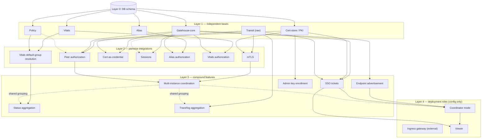

# Build order

The goal of this doc: separate what's genuinely a base capability — buildable
and testable entirely on its own — from what's an *integration*, which only
exists once two or more bases already do. Most of the apparent "everything
depends on everything" feeling dissolves once this split is made explicit;
what's left is a real, small set of "this has to exist before that"
constraints, not a loop.

## The rule for telling the two apart

A base needs nothing from the others to be real and testable — it does not
import another base's package, does not require a network connection to
another process to exercise its own logic, and its tests run against a
local DB (or nothing at all) alone.

An integration is the thing that happens once you want two bases to *know
about each other* — e.g., "only let this message through if the peer's
transport-verified identity resolves to a principal with a grant for this
action." That specific sentence needs Transit *and* Gatehouse-core *and*
Policy to all already exist. It does not need to exist for any of the three
to exist on their own.

**A node in this graph is a dependency unit, not a claim about internal Go
package structure.** "Gatehouse-core doesn't depend on Transit" is a
statement about the external boundary — whatever Gatehouse-core turns out
to be made of, none of it needs Transit to exist. It is not a claim that
Gatehouse-core is, or should be, exactly one package. Gatehouse-core in
particular — principals, credentials, grants, roles, groups, policy
evaluation, sessions, multiple auth providers — is large enough that it
almost certainly decomposes into its own internal sub-graph of packages,
using this same base/integration reasoning one level down (e.g., maybe
principals and grants don't need each other to exist, while evaluation
is itself an "integration" of both). That decomposition is deliberately
not decided here — it's exactly the kind of structural call that should
wait for real code, per
[`02-package-boundaries.md`](02-package-boundaries.md)'s note on the same
point, not be speculated upfront.

## Layer 0 — bedrock

**DB schema and connection.** No dependencies. Everything else assumes this
exists, the same starting point Lighthouse's own `ProvisionSchemas` used.

**Logging.** No dependencies — not even the DB. It comes first in
practice, not just on paper: every other base and integration wants to
call into it for its own observability the moment it exists, including
while being built and tested. Used directly by everything above, not
through an integration package, so it's deliberately left off the
dependency graph below rather than drawn as an arrow into every single
node — see [`06-logging-and-observability.md`](06-logging-and-observability.md)
for the full design, including why this is genericity-first rather than
just early, the standard trace/span terminology adopted instead of
Lighthouse's own ad hoc vocabulary, and how Transit's propagation
envelope carries correlation data for free.

**typedvalue.** No dependencies — pure data and logic, no DB, usable by
any app for any practical quantity. **typeconstraints** sits next to it,
depending one-way on typedvalue only (still no DB). Both come first for
the same reason Logging does: Policy is built on them, not the other way
around. See [`10-typedvalue-and-policy-model.md`](10-typedvalue-and-policy-model.md)
for the full model.

## Layer 1 — independent bases

These six do not depend on each other. Each is buildable, testable, and
individually useful with nothing else in this document existing yet.

| Base | What it is | Needs |
|---|---|---|
| **Gatehouse-core**¹ | Principals, credentials, grants, local authority evaluation, password/token auth | DB only |
| **Policy** | Policy definitions/instances/contexts, resolution, generation-based caching — serves config and security policy as one mechanism, see [`10-typedvalue-and-policy-model.md`](10-typedvalue-and-policy-model.md) | DB + typedvalue + typeconstraints |
| **Cert-store / PKI** | CSR handling, CA signing, enrollment records | DB only (+ eventually a `Signer` backend — vTPM/HSM/YubiKey, decided later, swappable) |
| **Transit (raw)** | WT/WS backends, delivery classes, byte-level peer identity extraction (`PeerIdentity()`) — decomposes into `wire` (shared envelope model) + `transit` (Session/Channel/Backend interfaces and backends), see [`11-transit-model.md`](11-transit-model.md) | Nothing — moving bytes between two processes doesn't need a DB, Gatehouse, or certs |
| **Alias** | Table + name → opaque target value, with its own lifecycle (active/released), never load-bearing | DB only |
| **Vitals** | Current-condition records — definitions/instances/readings/history/groups, ported from Lighthouse's own Vitals design (`lighthouse-docs/lighthouse_vitals_subsystem_supplement_v1.md`) and adapted to this topology, see [`14-vitals-model.md`](14-vitals-model.md) | DB only — useful for a single process with no peers, same as Alias |

Transit's `PeerIdentity()` extraction is pure crypto against whatever cert
is presented — it can be tested with a throwaway self-signed cert long
before the real cert store exists. It *produces* an identity; it never
*interprets* one. That's what keeps it a base rather than pulling
Gatehouse-core in as a dependency.

**Alias is a core base this time, not a later addition, on purpose.** In
Lighthouse it arrived after Gatehouse's core already existed with
`realm_id NOT NULL` baked into the alias tables, and it took a whole
migration phase to relax that once a genuinely realm-less table turned
out to be real (Lighthouse's own built-in Manual document set). Building
it as a Layer-1 base from day one, with no realm — or anything else —
assumed mandatory, means that specific mistake can't recur; there's
nothing to migrate away from because nothing was ever assumed. It fits
the base shape naturally: resolving a name to a target is pure structure
and evaluation over storage, and doesn't need Gatehouse to exist any more
than Gatehouse-core needs Alias — *who's allowed to create or resolve* a
given alias entry is a Layer 2 integration with Gatehouse-core, same as
everything else that needs authorization layered on top of a base that
doesn't require it to function.

¹ Treat "Gatehouse-core" as a name for a dependency unit, not a promise
that it's one package. It's the most likely of the four to turn out to be
several packages internally (principals, credentials, grants, evaluation,
sessions as their own sub-graph) — see the note above and
[`02-package-boundaries.md`](02-package-boundaries.md).

## Layer 2 — pairwise integrations

Each of these needs exactly two Layer-1 bases, combined by a package that
depends on both — never by one base importing the other directly.

| Integration | Needs | What it adds |
|---|---|---|
| **mTLS** | Transit + Cert-store | Real cert-backed `PeerIdentity()`, not a throwaway test cert |
| **Peer authorization** | Transit + Gatehouse-core (+ Policy) | "Does this verified peer's identity resolve to a principal with this grant" |
| **Cert-as-credential** | Gatehouse-core + Cert-store | Only if the credential model treats a certificate as a credential type — a real coupling to decide on purpose, not an accident |
| **Sessions** | Gatehouse-core (+ Transit, for connection-bound sessions specifically) | AuthoritySession tied to a principal, optionally to a live connection |
| **Alias authorization** | Alias + Gatehouse-core | *Who's allowed* to create, resolve, or release a given alias entry — Alias itself resolves a name with no opinion on this; this integration is what a caller reaches for the moment it needs one |
| **Vitals authorization** | Vitals + Gatehouse-core | *Who's allowed* to read/write a reading or manage a definition/group — Vitals' own scope field is a bare `(ContextType, ContextID)` pair, reused directly as a Gatehouse-core Context; same shape as Alias authorization |
| **Vitals default-group resolution** | Vitals + Policy | Resolves a scope's default Vitals group via a Policy pointer, reusing the *same* `(ContextType, ContextID)` pair as a Policy `Ref` — the scope identity never needs a vocabulary of its own; see [`14-vitals-model.md`](14-vitals-model.md) |

## Layer 3 — compound features

These need Layer 2 integrations, not just Layer 1 bases directly.

| Feature | Needs | Notes |
|---|---|---|
| **SSO ticket issuance/verification** | Gatehouse-core + Cert-store (dedicated signing key, *not* the mTLS key) + Transit for delivery | Audience-bound, identity-only, short-lived — see [`12-sso-tickets-model.md`](12-sso-tickets-model.md) |
| **Multi-instance coordination** (peer discovery, broadcast, locks) | Transit + Gatehouse-core (registry/grouping concept) | See [`03-multi-instance-and-suites.md`](03-multi-instance-and-suites.md) and [`13-registry-and-leases-model.md`](13-registry-and-leases-model.md) |
| **Status/health aggregation** | Vitals (groups + default-group policy pointer) + the registry/grouping concept, Transit only if a remote instance's reading needs delivering to wherever it's stored | Narrowed from an earlier draft: Vitals' own Group + policy-pointer mechanism (previous row) already *is* the rollup/overview substrate — each computed reading is just a Vitals reading written against a shared scope, snapshotting whatever policy value produced it; there's no separate aggregation engine to build |
| **Endpoint self-advertisement** | Gatehouse-core (permission metadata declared at registration) + the registry | The thing that replaces a hand-maintained allowlist with a real source of truth |
| **Admin/destructive-action key enrollment** | Cert-store (CSR+CA signing) + an out-of-band confirmation path (CLI) | Deliberately *not* gated by the same signed-request mechanism as app-level dangerous actions — machine access to the backend already implies broader trust than that mechanism would add |
| **Trace/log aggregation** | Transit (propagation envelope's trace-context field) + the same registry/grouping concept Multi-instance coordination uses | What a coordinator/Viewer uses to stitch events from multiple instances into one causal story — a consumer of existing infrastructure, not new plumbing; see [`06-logging-and-observability.md`](06-logging-and-observability.md) |

## Layer 4 — deployment roles

Pure configuration/composition of everything above. No new code, no new
package. This is why "multiple coordinators" and "any instance can be
designated coordinator" were cheap: there was never a separate thing to
build for them.

- **Coordinator mode** — registry + optional SSO-provider mode, turned on
  in an otherwise ordinary SDK instance.
- **Ingress gateway** — external infra (Caddy/Traefik), controlled via
  their own APIs. Not built by us at all.
- **Viewer** — a generic client consuming the registry, SSO, and whatever
  authority a given app grants it. Web-based, no special coordinator
  access of its own.

## The dependency graph

## What this buys, concretely

Nothing above requires the "everything eventually touches everything"
feeling to be resolved before starting. Build order:

1. **Layer 0 + Layer 1, in any order or in parallel.** Each is a standalone
   Go package (or module), tested against a local DB (or nothing, for raw
   Transit) with zero cross-imports. This is the actual place to start.
2. **Layer 2, once the two bases it needs exist.** Still small, still
   testable without the rest of the system running.
3. **Layer 3**, pulling Layer 2 pieces together into the features that are
   actually user-visible.
4. **Layer 4** last, and it costs nothing new — it's a configuration
   decision on top of software that already exists.

Anything that feels like a loop when reasoning about the *final, fully
integrated* system almost always isn't one in the *build* graph, once
bases are built against stubs/fakes for what they'll eventually integrate
with rather than against each other's final, integrated form.
