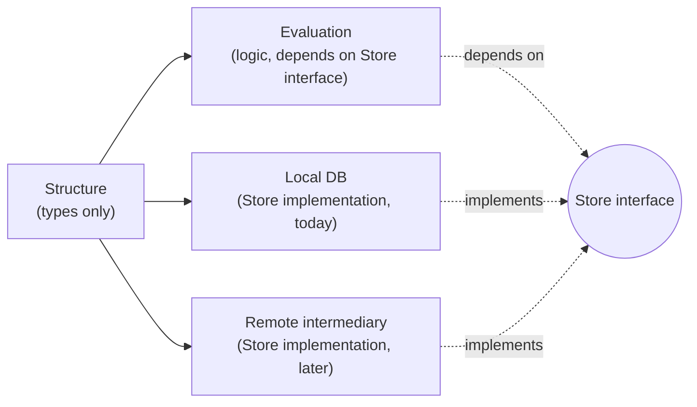
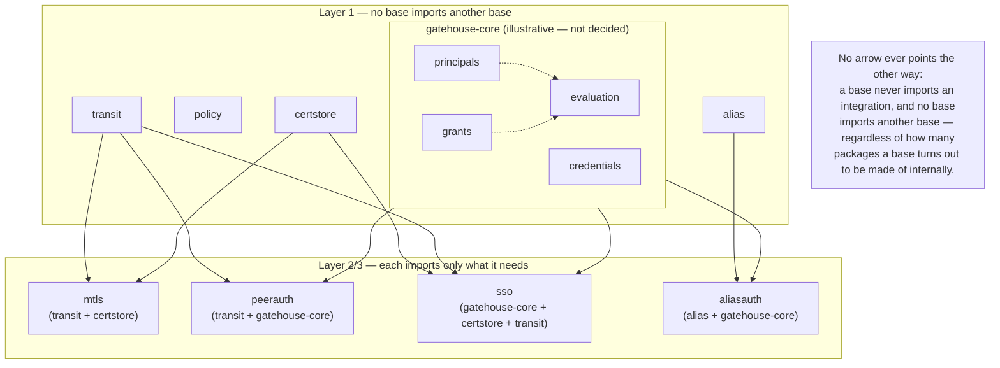

# Package boundaries

This is the Go-package-level expression of
[`01-build-order.md`](01-build-order.md)'s dependency graph. The two
documents should stay consistent — if a build-order dependency changes,
this doc's import rules change with it.

**A caveat that applies to everything below:** "gatehouse-core", "policy",
"certstore", "transit", and "alias" are names for dependency units —
groupings by the property of not needing the other groupings — not
promises that each
one is literally a single Go package. `gatehouse-core` in particular
(principals, credentials, grants, evaluation, sessions, multiple auth
providers) is large enough that it's very likely several packages
internally, related to each other by the same base/integration reasoning
one level down. That internal decomposition isn't decided here — it's a
call to make once real code exists, not something to lock in from a
diagram. What *is* fixed at this level: whatever `gatehouse-core` turns
out to be made of, none of it imports anything belonging to `policy`,
`certstore`, or `transit`, and vice versa.

## A decided internal boundary, and it's a general pattern, not a Gatehouse one

This isn't specific to `gatehouse-core` — it's the shape any base takes
whenever it has persisted domain data with logic over it, and it applies
wherever that's true, not just there. It was fixed for Gatehouse-core
first because the asymmetric/indirect DB access feature in
[`03-multi-instance-and-suites.md`](03-multi-instance-and-suites.md) was
decided first, but the reasoning doesn't reference anything
Gatehouse-specific:

- **Structure** — the plain data types. No logic, no storage calls,
  nothing but definitions. Everything else depends on this; it depends on
  nothing.
- **Evaluation** — the logic that operates over Structure. Depends on
  Structure for its types, and on a `Store`-shaped *interface* for
  reading/writing them — never on a concrete storage implementation
  directly.
- **Storage** — a concrete implementation of that `Store` interface.
  Depends on Structure. A local-DB implementation is the first one; a
  remote-intermediary-backed implementation, or one that's direct-for-reads
  and remote-for-writes, are later implementations of the *same*
  interface, not a reason to touch Evaluation.

The dependency points the opposite way from how it might read naturally:
Storage depends on Structure and implements the interface; Evaluation
depends on the interface, never on Storage. That inversion is what lets
Storage be swapped later without Evaluation or any calling code noticing.

**Where this applies, concretely, and where it's genuinely unclear it
should:**

- **Gatehouse-core** — yes, as above: principals/credentials/grants as
  Structure, authority checks as Evaluation, DB as the first Storage.
- **Policy** — yes, same shape: policy definitions/instances/contexts as
  Structure, resolution + generation-based caching as Evaluation, DB as
  Storage. A federated deployment may eventually want policy storage
  shared or centralized in ways that make the same swap useful.
- **Cert-store / PKI** — yes: CSRs/certificates/enrollment records as
  Structure, CA signing and purpose→policy-tier decisions as Evaluation,
  DB as Storage for the records (independent of where the *signing key*
  itself lives, which is the separate `Signer` abstraction in
  [`05-pki-and-signing.md`](05-pki-and-signing.md)).
- **Alias** — yes: the table+name→target entry and its lifecycle
  (active/released) as Structure, resolve/ensure/release as Evaluation,
  DB as Storage — the same reasoning as the other three, just not yet
  written down here when Alias was added as a Layer-1 base in
  [`01-build-order.md`](01-build-order.md).
- **Transit (raw)** — not obviously the same shape, worth being honest
  about rather than forcing the pattern everywhere. Its state (open
  connections, channels) is transient and connection-scoped, not
  persisted domain data the way the other three have. Nothing here says
  it *can't* fit; nothing decided yet says it *does*, and it shouldn't be
  assumed to just because the other three do.

Exactly how many packages this becomes, and what they're named, is still
open — this section fixes the *shape* of the boundary, not the package
layout around it.

## Why package boundaries specifically, not just discipline

Go enforces visibility at the package boundary, not at any looser
convention: two things in different packages can only talk through
exported identifiers. That's a compiler-backed guarantee, not a style
preference — you cannot accidentally reach into another package's
internals the way you easily could if two pieces of logic shared one
package with everything mutually visible.

This is a deliberate departure from Lighthouse's own convention, not a
carry-over. Lighthouse's `authority_*.go` family was split by *file*
within *one* package on purpose — those subsystems were all part of one
tightly-coupled evaluator, never meant to be used piecemeal. Archipelago's
bases are meant to be genuinely separable, independently testable, and in
some cases independently importable by an app that wants only part of the
system. That's exactly the shape where real package boundaries — not just
file boundaries — pay for themselves.

## The rule

**Layer 1 bases never import each other, at the level of the base as a
whole.** No package belonging to `gatehouse-core` imports anything
belonging to `policy`, `certstore`, `transit`, or `alias`, and the same
holds in every other direction between the five. This says nothing about how many
packages make up `gatehouse-core` internally, or how those internal
packages relate to each other — only that the boundary around the whole
base holds. This is checked, not just intended — see "Enforcing it"
below.

**Every Layer 2/3 integration is its own package that imports the bases it
needs.** It is never folded into one of the bases it combines. Concretely:
mTLS is not "transit, with gatehouse baked in" — it's a separate package
that imports both, and a system that wants raw peer identity with its own
authorization logic never has to pull in gatehouse-core's dependency graph
just because a convenience wrapper happened to live inside transit.

**Multiple integration packages can coexist for the same pair of bases.**
There is no single canonical "the" way to combine transit and
gatehouse-core. A convenience integration with opinionated defaults can
exist alongside a leaner one for systems that want different
authorization semantics on top of the same peer identity — neither is
privileged, and importing transit never implies importing either.

## What Go's compiler does and doesn't give you for free

It prevents **cycles** (`certstore` importing `transit` while `transit`
imports `certstore` simply won't build) and it prevents **reaching into
unexported internals** across a package boundary. It does **not** prevent
an unnecessary one-directional import — `gatehouse-core` *could* import
`transit` without creating a cycle, and the compiler would have nothing to
say about it even though it violates the rule above. That part is design
discipline, and discipline alone doesn't hold at scale.

### Enforcing it

- **Separate Go modules, one per base and one per integration,** is
  what actually enforces this today — see
  [`08-repo-scaffolding.md`](08-repo-scaffolding.md)'s "Integrations
  turned out to want modules too." A module's `go.mod` simply has no
  `require` line for something it isn't supposed to depend on; the
  rule below is checked by the compiler, not by a tool that has to be
  built and kept running in CI.
- **`internal/` packages** restrict who's even allowed to import
  something, when the goal is "no one outside this module" rather than
  "no one, period." Still useful *within* one module for the question
  module boundaries don't answer — see below.
- **A `go list`-based CI check (or a tool like `go-arch-lint`)**, if
  ever built, would target that same narrower, still-open question:
  discipline within one module's own internal packages (e.g. keeping
  `gatehouse-core/structure` from reaching into
  `gatehouse-core/storage/dbstore`'s internals) — not the base/
  integration boundary, which module separation already covers.

## Facades live inside their base, unless they need something extra

A simple, ergonomic API (`RequirePermission(ctx, "some.permission")`) that
just calls the real evaluator with sane defaults belongs inside whichever
package within `gatehouse-core` owns evaluation, as ordinary convenience
functions — no new package, no new dependency, regardless of how many
packages `gatehouse-core` ends up being internally. It only needs a
genuinely separate package if it pulls in something gatehouse-core itself
doesn't need (e.g., a convenience that also touches transit). Splitting
for its own sake, when
there's no real additional dependency to keep optional, just scatters one
coherent idea across files someone has to mentally reassemble — the same
"match the tool to the real shape of the problem" discipline as everywhere
else in this project, applied to package count instead of a technology
choice.

See [`04-facades-and-ergonomics.md`](04-facades-and-ergonomics.md) for the
facade-assumptions rules (parameter defaults vs. policy configuration,
and why they behave differently once more than one facade is in play).

## Diagram

