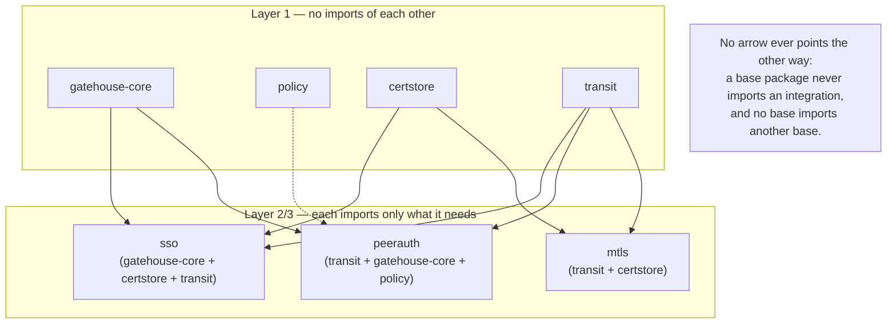

# Package boundaries

This is the Go-package-level expression of
[`01-build-order.md`](01-build-order.md)'s dependency graph. The two
documents should stay consistent — if a build-order dependency changes,
this doc's import rules change with it.

## Why package boundaries specifically, not just discipline

Go enforces visibility at the package boundary, not at any looser
convention: two things in different packages can only talk through
exported identifiers. That's a compiler-backed guarantee, not a style
preference — you cannot accidentally reach into another package's
internals the way you easily could if two pieces of logic shared one
package with everything mutually visible.

This is a deliberate departure from Lighthouse's own convention, not a
carry-over. Lighthouse's `authority_*.go` family was split by *file*
within *one* package on purpose — those subsystems were all part of one
tightly-coupled evaluator, never meant to be used piecemeal. Archipelago's
bases are meant to be genuinely separable, independently testable, and in
some cases independently importable by an app that wants only part of the
system. That's exactly the shape where real package boundaries — not just
file boundaries — pay for themselves.

## The rule

**Layer 1 bases never import each other.** `gatehouse-core`, `policy`,
`certstore`, and `transit` (raw) each have zero imports of the other
three. This is checked, not just intended — see "Enforcing it" below.

**Every Layer 2/3 integration is its own package that imports the bases it
needs.** It is never folded into one of the bases it combines. Concretely:
mTLS is not "transit, with gatehouse baked in" — it's a separate package
that imports both, and a system that wants raw peer identity with its own
authorization logic never has to pull in gatehouse-core's dependency graph
just because a convenience wrapper happened to live inside transit.

**Multiple integration packages can coexist for the same pair of bases.**
There is no single canonical "the" way to combine transit and
gatehouse-core. A convenience integration with opinionated defaults can
exist alongside a leaner one for systems that want different
authorization semantics on top of the same peer identity — neither is
privileged, and importing transit never implies importing either.

## What Go's compiler does and doesn't give you for free

It prevents **cycles** (`certstore` importing `transit` while `transit`
imports `certstore` simply won't build) and it prevents **reaching into
unexported internals** across a package boundary. It does **not** prevent
an unnecessary one-directional import — `gatehouse-core` *could* import
`transit` without creating a cycle, and the compiler would have nothing to
say about it even though it violates the rule above. That part is design
discipline, and discipline alone doesn't hold at scale.

### Enforcing it

- **`internal/` packages** restrict who's even allowed to import
  something, when the goal is "no one outside this module" rather than
  "no one, period."
- **A `go list`-based CI check (or a tool like `go-arch-lint`)** can assert
  "package X must never import package Y" as an automated rule, not
  something caught only in review. Worth setting up once the Layer 1
  package boundaries are real, not deferred indefinitely.

## Facades live inside their base, unless they need something extra

A simple, ergonomic API (`RequirePermission(ctx, "some.permission")`) that
just calls gatehouse-core's own evaluator with sane defaults belongs
*inside* the `gatehouse-core` package as ordinary convenience functions —
no new package, no new dependency. It only needs its own package if it
pulls in something gatehouse-core itself doesn't need (e.g., a
convenience that also touches transit). Splitting for its own sake, when
there's no real additional dependency to keep optional, just scatters one
coherent idea across files someone has to mentally reassemble — the same
"match the tool to the real shape of the problem" discipline as everywhere
else in this project, applied to package count instead of a technology
choice.

See [`04-facades-and-ergonomics.md`](04-facades-and-ergonomics.md) for the
facade-assumptions rules (parameter defaults vs. policy configuration,
and why they behave differently once more than one facade is in play).

## Diagram

