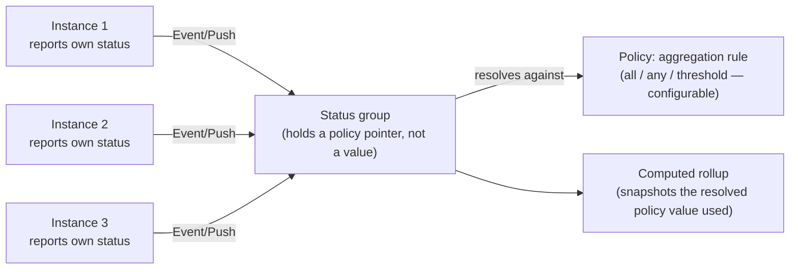

# Multi-instance coordination and application suites

## Two things that look similar and mostly are

"Multiple instances of one service" and "multiple different services in
one application suite sharing the same authority domain" are not
structurally different problems. In both cases you have multiple
processes that are clients of the same DB-backed authority store. The
peer-grouping concept below (an "app + instance-group" tag) covers both —
the grouping is really "same authority domain," not "same service
binary."

The place they genuinely diverge is **whether the processes need to agree
on something**, not what kind of processes they are. That's the fork that
actually determines how hard a given piece of multi-instance coordination
is.

## The fork: agreement vs. independent reaction

- **No agreement needed** — an instance does something and tells its
  peers; each peer reacts independently, and nothing breaks if they react
  in slightly different orders or one of them misses the message
  entirely. This is the easy, common case.
- **Agreement needed** — multiple instances need to land on the *same*
  answer (who's the leader, what's the current value of a shared counter,
  is this write allowed given what another instance just wrote). This is
  where real distributed-systems difficulty lives, and it varies by what
  the *application's own domain logic* actually requires — Archipelago
  cannot generically solve this once for every app, only give apps the
  tools to solve their own specific instances of it.

Archipelago provides primitives, not a mandated architecture. Which of the
following an app reaches for is the app's decision.

## The toolkit, cheapest first

| Tool | Solves | Built on |
|---|---|---|
| **Peer discovery** | "Who else is out there" | Registry-backed by default (simple, coordinator-dependent); optional SWIM-style gossip fallback for resilience when the coordinator is unreachable |
| **Broadcast / pub-sub** | "Tell peers something happened," no agreement needed | `Event/Push` delivery class + mTLS peer transport — already built, just pointed at a new audience |
| **Shared, slowly-changing state distribution** | Feature flags, shared rate-limit budgets — eventually-consistent snapshots, not live messaging | Same mechanism the registry already uses for service discovery, generalized |
| **Lease-based locks / leader election** | "Exactly one instance should be doing X right now" | A time-limited lease, acquired and renewed periodically — covers a large fraction of real coordination needs without full consensus |
| **CRDTs** | Some genuinely shared state, but eventual convergence is fine | A known technique for data structures that merge deterministically (counters, sets) — not a general answer, a specific tool for a specific shape |
| **Real consensus** | Strongly-consistent shared state, strict agreement | **Deliberately not built here.** Point apps at `hashicorp/raft` or etcd; the mTLS peer transport already built can serve as that library's own transport layer |

## DB access within a suite: symmetric or asymmetric

Every service in a suite can embed the SDK and connect to the shared DB
directly — simplest, no bottleneck, but every service holds real DB
credentials, and there's no single enforcement point for authority
checks.

Or: reads go direct, writes go only through a designated writer service
(or a pool of writer *processes* — see caveat below). This is the same
pattern as classic read-replica database scaling, or CQRS — reads are far
more frequent than writes for permission-checking specifically, so this
captures most of the blast-radius benefit of full intermediation (a
compromised read-only credential can leak data; it cannot forge grants or
corrupt the authority store) while keeping most of the performance
benefit of direct access.

**The pool caveat.** "A pool of writers" is easy exactly as long as it
means *multiple processes writing to the same shared database* — ordinary
ACID transaction semantics already handle concurrent writers from
multiple connections, nothing new to build. It becomes the hard consensus
problem above the moment it means *multiple independent writers, each
with their own storage, that need to reconcile with each other*.
Archipelago assumes the former for now — **one shared DB** — and treats
genuine multi-DB reconciliation as deliberately out of scope until there's
real experience to design it from, not hypothetical need.

## Status and health: per-instance and collective

Per-instance status and a rolled-up collective view are both needed, and
neither replaces the other — the same two-tier model Kubernetes
(Pod → Deployment) and Consul (per-check → service-level, with a
configurable aggregation policy) already use.

- **The aggregation policy is a pointer, not an embedded value**, on the
  status group's own definition — same reasoning as Lighthouse's §6
  alias-default-table design: repointing/changing the default should not
  require rewriting every group record, and the general Policy system's
  inheritance/override machinery already does this for free.
- **Each computed rollup snapshots the policy value it actually used** —
  the `copied_at_creation` pattern, applied to a status computation
  instead of a resource's creation-time config. The group stays flexible
  and repointable; each individual result stays an honest historical
  record of what was actually used to produce it.
- Reports ride the same generic propagation envelope (`kind`, `source`,
  `idempotency_key`, `seq`, `payload`) and the `Event/Push` delivery
  class already designed — this is a consumer of existing infrastructure,
  not a new subsystem.

