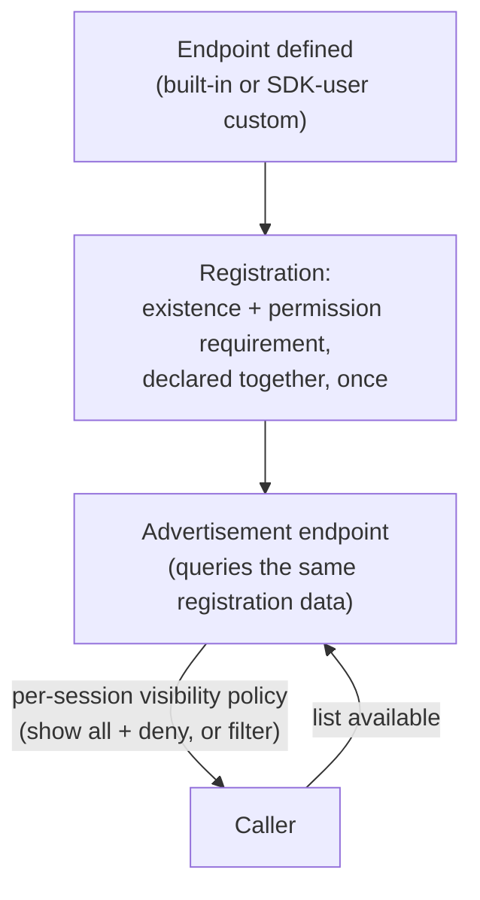

# Facades, ergonomics, and endpoint advertisement

## Simple mode is a facade, never a second system

Gatehouse is complex by design — grants, roles, groups, policies,
contexts, wildcard matching. Most callers don't need all of that for the
common case ("does this principal have this permission"), but the simple
API for that case must be **a thin wrapper over the same real evaluator**,
never a parallel implementation that usually agrees with it. Two code
paths that are supposed to agree can silently diverge; one evaluator with
two entry points cannot.

Concretely, a facade's opinions are expressed through exactly two
mechanisms:

- **Selective parameter use** — e.g., always passing the default realm,
  never exposing contexts unless explicitly reached for. This is
  **call-scoped and safe to mix freely** — nothing persists between calls,
  so using two differently-opinionated facades side by side within the
  same app causes no interaction at all.
- **Policy configuration** — a facade's setup writes opinionated defaults
  into the *same* shared Policy store other things read. This is **not**
  safe to mix freely: it's persistent, shared state, and a second facade's
  policy writes silently win over an earlier one's if they touch the same
  keys. A facade's policy-configuring assumptions should be an app-wide,
  one-time choice, not something switched between call to call — nothing
  errors if you do, it just quietly produces a security posture that
  reflects whichever facade touched policy most recently, not a
  deliberate decision anyone can point to.

Multiple facades, each with different assumptions, are expected to
coexist eventually. Each one documents which of its assumptions are
parameter-level (freely mixable) and which are policy-level (app-wide,
pick one) — the doc for a facade is incomplete without that distinction
stated explicitly.

## Endpoint self-advertisement, from the beginning

Lighthouse's `adminTokenMessageTypes` — a hand-maintained list of which
message types the SDK would attach a bearer token to — drifted from the
agent's own real endpoint set repeatedly, silently, for years, because
"which endpoints exist" and "which endpoints need what" lived in two
places that had no reason to stay in sync. The agent's own endpoint
registry (`lighthouse.docs.endpoints`) existed the whole time; the SDK's
allowlist just wasn't derived from it.

Archipelago does not repeat this. From the start:

- **Endpoints register themselves, once, in one place** — including
  SDK-user-defined custom endpoints, not just built-in ones. Registration
  carries the endpoint's own permission requirement as metadata at the
  same point its existence is declared.
- **A real endpoint advertises the others** — "what exists, what does
  each one need" is a live query against the same registration data, not
  a second, separately-maintained list anyone has to remember to update.
- **Visibility is a policy choice, not a fixed philosophy.** An app can
  choose to show every endpoint and deny at call time, or hide endpoints
  a given session can't use — this is a real, legitimate difference in
  UX/security posture between apps, decided via policy or SDK-init
  configuration, same as everything else that genuinely varies by app
  rather than having one right answer.

