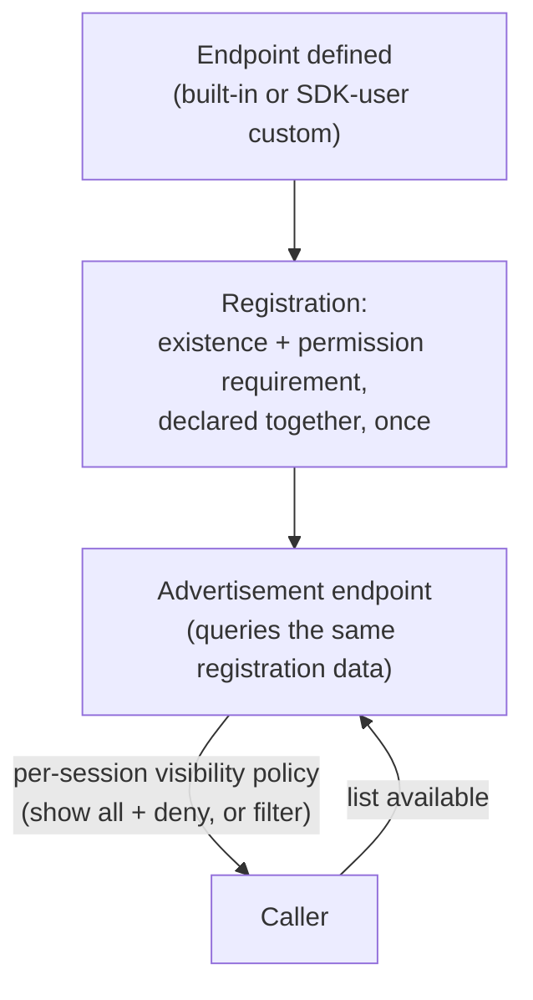

# Facades, ergonomics, and endpoint advertisement

## Simple mode is a facade, never a second system

Gatehouse is complex by design — grants, roles, groups, policies,
contexts, wildcard matching. Most callers don't need all of that for the
common case ("does this principal have this permission"), but the simple
API for that case must be **a thin wrapper over the same real evaluator**,
never a parallel implementation that usually agrees with it. Two code
paths that are supposed to agree can silently diverge; one evaluator with
two entry points cannot.

This applies just as much to non-code callers. An HCL "ensure these
principals/roles/groups/grants exist" template (see
[`07-config-formats-and-templating.md`](07-config-formats-and-templating.md))
is parsed and then applied as the same `Ensure*`-style calls a facade
already exposes — another caller of the one real evaluator, not a second
way to create authority state.

Concretely, a facade's opinions are expressed through exactly two
mechanisms:

- **Selective parameter use** — e.g., always passing the default realm,
  never exposing contexts unless explicitly reached for. This is
  **call-scoped and safe to mix freely** — nothing persists between calls,
  so using two differently-opinionated facades side by side within the
  same app causes no interaction at all.
- **Policy configuration** — a facade's setup writes opinionated defaults
  into the *same* shared Policy store other things read. This is **not**
  safe to mix freely: it's persistent, shared state, and a second facade's
  policy writes silently win over an earlier one's if they touch the same
  keys. A facade's policy-configuring assumptions should be an app-wide,
  one-time choice, not something switched between call to call — nothing
  errors if you do, it just quietly produces a security posture that
  reflects whichever facade touched policy most recently, not a
  deliberate decision anyone can point to.

Multiple facades, each with different assumptions, are expected to
coexist eventually. Each one documents which of its assumptions are
parameter-level (freely mixable) and which are policy-level (app-wide,
pick one) — the doc for a facade is incomplete without that distinction
stated explicitly.

## A future pluggable evaluator: shape constraints, not a design yet

Gatehouse-core is optional at zero cost today simply by not importing
it — it's its own module. The harder case is wanting the *rest* of the
SDK (Transit, certstore, endpoint registration) without being locked
into Gatehouse-core's specific evaluator. Nothing forces that question
yet. Integrations that authorize (`peerauth`, `vitalsauth`, `sso`) do
call `evaluation.RequirePermission` directly today, but they're
*Gatehouse-core integrations by definition* — they already import it,
so there's no lock-in to avoid. The question only bites for something
that wants an authorization check **without** importing Gatehouse-core
at all, and nothing does yet. Three constraints are worth holding onto
for whenever something does, so the eventual design doesn't have to be
re-derived from scratch:

1. **The consumer declares its own thin interface at its own
   boundary** — the same rule already applied twice (`evaluation.Store`,
   `facade.Writer`). A future integration that needs "the evaluator"
   defines something like `Evaluate(subject, action, resource) ->
   Decision` for itself; Gatehouse-core's real evaluator is wired in
   through a one-function adapter, never imported directly. Swapping
   evaluators later means swapping which adapter is wired in, never a
   rewrite of the integration and never two parallel SDKs.
2. **`Decision` must stay rich — a bare `bool` would be a regression,**
   not a simplification. Lighthouse's own `AuthorizationDecision` earns
   its explainability from ~30 named, typed, Lighthouse-specific
   fields on one concrete struct, which is exactly right for
   Gatehouse-core's *own* decision type (free to keep growing fields
   the same way) but can't be copied wholesale into a generic
   interface — a foreign evaluator wouldn't know what `WildcardMatch`
   means. The generic shape's answer is an open, evaluator-specific
   detail bag (`Reason string` + `Details map[string]any` or similar)
   alongside `Allowed` — rich by construction, generic only in not
   assuming Grants/Roles/Context are the only possible backing model.
   The interface's return type needs to be an interface, not a
   concrete struct, so a caller that knows it's talking to
   Gatehouse-core can still type-assert down to the full concrete type
   (the same pattern as `error` + `errors.As`) rather than having the
   extra fields silently truncated by Go's own assignment semantics.
3. **A decision's correlation ID is a log attribute, not a database
   row.** Riding on the trace/span machinery already in
   [`06-logging-and-observability.md`](06-logging-and-observability.md)
   costs nothing per check; a dedicated decisions table would
   reintroduce exactly the per-check DB write the generation/freshness
   work exists to avoid. Durable storage stays reserved for the
   selective audit record a real decision earns, per that same doc's
   operational-vs-audit-logging split — never a blanket table for every
   check.

## Endpoint self-advertisement, from the beginning

Lighthouse's `adminTokenMessageTypes` — a hand-maintained list of which
message types the SDK would attach a bearer token to — drifted from the
agent's own real endpoint set repeatedly, silently, for years, because
"which endpoints exist" and "which endpoints need what" lived in two
places that had no reason to stay in sync. The agent's own endpoint
registry (`lighthouse.docs.endpoints`) existed the whole time; the SDK's
allowlist just wasn't derived from it.

Archipelago does not repeat this. **Built:** the registration and the
live query below exist in Gatehouse-core
([`15-endpoint-advertisement-model.md`](15-endpoint-advertisement-model.md)).
**Not built:** the "advertisement endpoint" in the diagram is, today, an
in-process Go function — nothing exposes it as a Transit-callable
endpoint, pending a Router. From the start:

- **Endpoints register themselves, once, in one place** — including
  SDK-user-defined custom endpoints, not just built-in ones. Registration
  carries the endpoint's own permission requirement as metadata at the
  same point its existence is declared.
- **A real endpoint advertises the others** — "what exists, what does
  each one need" is a live query against the same registration data, not
  a second, separately-maintained list anyone has to remember to update.
- **Visibility is a policy choice, not a fixed philosophy.** An app can
  choose to show every endpoint and deny at call time, or hide endpoints
  a given session can't use — this is a real, legitimate difference in
  UX/security posture between apps, decided via policy or SDK-init
  configuration, same as everything else that genuinely varies by app
  rather than having one right answer.

