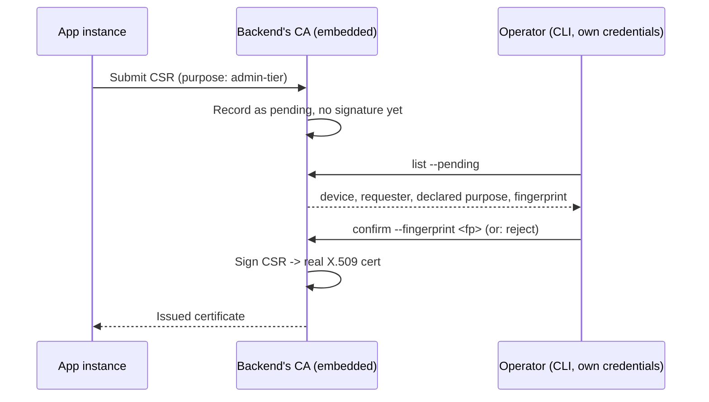

# PKI, signing, and key enrollment

## The key inventory, and why each one is separate

Every key below exists because an earlier "could we just reuse X for Y"
question got a specific, real "no" — not because more keys felt safer in
the abstract. None of them overlap in purpose.

| Key | Purpose | Notes |
|---|---|---|
| **TLS/mTLS keypair** | Service-to-service transport identity only | Never reused for signing — cross-protocol signature reuse is a real, documented attack class, and TLS-usage certs carry `serverAuth`/`clientAuth` EKUs by convention, not a general signing purpose |
| **Dedicated application-signing keypair** (per coordinator/service) | Signs SSO tickets, resource-ownership proofs | Ed25519/ECDSA, published via the registry alongside connection info — doesn't need a full CA-issued cert chain, just a key the registry vouches for |
| **Passkey credentials** | Human login | Platform-managed, syncs via Apple/Google's own dedicated infrastructure; cannot be repurposed for arbitrary signing — the WebAuthn API has no "sign arbitrary bytes" primitive, and platform-backed keys are non-extractable by design |
| **Device-specific destructive-action signing key** | Gates particularly dangerous permission-node calls | Secure-Enclave-backed where available, per-operation biometric gate (`SecAccessControl` + `.privateKeyUsage` + `.biometryCurrentSet`); deliberately non-syncable — losing the device means losing this capability until re-provisioned, which is the correct tradeoff for something this sensitive |

`biometryCurrentSet` over `biometryAny` is the deliberate choice for the
destructive-action key specifically: it ties the key to the *exact*
biometric data enrolled when the key was created, invalidating on
re-enrollment rather than silently transferring to a new face/fingerprint
on the same device.

## CSR and CA, not a boolean "enrolled" flag

A key's legitimacy is a real, standards-compliant X.509 certificate signed
by the backend's own narrow CA — not a database flag someone flips. This
buys standard verification (certificate-chain validation, not a bespoke
lookup), natural expiry, and standard extensibility (custom EKUs, custom
extensions under our own OID) for carrying Archipelago-specific meaning —
all without inventing a new format. X.509 is general-purpose; Web PKI's
conventions (domain names, CA/Browser Forum baseline requirements) are a
profile on top we're not bound by for our own private CA.

**Embed the CA, don't run it as a daemon.**
`github.com/smallstep/certificates/authority`'s `NewEmbedded` gives the
same provisioner-based CSR/signing logic that powers `step-ca`, as a
library inside our own process — no separate service to network-secure.

## The enrollment ceremony is generic across purposes

The same list-then-confirm shape applies to service mTLS peers, dedicated
signing keys, and admin/destructive-action keys — what varies is the
**policy tier**, not the mechanism:

- **Purpose/EKU and subject shape** — a custom OID `otherName` SAN entry
  carrying whatever identifier fits (a principal ID, a service identifier).
- **Confirmation policy per purpose** — low-risk purposes (a service's own
  mTLS peer cert, both ends already owned) can auto-approve; the
  admin/destructive-action tier gets the full ceremony: `list --pending`
  shows enough context to actually evaluate (device, requester, declared
  purpose — never a bare fingerprint), confirmation happens via a genuinely
  separate channel (CLI, an operator's own credentials), and there's an
  explicit reject alongside expiry, so a suspicious pending request can be
  killed immediately rather than just timing out.
- **The one thing *not* worth adding**: requiring the confirm action itself
  to be a signed, step-up-gated request the way an app-level dangerous
  action is. Someone with machine-level access to the backend already has
  far more ambient capability than a single command-level signature check
  could meaningfully constrain — that control belongs at the
  app-to-coordinator boundary (§ above), not here.
- **The real risk of generalizing**: the purpose→policy mapping becomes
  one shared, security-critical surface. A misconfiguration that puts the
  admin tier into the wrong (looser) bucket now weakens multiple purposes
  at once. Mitigate with separate intermediate CAs per risk tier, so a
  mistake in the shared mapping logic isn't the *only* thing standing
  between "auto-approved" and "requires the full ceremony" — the two
  tiers' signing keys can also live in structurally different places
  (e.g., the admin tier's key on a YubiHSM, the service tier's in a vTPM).

## Signing hardware is a swappable abstraction

A `Signer` interface — software key, PKCS#11-backed HSM, TPM-sealed key,
YubiKey/PIV — means the backing-hardware decision doesn't need to be
locked in at design time, and upgrading later is swapping an
implementation, not redesigning the enrollment system around it.

One distinction worth keeping straight when picking hardware: a
**virtual TPM** (Proxmox's `swtpm`-based vTPM, for instance) protects
against a compromised *guest OS* — it does not protect against a
compromised *hypervisor host*, since the "sealed" key material is just a
file on the host's own disk, no separate tamper-resistant boundary
involved. A real HSM (YubiHSM2 is the approachable option at this scale)
or a bare-metal host's genuine hardware/firmware TPM resists extraction
even by someone with host-level access — decide which threat model
actually applies before assuming "TPM" means the stronger guarantee.

## Revocation: DB check first, CRL because it's nearly free

The backend already does a synchronous DB-enrollment check on every use —
that's a better revocation signal than a CRL ever gives (no propagation
delay, no stale-cache window), so it stays primary. CRL generation is
enabled anyway, not because it's needed for our own verifiers, but because
`step-ca`'s embedded authority makes it a config flag
(`crl.enabled: true`) rather than something to build — worth having for
genuinely external verifiers (a different coordinator, in the federated
case) and generic X.509 tooling interop. OCSP stays out of scope; it's not
part of the open-source offering.

**Distribution points, split by actual audience:**

- `https://` CDP entry — for generic, non-Archipelago-aware tooling. Only
  populated if the issuing app actually has a bindable public port; a
  purely internal service that's never checked by outside tooling doesn't
  need one, same "capabilities are optional, apps opt in" rule as
  everywhere else.
- **A custom extension** (not a second CDP entry) — carries an
  `archipelago://…` live per-serial revocation-check endpoint for
  federated, Archipelago-aware peers that don't have direct DB access to
  the issuing backend. A live check beats fetching a whole CRL for one
  entry, and a separate extension says what this actually is rather than
  relying on every consumer correctly guessing from a URI scheme inside a
  field meant for something else.

Both are non-critical extensions; an implementation that doesn't
recognize one simply skips it, per RFC 5280 — no compatibility risk from
carrying both.
