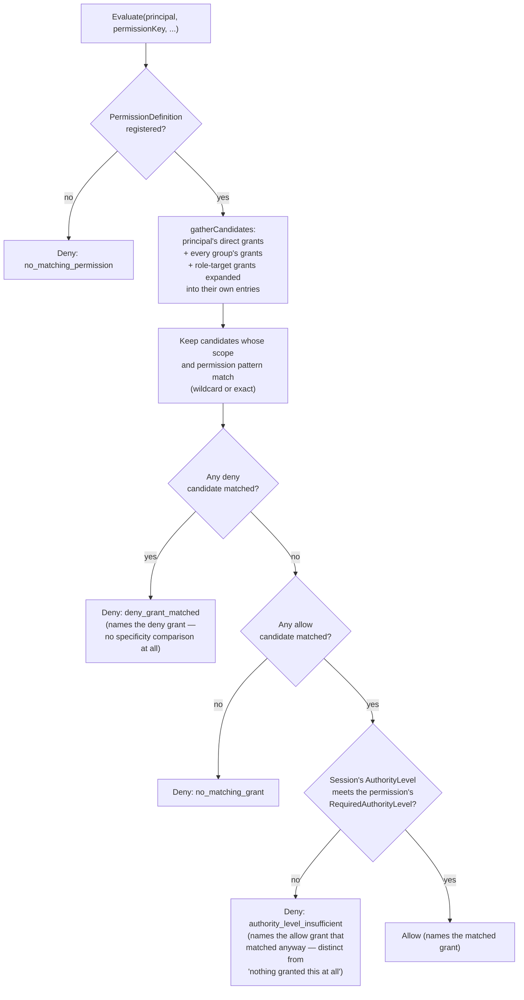

# Gatehouse-core model

## Where this sits

[`01-build-order.md`](01-build-order.md) and
[`02-package-boundaries.md`](02-package-boundaries.md) decided
Gatehouse-core's *external* shape (a Layer 1 base, DB only, no
dependency on any other base) and left its *internal* package
decomposition open until real code exists. Neither decided what a
Principal, Credential, Grant, Role, Group, Session, Context, or
Permission actually *is* — that gap is what this doc closes. Nothing
here changes the dependency graph; it fills in the base the graph was
already drawn around.

**A status table, not a false consensus.** The items below were arrived
at with very different amounts of actual discussion. Treat the
"confirmed" rows as decided and the "proposed" rows as a loose
first draft borrowed from Lighthouse's own model, offered for
correction, not as already settled:

| Concept | Status |
|---|---|
| Context (exact-match, type+id) | confirmed |
| Grant scope (global / context, not lighthouse/realm/context) | confirmed |
| No realm anywhere in this model | confirmed |
| No cross-tenant permissions, no first-class tenant concept | confirmed |
| Principal types, `app_client` dropped, `external` generalized | confirmed |
| Cross-app/shared-CA credential vocabulary stays open | confirmed (deferred on purpose) |
| Credential shape, method-vs-credential split, storage per kind | confirmed |
| Session shape, session-vs-credential invariant, no connection field | confirmed |
| Role / Group / Template, RolePermission carries `effect` too | confirmed |
| Deny effect (deny-always-wins, no graduated specificity) | confirmed |
| Authority level; minimal PermissionDefinition introduced | confirmed |
| Generations / freshness (two counters, one invariant) | confirmed |
| Caches never override revocation | confirmed |
| No implicit principal creation, narrow mTLS-fingerprint policy exception | confirmed |
| Devices/hosts are correlation context, not principals | confirmed |
| Attestation via ownership and/or groups, policy-governed (full mechanics open) | confirmed (partial) |
| Certificates inform provisioning under policy, never authorize directly | confirmed |
| Evaluation facade (`Evaluate`/`Require` as the one chokepoint) | confirmed |
| Three-Identity Model, trimmed authority-source vocabulary | confirmed |
| Direct-DB-write bypass is an operation fact, not a principal classification | confirmed |
| Wildcards never include recovery-access permissions | confirmed |
| Reserved permission-key namespaces (hygiene default, not a security wall) | confirmed |

## Why no realm, concretely, not just as a slogan

Lighthouse needed a containment concept *inside* its authority model
because one Lighthouse instance served many apps. Archipelago doesn't
have that problem: each app (or suite, sharing one authority domain per
[`03-multi-instance-and-suites.md`](03-multi-instance-and-suites.md))
gets its own Gatehouse-core instance and its own database. "Which app's
data is this" is answered by which database you're connected to, not by
a column every row carries. Realm's job is absorbed by the architecture,
not replaced by a new concept.

This also settles a question that sounds unrelated but isn't: whether
Gatehouse-core needs an intra-app tenant/namespace concept, for an app
that itself serves multiple customer orgs. It doesn't, on purpose — that
was never what realms solved anyway (realms were inter-*app*, never
intra-app multi-tenancy), and giving it a first-class concept without a
real case driving it repeats the mistake sharding would have been (see
[`06-logging-and-observability.md`](06-logging-and-observability.md)'s
note on the same reasoning). An app that genuinely needs customer
isolation models it with a group per customer and customer-scoped
context IDs in its grants — ordinary primitives, no new concept.

## Principal

*Confirmed shape, adapted from Lighthouse §4.1/§5.*

Anything that can act. Types:

```text
user | agent | service_account | system | external | anonymous
```

`app_client` is dropped — it existed specifically for *other apps*
connecting to one shared Lighthouse, a relationship that doesn't exist
here. `external` is kept and generalized: it's what any identity this
app's own Gatehouse-core didn't mint becomes, once mapped to a local
principal with its own locally-decided grants — an SSO-asserted human
identity today, and later (deliberately deferred — see below) an
identity from a genuinely different app, authenticated some other way
entirely. One principal type covers both because the receiving app does
the same thing either way: it never grants authority to the assertion
itself, only to the local principal it maps the assertion onto.

```text
PrincipalRecord
- principal_id     uuid
- key               stable human-oriented key
- display_name
- type              user | agent | service_account | system | external | anonymous
- owner_principal_id?   attestation-rights input, see below; never self-referencing
- metadata          opaque, never authorized on
- created_at / ... 
```

**No implicit principal creation, with one narrow, policy-gated
exception.** Principals are never created as a side effect of login,
alias lookup, or app-assertion — creation is always an explicit,
separately-authorized operation. The one deliberate carve-out: an app
may opt into auto-provisioning a `service_account` principal on first
mTLS connection from a specific, already-enrolled certificate — gated by
policy, and keyed on **subject + fingerprint**, never subject alone. A
cert's mere existence already represents an explicit authorization event
(it went through the enrollment ceremony in
[`05-pki-and-signing.md`](05-pki-and-signing.md)); auto-provisioning on
first use from *that specific* cert just defers the last step of a
provisioning flow that already happened explicitly, to first contact.
Keying on the claimed subject alone instead would reopen the exact
silent-materialization risk this rule exists to prevent, since it ties
provisioning to a claim rather than a specific vetted artifact.

**Devices and hosts are correlation context, not principals.** A device
doesn't hold grants of its own; it's referenced from a Credential or
Session (and from log/trace Resource attributes — see
[`06-logging-and-observability.md`](06-logging-and-observability.md))
purely for correlation — "which device was this," not "what can this
device do." Anything a device needs to be able to do is a permission
held by the principal using it, not the device itself.

**Attestation rights — vouching that a principal authenticated, the
thing `asserted_by_principal_id` on Session records — come from
two independent paths, not one.** A principal's owner
(`owner_principal_id`) may attest for it; so may any principal holding
delegated attestation authority over a group the principal belongs to.
Neither path is required and both can coexist — a service in a suite
often needs to attest for principals it doesn't own, which is exactly
what group-delegation covers and pure ownership doesn't. Which path(s)
are enabled, and whether ownership alone is trusted at all, is a policy
decision per Archipelago instance. The full shape — how ownership
actually works, what a cycle-free structure looks like concretely —
isn't decided yet; only that both paths exist and policy governs them is.

## Credential — confirmed

*Adapted from Lighthouse §4.2, §8.2, §9–10, §29.*

Lighthouse drew a real, worth-keeping distinction between **how a
principal first proves who it is** (an authentication *method*) and
**what's presented on the wire afterward to authenticate a request**
(the *credential*):

```text
methods:    password | totp | passkey | sso_assertion
credentials: password | totp | passkey | session_token | mtls_certificate
```

(Password/TOTP/passkey end up as both a method *and* a stored
`CredentialKind` — there's a secret or public-key record to keep and
re-verify against on every subsequent request, unlike `sso_assertion`,
which produces a session directly with nothing of its own to store.
`session_token` is what password/passkey login additionally mints for
bearer use afterward. No `system` credential kind exists — that word
names a `PrincipalType`, not a `CredentialKind`; an earlier draft of
this list conflated the two.)

This lines up with what's already decided elsewhere: local-first login
(password+TOTP, passkeys) via composable primitives
(`00-overview.md` §6) establishes identity; `completeSession()` is what
actually mints the credential (a session token) that gets presented
afterward. Cert-as-credential (the Layer 2 integration with certstore,
`02-package-boundaries.md`) is a second, independent way a request
authenticates — a certificate itself, not a token derived from one.

**Certificates identify bindings; they inform decisions, they never
carry mutable authorization themselves.** A certificate's content (its
subject) can legitimately influence what gets auto-provisioned (see
Principal, above) without that being authorization baked into the
cert — provisioning still produces an ordinary principal with ordinary
DB-backed grants, evaluated the normal way afterward. Whatever a cert's
content suggests, local policy is the ceiling: policy can only narrow
what cert-based provisioning would otherwise produce, never let a
cert's claim push authority up past what policy allows — the same
narrowing rule SSO assertion already follows (see the Three-Identity
Model, below, for exactly where that rule does and doesn't apply).

### Storage: one table per credential kind, not grouped by shape

*Confirmed, after checking against Lighthouse's own actual field shapes
(§10.1, §9.1) rather than assuming.* A first pass at this grouped
storage by confidentiality property — one shared table for anything
verified by "hash and compare," on the theory that password and token
credentials are the same shape. They aren't, once the real fields are
on the table: password credentials carry memory-hard hash parameters,
failed-attempt lockout tracking, and rehash-on-success bookkeeping that
token credentials have no use for at all (a token is already
high-entropy, so it's hashed fast with no cost parameters and never
rehashed). Sharing one table would mean a pile of columns only one kind
ever populates — the exact nullable-column sprawl a single generic
"secrets" table was already rejected for. Lighthouse's own choice (a
separate table per credential kind: `passwords.go`, `tokens.go`,
`passkeys.go`) holds up better than grouping did, and Archipelago
carries that forward:

```text
password credentials   hash (memory-hard algorithm), hash params,
                        lockout state, rehash-on-success tracking
token credentials      hash (fast, no cost params), purpose, scope,
                        expiry — tokens are never rehashed
totp credentials       encrypted secret (reversible — the code has to
                        be computed from it), key version for rotation
passkey credentials    public key material, sign count, transports —
                        not a secret at all; never hashed or encrypted
cert-as-credential     no secret storage in gatehouse-core at all — a
                        reference into certstore's own records, never
                        a copy of the certificate or key
```

What *is* still a useful, shared idea across those rows — verification
falls into exactly three operations (hash-and-compare, decrypt-and-
compute, or check-a-public-key), and that's a property of Evaluation's
logic, not a reason to collapse Storage into fewer tables.

**Deferred, reusing the TOTP machinery once it exists — and worth
starting from Lighthouse's own (also never-built) design instead of a
blank page when that happens.** Once an encrypted, rotatable-key
credential table exists for TOTP, the same mechanism generalizes into an
app-facing secrets capability. Lighthouse's own design for this
(design-only there too, but genuinely thought through) is worth keeping
as the starting shape:

```text
metadata access, value read, and value use are separate rights — "use"
  (the system uses the secret for an approved operation without ever
  revealing it back) is preferred over "read," and is a real, separate
  right from it
discovery rule: no discovery rights -> not found; discovery without
  action rights -> forbidden (never confirm a secret exists to someone
  without the right to know that)
secrets are modeled as ordinary Contexts (an app-defined context type) —
  reusing the Grant/Context machinery already decided above, not a
  parallel permission system
```

Still deferred because TOTP itself isn't built yet, so there's nothing
yet to generalize from — this just means the eventual generalization
starts from a better-informed shape instead of reinventing one later.

**Gatehouse-core owns storage for the kinds it implements itself**
(password, TOTP, passkey, session tokens) — pushing that to the app
would reintroduce exactly the tax Archipelago exists to remove
(`00-overview.md` §6). For a kind it doesn't natively implement,
it stores only an opaque reference + metadata — Lighthouse's own §14
"provider boundary" concept, loosely carried forward — and the app or a
future provider owns verification and secret storage for that kind.

Hash-at-rest, raw-once-at-mint, fingerprint-only-in-logs carries forward
unchanged from Lighthouse's own conventions, regardless of table shape.

**Deliberately left open, per this conversation:** a future credential
kind for a principal whose proof came from a *different app entirely* —
possibly a certificate signed by some shared CA multiple apps trust,
possibly something else. The exact shape isn't decided. What matters now
is that the vocabulary isn't closed: a kind like `foreign_certificate`
slots in next to `mtls_certificate` later without touching Principal,
Grant, or Session shape at all, the same way Lighthouse reserved
`mtls_certificate`/`challenge_key` as vocabulary years before either had
a provider.

## Session — confirmed

*Adapted from Lighthouse §8, §8.3, §4.14.*

The invariant carries forward unchanged, because it has nothing to do
with realms: **a session record alone never authenticates a request;
only explicit credential material does.** A session is who/what is
currently authenticated or asserted; a credential is how a given
request proves it belongs to that session. Collapsing the two is
exactly the escalation this split exists to prevent — the same reason
`credential_id` below stays singular and optional rather than a session
carrying its own ambient authority.

```text
SessionRecord
- session_id
- principal_id
- credential_id?        present when a transport credential exists;
                        absent for a service-mediated record that's
                        authoritative but never itself bearer-usable
- session_kind          ui | cli | agent | service | automation | asserted
                        | assumed  (see "Assumed sessions" below)
- authority_level       standard | elevated | recovery_access
- authentication_method
- asserted_by_principal_id?   set when this session's proof came from
                              somewhere other than local credentials
- requested_by_principal_id?  (assumed sessions only)
- metadata               opaque, never authorized on
- created_at / expires_at? / last_seen / revoked_at?
```

`session_kind = asserted` is the one kind covering both today's SSO case
and tomorrow's still-deferred cross-app case — named to match
`asserted_by_principal_id` rather than introducing a second word
(Lighthouse's own `app_user`/`app_service` kinds did this same job but
don't translate by name, since they existed specifically for "another
app's user, asserted in," a relationship this model doesn't have).

**Elevation is session/action-scoped, never a separate principal** —
`authority_level = elevated` on an existing session, not a second
principal with more power. `recovery_access` stays reserved vocabulary,
same treatment as the still-unbuilt credential kinds: the value exists
so nothing has to be renamed later, but the actual recovery-activation
mechanism is undesigned and deferred, matching Lighthouse's own current
state (its recovery flows are design-only too).

**What's deliberately *not* in this record: any notion of a live
connection.** Per `01-build-order.md`'s Layer 2 table, connection-bound
sessions are the "Sessions" integration's job (Gatehouse-core + Transit),
not a field Gatehouse-core's own Session shape carries. An app that
never uses Transit gets ordinary sessions with nothing missing; one that
does gets the integration adding a connection reference on top, without
the base record ever needing to change for it — the structure/
evaluation/storage split doing exactly what it's for.

## Assumed sessions — confirmed, built

*Arose from designing the job system (`20-jobs-model.md`). Built in
`gatehouse-core`: `structure.SessionKindAssumed`, migration 0023, and
`facade.AssumeSession`, `ValidateAssumedSession`,
`RequireAssumedPermission` / `RequireAssumedContextPermission` and
`RegisterAssumePermissions`.*

Some work runs on a different node from the one that asked for it, under
the authority of a third principal. Four facts are involved, and
collapsing any two loses something:

```text
actor_principal       A  who performed the work (the runner)
requested_by          B  who asked for it
effective_principal   C  whose permissions the work's operations are
                         evaluated against
authority_source         the relationship that justifies this A/B/C
```

The common cases collapse: a user's own job has C equal to B; ordinary
service work has C equal to A. Only when C is a third principal does it
need the machinery below.

**An assumed session is a `Session` with `session_kind = assumed`.**
`principal_id` is C, `asserted_by_principal_id` is A (the creator, who runs
the work), and a new nullable `requested_by_principal_id` holds B. An
assumed session **must carry `expires_at`**, since it is time-bounded by
definition, and it can be revoked like any session. This extends
`Session` rather than adding a parallel object, so expiry, revocation and
audit are not reimplemented. (It is deliberately not called an "execution
context": that collides with this doc's `Context`, the scope grants attach
to, and with Go's `context.Context`.)

**Creating one is a permission-checked act with two consent edges.** The
closest precedents are AWS `PassRole` plus a role's trust policy,
Kubernetes impersonation, and `sudo -u`:

1. *The requester may cause work to run as C.* An explicit grant scoped to
   C — the escalation control. Implicit when C is B.
2. *The creator may execute as C.* A grant from C's side to A. Implicit
   when C is A.

Both are checked when the session is created and again as the work runs
(`ValidateAssumedSession` re-checks them on every use), because grants
get revoked. The two permissions are `gatehouse.assume.cause` and
`gatehouse.assume.execute`, scoped to the context type
`gatehouse.principal` with C's ID; neither is wildcard-includable, so a
`gatehouse.*` grant cannot silently let its holder act as anyone. Names
are still provisional.

**What `Validate` enforces for this kind:** a creator, a requester and an
expiry are required; authority is `standard` only, which is how
"`recovery_access` is never assumable" is made true (an elevated session
is refused too); and no `credential_id` — nothing authenticates *as* an
assumed session, which is what keeps it from becoming ambient authority.
A denial is `ErrAssumeNotPermitted`, refined to `ErrAssumeCauseDenied` or
`ErrAssumeExecuteDenied` so a caller can tell which edge failed — the
difference matters, since a failed cause edge means the work as submitted
is no longer permitted while a failed execute edge only means *this*
executor may not run it. `RequireCanCauseAs` and `RequireCanExecuteAs`
check one edge alone, for an integration that must check at submission
before any session exists. A store failure is returned as itself, never as
a denial; `evaluation.ErrDenied` plays the same role for the evaluator. Expiry is judged against the calling node's
clock, the same single-clock caveat the lease code has.

**Scope is not a field of the session.** The thing that wants the
authority (a job's task kind, for instance) declares the permissions it
may exercise, and the execution layer requires both that an operation be
evaluated against C and that it fall within that declaration. Core
evaluation does not change.

**Where this does and does not apply.** The "assertion narrows, never
expands" rule below belongs to the SSO-style `asserted` kind. An assumed
session is authorized by the two explicit grants instead, so it can
legitimately give a purpose-built principal rights its requester lacks.
Like everything in this doc, how strongly it is enforced depends on
topology: with direct database access it is discipline and audit; behind
an indirect store it is a real boundary.

## Context

*Confirmed, carried forward close to unchanged from Lighthouse §17.*

Exact-match only, deliberately — no hierarchy, no policy conditions, the
same restraint Lighthouse kept even after real production use:

```text
ContextType    type_key (namespaced, e.g. myapp.readinglist), description
Context        context_type + context_id, lifecycle
```

No owner/visibility dimension — Lighthouse's `owner: lighthouse | app |
realm` and multi-level visibility existed because of nested containment
that no longer exists. A Context here just identifies one specific
resource instance a grant can be scoped to (a specific reading list, not
"reading lists" as a class).

## Grant

*Confirmed shape.*

```text
Grant
- subject_type       principal | group
- subject_id
- target_type        permission | role
- permission_key     (xor role_id)
- scope              global | context
- context_type / context_id    (required iff scope = context)
- effect             allow | deny
- status             active | revoked
- origin             builtin | manual | provisioned
- metadata           opaque, never authorized on
- created_by / timestamps
```

`scope` is two-way (`global`/`context`), not Lighthouse's three-way
(`lighthouse`/`realm`/`context`) — the direct, mechanical consequence of
one level of containment instead of two. `origin: provisioned` is what
Lighthouse called `app_managed`: a template or automation created this
grant, not a human clicking a button — still a meaningful distinction
here, just renamed since "app" no longer disambiguates anything (there's
only ever one).

## Role, Group, Template — confirmed

*Adapted from Lighthouse §18.2–18.4. Group and Template carry forward
unchanged; Role needs one real addition now that deny exists, decided
here rather than retrofitted later.*

```text
Role      = live bundle of permissions, with inheritance (cycle-checked,
            bounded expansion)
Group     = live bundle of principals; membership changes bump the
            principal-grant generation
Template  = an explicitly-applied creation recipe; never live authority —
            changing a template never silently changes what it already
            created
```

**Role permissions need the same `effect` field Grant has.** A role's
bundle isn't purely additive once deny is real: a `support-agent` role
might inherit `employee`'s broad allow set while explicitly denying one
sensitive permission it deliberately excludes even from what it
inherits. Deciding this now avoids retrofitting `effect` onto an
allow-only `RolePermission` table after code already assumes one:

```text
RolePermission
- role_id
- permission_key (xor child_role_id, for inheritance edges)
- effect          allow | deny
```

**Expansion flattens the whole inheritance chain into one pool before
resolving — no separate "child overrides parent" rule.** Direct role
permissions plus everything inherited, transitively, cycle-checked,
become one flat set of `(permission, effect)` entries, and the *same*
deny-always-wins rule from Grant evaluation applies uniformly across
that pool, regardless of which role in the chain contributed which
entry. One precedence mechanism, reused, not a second one invented for
role conflicts specifically.

Group needs no change: membership has no `effect` of its own — a
principal either is or isn't a member. Template needs no change either:
it applies a recipe of grants/role-permissions that already carry
whatever effect they're meant to.

## Authority level — confirmed

*Adapted from Lighthouse §4.5, §4.10.*

```text
standard | elevated | recovery_access
```

The real question worth deciding now, not patching in later: **where
does "this permission requires elevation to use at all" live?** Not on
Grant — that would reintroduce a matching dimension right after
deliberately removing graduated specificity from Grant evaluation for
deny's sake. It lives on the permission definition itself, as metadata
independent of any specific grant — a minimal `PermissionDefinition`,
introduced here only far enough to give these two fields a home:

```text
PermissionDefinition
- permission_key            namespaced, e.g. myapp.readinglist.delete
- required_authority_level  standard | elevated | recovery_access
- wildcard_includable       bool — can a wildcard grant
                             (myapp.readinglist.*) satisfy a check
                             against this key at all
```

Evaluation becomes two genuinely separate checks, not one blended one:
*is there a matching grant with no overriding deny* (Grant/Role/Group,
as above), and *separately*, *does the current session's authority
level meet this permission's required minimum*. Keeping "who's been
granted this" and "is the session currently elevated enough to use it"
orthogonal — rather than folding elevation into Grant matching — is
what keeps deny-always-wins valid as the *only* precedence rule Grant
evaluation needs.

**Wildcards never include recovery-access permissions.** A wildcard
grant (`myapp.readinglist.*`) structurally excludes any permission whose
`required_authority_level` is `recovery_access`, no exceptions — cheap
to decide now, independent of whether recovery access itself is built
yet.

`recovery_access` stays reserved, not built, same as before.
`PermissionDefinition`'s fuller shape (Lighthouse also has risk class,
audit policy, evaluation path, and break-glass fields here) isn't
decided — only the two fields Authority level and wildcard matching need
a home for are.

## Deny — confirmed, built from day one

Lighthouse never built deny evaluation — `GrantEffectAllow` was the only
effect constant — because their proposed precedence rule was *graduated*:
subject specificity (principal beats group), permission specificity
(exact beats wildcard/inherited), context specificity (exact beats
ancestor), authority specificity (elevation-specific beats baseline).
Getting four axes of "which is more specific" deterministic and
explainable before shipping was the actual blocker, not deny as a
concept.

Archipelago sidesteps that problem rather than solving it, for reasons
that hold up independently of each other:

- **Two of the four axes are already gone.** Context has no hierarchy
  at all (confirmed above), so "context: exact > ancestor" has nothing
  to compare. Authority-level elevation specificity isn't a settled
  concept here either.
- **The remaining two don't need graduated ranking if deny always
  wins.** Adopt AWS IAM's actual rule: *any matching deny overrides any
  matching allow, unconditionally, no specificity comparison at all.*
  Allow-grant matching never needed ranking to begin with — Lighthouse's
  own allow-only evaluator just needed *any* matching grant, not the
  *most specific* one. Ranking was only ever going to be needed to
  resolve allow-vs-deny conflicts, and "deny wins" resolves that without
  ranking anything.
- **It's also the safer failure mode.** Ambiguity resolves toward
  restriction, not permission — ties, overlaps, and edge cases in grant
  matching all fail closed rather than open.

Explanation, the thing Lighthouse said it hadn't built, falls out for
free under this rule: a denial names the deny grant that matched, the
same way an allow decision already names the grant that matched.
Reporting which allow grant(s) *would* have matched too is a cheap
addition (the same evaluation pass already computes both sets) but
isn't required for the decision to be correct or explainable.

`Evaluate`'s real shape — gathering every candidate grant before
matching any of them, so deny-always-wins has the full set to check
against rather than short-circuiting on the first allow it happens to
find:



**The trade-off, named honestly:** a broad deny can no longer have a
narrower allow carved out as an exception to it (deny a group from
everything, then allow one principal anyway) — once any deny matches,
that's the answer, full stop. AWS IAM ships without this and structures
around the need instead; given how consistently this design has favored
the simpler, well-precedented option over the more expressive one until
a real case demands otherwise, the same call applies here.

## Generations and freshness — confirmed

*Adapted from Lighthouse §4.13. Two counters here, not three — the
third (`policy_generation`) belongs to the Policy base, tracked there;
Gatehouse-core never imports Policy's type to get it, per
[`02-package-boundaries.md`](02-package-boundaries.md)'s base-isolation
rule.*

```text
permission_schema_generation   bumps when a PermissionDefinition
                                changes — a key registered, or its
                                required_authority_level or
                                wildcard_includable changed
principal_grant_generation     bumps on anything that could change any
                                principal's effective grants
```

**One global counter each, not per-principal.** Coarser invalidation —
any principal's grant change invalidates every cached decision, not
just that principal's — but simpler, matching both Lighthouse's own
choice and the "simpler until a real case proves otherwise" reasoning
used throughout this design. A per-principal or per-group counter graph
would invalidate more precisely, but it's a real dependency-tracking
system to get right, and nothing yet justifies that cost.

**`principal_grant_generation` is one invariant, stated explicitly now
so it can't drift into three unsynchronized bump points later:** it
bumps on a direct grant change (allow or deny, added or revoked), a
group membership change, and a role change (a `RolePermission` added or
removed, or an inheritance edge added or removed) — anything that could
alter what any principal is effectively authorized for, regardless of
which table the change landed in. Writing this down as one rule now,
rather than three separate bump calls scattered across Grant/Group/Role
code, is exactly the cheap-now/expensive-later distinction this doc
exists to get ahead of.

**Caches never override revocation — stated now even though nothing
caches yet.** Whatever snapshot or fast-path evaluation mechanism
eventually gets built on top of these generations (Lighthouse's own
`AuthorizationSnapshotEvaluation` is the shape to look at when that
happens), a revoked grant, credential, or principal takes effect
immediately regardless of what any cached decision still claims.
Writing this down before any caching exists is the point — so a future
performance optimization can't accidentally violate it by construction.

## Evaluation facade — confirmed

*Adapted from Lighthouse §20.1. Never explicitly stated until now, even
though nothing decided so far contradicts it.*

Every privileged operation goes through one chokepoint, never a
scattered set of ad hoc checks at call sites:

```text
Evaluate(ctx, request) -> Decision
Require(ctx, request) -> error
```

`Require` is `Evaluate` plus "return an error if not allowed" — a
convenience wrapper, not a second evaluator, the same rule facades
generally follow (see
[`04-facades-and-ergonomics.md`](04-facades-and-ergonomics.md)).
Permission semantics live in this one evaluator; nowhere else gets to
reimplement matching, deny precedence, or authority-level checking on
its own.

## The Three-Identity Model — confirmed

*Adapted from Lighthouse §22, trimmed, and resolved against this
conversation's own discussion of direct-DB-write bypass.*

Background and delegated work must never flatten three distinct facts
into one actor field:

```text
actor_principal          who performed the work
requested_by_principal   whose authority requested/authorized it
authority_source         the artifact/session/delegation/internal
                         authority justifying it
```

(A fourth fact, the *effective principal* whose permissions apply, is
the same as the requester or the actor in every case except
`assumed_authority`; see "Assumed sessions" above.)

All three are ordinary principal IDs or typed source references — even
a fully internal, code-defined operation runs as a real principal with a
stable ID, never a bare string.

### Authority source vocabulary, trimmed from Lighthouse's nine to six (plus one added since)

1. `session` — the ordinary case; actor == requester.
2. `internal_system` — direct DB write, no other party asked. This *is*
   the bypass case resolved earlier in this doc's history: bypass isn't
   a classification on a principal, it's a fact about the operation —
   writing directly to data you already fully own has no second party
   to check against. The moment an operation needs to ask another node
   to act, that request is the checked boundary (ordinary Peer
   authorization, per `01-build-order.md`'s Layer 2 table); there's no
   separate "is this really a system principal" question on top of that.
3. `delegated_authority` — effective authority is the intersection of
   the requester's current permissions and whatever scope was delegated
   to the actor; delegation narrows, it never expands; the requester
   must still hold the permission at execution time, not just when the
   delegation was granted.
4. `service_action` — a service acting under its own standing authority,
   not on anyone's behalf. Matters more here than it did for Lighthouse,
   given how much more the suite model gets used in this design.
5. `scheduled_task` — a reference type for job/scheduler-triggered work,
   even though the scheduler itself is a different subsystem entirely.
6. `recovery_elevation` — matches the already-reserved `recovery_access`
   vocabulary; never an ordinary delegation source, never delegable to
   scheduled work.
7. `assumed_authority` — added after the six above were fixed: work
   running as a third principal C under an assumed session (see that
   section). Effective authority is C's current permissions intersected
   with the scope the work declares.

Dropped rather than carried forward: Lighthouse's `credential` and
`live_creator_authority` aren't justified by anything decided yet.
`system_task_definition` isn't a seventh type — it's an optional
reference ID attached to an `internal_system` source ("which internal
task, specifically"), not a parallel option.

### Where "assertion narrows, never expands" does and doesn't apply

That rule is scoped tightly to app-to-app/SSO-style assertion — the
`session_kind = asserted` case. It is *not* a general claim about what
any service can do:

1. A service needing elevated authority for specific internal operations
   isn't "asserting" a different principal — it's `internal_system`
   direct-write work (above), or the service's own principal legitimately
   holding the grants it needs. Forcing that into the assertion model
   would be reaching for the wrong tool.
2. For a suite using symmetric DB access
   (`03-multi-instance-and-suites.md`), a service holding real DB
   credentials has ambient capability no permission check can actually
   constrain — `Evaluate`/`Require` is a discipline and audit layer at
   that point, not an absolute enforcement boundary. That's not a flaw;
   it's the honest cost symmetric access already named as a trade-off
   against asymmetric/designated-writer access narrowing blast radius.
   An unqualified "assertion never expands" claim would overstate what
   permission checks actually guarantee there.

A genuinely unrestricted writer can still choose to route its own
`internal_system` operations through `Evaluate`/`Require` anyway, purely
as a self-imposed defense-in-depth setting against its own bugs — a
config toggle an app opts into, not something the evaluator needs to
treat as a special case.

### Audit shape

Delegated/background work logs all three identities, the effective
principal (when it differs from the requester and the actor), plus the
outcome —
`actor_principal_id`, `requested_by_principal_id`,
`authority_source_type` (+ a reference id where one applies), the
permission/scope/context checked, and the decision — loosely adapted
from Lighthouse §22.6, not yet pinned to exact field names.

## Permission namespace reservation — confirmed

*Adapted from Lighthouse §15.3, reframed after this conversation's own
correction of the original framing.*

Reserved prefixes (something like `gatehouse.*`) are blocked by default
for app-defined permission keys — but as a **hygiene guardrail against
accidental collision, not a security boundary.** There's no real
adversary to wall off here: an app defining its own permission keys
already has full access to its own database, so "protecting" a
namespace from a *malicious* app defends against a threat that doesn't
exist in this architecture. What the reservation actually prevents is an
app unknowingly defining a key that shadows a built-in one and getting a
confusing bug from it. Because it's a default, not a wall, an app that
deliberately wants to use a reserved-looking prefix can override it
explicitly via policy or SDK setup config.

## What stays explicitly deferred

- **Cross-app / shared-CA credentials.** Vocabulary left open (see
  Credential above); mechanism not designed.
- **Context hierarchy and policy conditions on contexts.** Exact-match
  only for now, same as Lighthouse's own Context v0.
- **Intra-app multi-tenancy.** No first-class concept; an app that needs
  it uses groups and context-scoped grants.
- **`PermissionDefinition`'s fuller shape.** Only `required_authority_level`
  and `wildcard_includable` are decided; Lighthouse's risk class, audit
  policy, evaluation path, and break-glass fields aren't carried forward
  or rejected, just not addressed yet.
- **Per-principal/per-group generation granularity.** Staying with one
  global counter each until coarse invalidation is shown to actually
  cost something.
- **Attestation ownership/group mechanics in full.** Only that both an
  ownership path and a group-delegation path exist, and that policy
  governs which are enabled, is decided — the cycle-free structure,
  reassignment rules, and default trust posture aren't.
- **Snapshot/fast-path evaluation.** The generation/freshness groundwork
  exists to make this possible later; no snapshot mechanism itself is
  designed yet.
- **The exact denial-reason vocabulary.** Deny and the evaluation facade
  are confirmed; the specific set of named denial reasons an
  implementation returns isn't pinned down yet.
