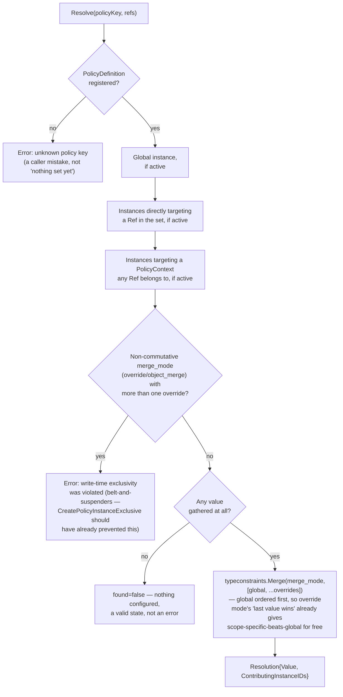

# TypedValue, TypeConstraints, and the Policy model

## Where this sits

[`01-build-order.md`](01-build-order.md) names Policy a Layer 1 base
("policy definitions/instances/contexts, resolution, generation-based
caching — DB only") and [`02-package-boundaries.md`](02-package-boundaries.md)
fixes its external shape (definitions/instances/contexts as Structure,
resolution as Evaluation, DB as Storage; no import of or from any other
base). Neither decided what a definition, instance, or context actually
*is*. This doc closes that gap, the same way
[`09-gatehouse-core-model.md`](09-gatehouse-core-model.md) closed it for
Gatehouse-core.

This also absorbs and supersedes Lighthouse's `pkg/typedvalue`
generalization design (`lighthouse-docs/lighthouse_typedvalue_generalization_design_v1.md`
in the Lighthouse repo) — that document's dimension/unit/constraint model
is adopted close to unchanged; what's new here is building it in from day
one as the foundation two other things sit on, rather than retrofitting it
under an already-shipped `security_policy` table the way Lighthouse would
have had to.

**Scope correction from where this started.** Policy was first discussed
as a security-policy system needing a realm-free attachment model. It's
broader than that: one typed-value foundation serves **policy and runtime
app config as the same mechanism**, not two — the exact gap Lighthouse's
own typedvalue doc named (§1.1: "config never adopted it") and never
closed. A config default and a security-policy clamp are both "a typed
value, resolved against a target, with rules about what's a valid value" —
nothing about that sentence is policy-specific.

| Concept | Status |
|---|---|
| typedvalue as its own module, Layer 0, no DB | confirmed |
| typeconstraints as its own module, depends on typedvalue only | confirmed |
| Dimension-map model (sparse map, not `[]UnitTerm`-only) | confirmed, ported from the typedvalue design doc |
| `count:<what>` always parameterized; no bare `count` | confirmed, ported |
| Currency as one non-convertible-unit dimension | confirmed, ported |
| Mass canonicalized to gram | confirmed, ported |
| Affine vs. vector distinction (`SemanticType` axis) | confirmed, ported |
| `allowed_values` stays in typedvalue; `min`/`max`/length/pattern move to typeconstraints | confirmed, ported |
| Formatting, human-input parsing, compound-unit display | deferred, same as the source doc |
| Policy serves config and security policy as one mechanism | confirmed |
| No SecurityContext containment tree; one generic Target + PolicyContext | confirmed |
| `Ref` (open `RefKind`/`RefKey` pair) as the atom Policy resolves against | confirmed |
| PolicyContext membership is `Ref`s only — no nested PolicyContexts | confirmed |
| Resolution takes a *set* of Refs, not one | confirmed |
| Non-commutative merge modes (`override`, `object_merge`) need write-time exclusivity; others don't | confirmed |
| `policy_generation` counter, bumped by definitions/instances/context membership | confirmed |
| `PolicyDeleteBlocker` (can't delete a definition still referenced) | confirmed, carried forward |

## typedvalue — what a value means

*Ported from the Lighthouse design doc; see that doc for the full
reasoning on each point. Summarized here, not re-derived.*

A **dimension** is a sparse map from dimension name to integer exponent
(`{"mass":1,"length":2,"time":-3}` for a watt), not Lighthouse's original
`[]UnitTerm`, because a map has exactly one canonical serialization and
`[]UnitTerm` doesn't — two authored orderings of the same quantity
compared unequal under the old model. The authored term list is kept
*alongside* the derived map (it's what renders back as `kg·m²·s⁻³`), it's
just no longer the only representation anything compares against.

The base dimension set is the seven SI base dimensions in full, plus
three Archipelago/Lighthouse-specific additions:

- `count:<what>` — always parameterized (`count:request`, `count:retry`),
  never bare `count`, because a bare `count` cancels against itself
  (`count/count` = dimensionless, indistinguishable from a real ratio).
  Registering a new `count:<what>` name follows the same reserved-prefix
  hygiene rule gatehouse-core's permission namespaces already use (see
  "Permission namespace reservation" in `09-gatehouse-core-model.md`) —
  not a security boundary, a collision guardrail.
- `currency` — one dimension; specific currencies are **non-convertible
  units** within it (no static USD/EUR factor exists), not one dimension
  per currency. Money is stored as integer minor units, never float.
- `angle`/`solid_angle` — kept distinct from "dimensionless" so a radian
  never compares equal to a bare fraction.

**Mass is canonicalized to the gram, not the kilogram** — SI's own
kilogram-as-base-unit is the one base unit with a prefix baked into its
name, which breaks a uniform prefix ladder. Archipelago doesn't inherit
that exception.

**Units** (`Name`, `Symbol`, `Dim`, `Factor`, `Offset`, `Affine`,
`Convertible`) have no separate `Kind` field — two units are the same
kind iff their `Dim` maps are equal, so a redundant string that could
disagree with the dimension map never exists. Compound units (`m/ft`,
energy-per-byte-per-second) are derived by composing component
dimensions and factors, never pre-registered; the system permits
semantically meaningless compounds the same way arithmetic permits
`0/0`-shaped expressions — closure requires it, and garbage is only
reachable through garbage operations.

**Prefixes** store `(Step, Binary)`, never a precomputed multiplier
(`int64` overflows before `zetta`/`zebi`); the multiplier is computed at
the call site. The full SI ladder (through ronna/quetta, ronto/quecto)
and the full IEC binary ladder (through yobi) are both supported, with
the binary walk capped at step 8 since IEC 80000-13 defines no binary
prefixes past it.

**Affine vs. vector is a distinct axis from dimension, carried as
`SemanticType`**, because dimension alone can't separate a timestamp from
a duration (both time-dimensioned) or distinguish torque from energy
(both `kg·m²·s⁻²`). `timestamp − timestamp = duration`,
`timestamp + duration = timestamp`, `timestamp + timestamp` is an error —
the identical shape as absolute-vs-relative temperature. Affine values
carry `Offset` in addition to `Factor` and are barred from compound
expressions (`°C/second` is meaningless; `K/second` isn't).

**`allowed_values` stays here, not in typeconstraints**, because an enum
without its member set isn't a complete description of what the value
*is* — the dividing line (§ below) is "completes the type" vs. "restricts
values within an already-complete type."

**Deferred, same as the source doc, for the same reasons:** a human-input
parser (`2GB` typed at a CLI), compound-unit formatting
(`1.5 MB/s`), and reconciling `SemanticIdentifier` against
`LighthouseURIFieldKind`'s entity-reference kinds. Display-only
formatting (render, don't parse) is a legitimate first version.

## typeconstraints — what rules apply to a value

*Ported from the source doc's §7, a one-way dependency on typedvalue.*

The dividing line: a constraint that **completes a type** stays in
typedvalue (`allowed_values`); a constraint that **restricts values
within an already-complete type** lives here (`min`, `max`, length,
pattern). An `int` is fully described without `min`/`max`; an enum is not
fully described without its member set.

Two more things belong here specifically because they need both a type
and a rule to check against each other, which is exactly this package's
job:

- **`merge_mode` type-coherence.** `minimum`/`maximum` require an ordered
  type; `boolean_and`/`boolean_or` require boolean; `object_merge`
  requires a JSON-shaped value. A `PolicyDefinition` registering
  `boolean_and` against an int-typed value is rejected here, at
  registration, not silently accepted the way Lighthouse's own
  `ValidateValue` let it through.
- **Clamps.** A bound declared at one scope limiting what a narrower
  scope may set is the same type-dependent family as range constraints,
  just applied to "what another value is allowed to be" instead of "what
  this value is allowed to be."

## Why Policy's attachment model looks nothing like a containment tree

Lighthouse's policy system had its own containment hierarchy —
`SecurityContext` kinds `lighthouse → realm → app-realm → app-instance →
alias-group → job-namespace` — entirely separate from Grant's `Context`.
Most of those kinds are realm-shaped special cases: `realm`, `app-realm`,
and the realm-qualified forms of `alias-group`/`job-namespace` all exist
because one Lighthouse instance served many apps. Archipelago's "one
instance per app (or suite)" architecture already removed that need for
Grant (`09-gatehouse-core-model.md`'s "Why no realm" section); Policy gets
the same removal, but needs a replacement for one thing Grant's model
doesn't have to solve: **policy must bind to things Gatehouse-core
defines — principals, groups, roles, app-level contexts — without
depending on Gatehouse-core**, since Policy is a standalone, DB-only
Layer 1 base per `02-package-boundaries.md`'s isolation rule.

The replacement is one generic primitive, not a tree:

```text
Ref
- ref_kind    open vocabulary — "principal", "group", "role", "context",
              or anything a caller invents later; Policy never validates
              or interprets this string
- ref_key     opaque identifier within that kind
```

A `Ref` is exactly the same discipline Grant's own `context_type` +
`context_id` already uses — Policy stores and compares it, never parses
it. Gatehouse-core (or any other base) decides what `"principal"` or
`"role"` means and how to produce the right `ref_key` for one; Policy
only ever sees opaque strings.

## PolicyContext — a named, reusable set of Refs

```text
PolicyContext
- policy_context_id
- key
- description
- created_at / updated_at

PolicyContextMember
- policy_context_id
- ref_kind
- ref_key
- created_at
```

This is the "apply one override to a group of services" case from
earlier discussion, generalized: a `PolicyContext` is a named,
independently-editable set of `Ref`s, so an override can target the set
once and have membership change later without touching the override
itself — the same "pointer, not an embedded value" reasoning
`03-multi-instance-and-suites.md` already uses for the status-aggregation
policy pointer.

**No nested PolicyContexts — membership is `Ref`s only, never another
`PolicyContext`.** This is the one invariant worth stating as firmly as
"no realm anywhere in this model": a `PolicyContext` that could contain
other `PolicyContext`s recreates a containment tree under a new name,
which is the exact mistake this doc exists to not repeat. If a real case
ever needs it, that's a deliberate, documented decision to make then —
not a default capability sitting unused today.

## PolicyDefinition and PolicyInstance

```text
PolicyDefinition
- policy_definition_id
- policy_key           namespaced, e.g. myapp.rate_limit.max_requests
- value_type           typedvalue.Definition — what the value means
- constraints          typeconstraints.Set  — what rules apply to it
- merge_mode           minimum | maximum | boolean_and | boolean_or |
                        override | enum_strength_order | object_merge
- activation_mode      immediate | deferred — consumer decides what
                        "deferred" means for its own long-lived resources;
                        Policy doesn't assume Gatehouse-core's Session
                        exists to define it against
- default_binding_mode inherited_live | copied_at_creation | explicit_override
- lifecycle_state      active | archived
- created_by / updated_by / timestamps

PolicyInstance
- policy_instance_id
- policy_definition_id
- target_kind          global | ref | policy_context
- ref_kind / ref_key          (required iff target_kind = ref)
- policy_context_id           (required iff target_kind = policy_context)
- value                 typed per the definition's value_type
- binding_mode          inherited_live | copied_at_creation | explicit_override
- lifecycle_state       active | archived
- metadata               opaque
- created_by / updated_by / timestamps
```

**There is no separate "default value" field on `PolicyDefinition`.** The
platform-wide default is an ordinary `PolicyInstance` with
`target_kind = global` — one mechanism for "what applies absent an
override," not two places a default could live. This is the same
"pointer/value unification" instinct as the PolicyContext section above,
applied one level up.

`binding_mode` (per instance) and `default_binding_mode` (per definition)
carry forward from Lighthouse unchanged — nothing about live-vs-copied
resolution tracking is realm-shaped. `activation_mode` is renamed from
Lighthouse's `new_sessions_only` to `deferred` specifically because
Policy can't reference Gatehouse-core's `Session` to define "new" against
— the consumer integration decides what counts as a fresh acquisition
worth picking up the new value.

## Resolution takes a set of Refs, not one

This is the piece that actually answers "policy can bind to principals,
groups, roles, contexts, and more": Policy's resolver doesn't know what a
role or a group is, and doesn't need to. The **caller** gathers every
`Ref` that applies to the current evaluation — a principal's own ref, the
refs of every group it belongs to, the refs of every role it holds, the
active context's ref — using whatever expansion logic that caller already
has (Gatehouse-core's own role/group expansion, for instance, which
already exists and is already tested). Policy's resolver takes that whole
set and treats every member identically:

```text
Resolve(ctx, policyKey string, refs []Ref) (value, error)
```

For a given `policyKey`, the resolver gathers: the global instance (if
any), any instance directly targeting a `ref` in the set, and any
instance targeting a `PolicyContext` that any `ref` in the set is a
member of. Everything found is combined with `merge_mode` — not ranked by
"direct beats group" or "group beats global," the same graduated-
specificity trap `09-gatehouse-core-model.md`'s Deny section already
named and avoided for Grant. A caller that wants "this principal's own
override always wins regardless of what groups it's in" gets that by
choosing `override` mode and relying on the write-time exclusivity rule
below, not by Policy secretly ranking attachment kinds.

`Resolve`'s actual gather-then-merge shape — nothing here ranks a
source over another; every applicable value is collected first, and
only `merge_mode`'s own math decides the result:



### Multiple applicable instances: commutative modes merge, others need exclusivity

| `merge_mode` | Commutative/associative | Multiple simultaneous instances |
|---|---|---|
| `minimum`, `maximum` | yes | merge freely — `min`/`max` over any count of values is well-defined |
| `boolean_and`, `boolean_or` | yes | merge freely |
| `enum_strength_order` | yes (min/max over a declared strength ordering) | merge freely |
| `override` | no — "ignore everything else, use this" has no meaning for more than one "this" | write-time exclusivity: creating an instance that would make two non-global `override`-mode instances simultaneously reachable from the same `Ref` is rejected |
| `object_merge` | no in general — key collision makes the result order-dependent | same write-time exclusivity as `override` |

This is a direct consequence of each `merge_mode`'s own math, not a new
precedence system layered on top: the commutative modes never need a
conflict rule because the operation itself doesn't care about order or
count, and the two non-commutative modes get the one rule that actually
matches why they're non-commutative — at most one active source, checked
when a write would create a second, not resolved by ranking at read time.

That check and the write it guards run inside one transaction
(`Writer.CreatePolicyInstanceExclusive`), serialized per
`PolicyDefinitionID` by a `pg_advisory_xact_lock` taken first — not a
separate read-then-write at the facade layer. Two concurrent creates
for different new targets under the same non-commutative definition
could otherwise each see "no others exist" against the other's
pre-commit state and both succeed, which is exactly the invariant this
rule exists to prevent in the first place.

## Generation and freshness

`policy_generation` — the counter `09-gatehouse-core-model.md` already
reserves a slot for without importing Policy's type to get it. One
counter, bumped by: a `PolicyDefinition` change (value_type, constraints,
merge_mode, activation_mode), a `PolicyInstance` change (created, value
changed, lifecycle changed), or a `PolicyContextMember` change (added or
removed) — anything that could change what `Resolve` returns for any
`Ref`, regardless of which table the change landed in. Same "one
invariant, stated once" discipline as Gatehouse-core's own generation
counters, for the same reason: three unsynchronized bump points
scattered across Definition/Instance/Context code is exactly the drift
this is written down to prevent.

**Caches never override revocation/deactivation** — the same invariant
Gatehouse-core's generations section states for grants applies here
unchanged: an archived `PolicyInstance` or a membership removal takes
effect immediately regardless of what a cached resolution still claims.

## PolicyDeleteBlocker — carried forward

Deleting (or archiving) a `PolicyDefinition` that live `PolicyInstance`s
still reference needs the same blocker-reporting shape Lighthouse already
had: report what's still referencing it (instance, its target, which
`Ref` or `PolicyContext`) rather than either silently cascading or
failing with no actionable detail. Carried forward essentially unchanged
— nothing about it was realm-shaped to begin with.

## What stays explicitly deferred

- **typedvalue formatting/parsing.** Display-only for now, per the source
  doc; a human-input parser and compound-unit formatting aren't built.
- **Nested PolicyContexts.** Deliberately excluded above, not just
  unbuilt — see that section for why this is a firmer line than most
  "deferred" items in this doc.
- **Cross-instance/federated policy storage.** `02-package-boundaries.md`
  already flags Policy as a plausible candidate for a swapped Storage
  implementation in a federated deployment; the shape of that swap isn't
  designed here.
- **Exact `PolicyDeleteBlocker` field names.** The shape ("what still
  references this") is confirmed; field names aren't pinned down.
- **Entity-reference reconciliation** between typedvalue's
  `SemanticIdentifier` and anything resembling Lighthouse's
  `LighthouseURIFieldKind`. Named as a real gap in the source doc; still
  a real gap here.
