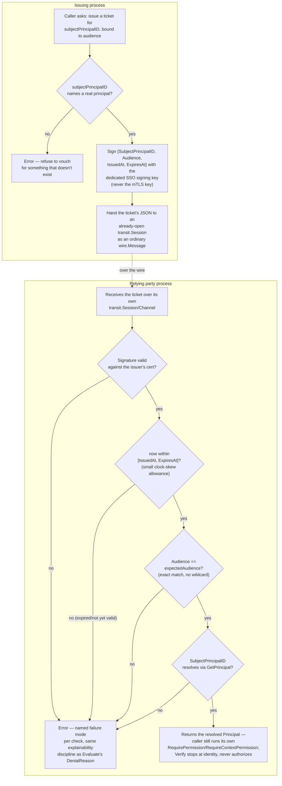

# SSO tickets: issuance and verification

## Where this sits

[`01-build-order.md`](01-build-order.md) names this a Layer 3 compound
feature needing Gatehouse-core + Cert-store (a dedicated signing key,
*not* the mTLS key) + Transit for delivery, and describes the shape in
five words: "Audience-bound, identity-only, short-lived." Everything
below is pinning down what those five words actually mean field-by-field
before writing any code — the same discipline
[`10-typedvalue-and-policy-model.md`](10-typedvalue-and-policy-model.md)
and [`11-transit-model.md`](11-transit-model.md) followed for their own
bases.

This is genuinely new ground — no prior Lighthouse doc covers it, unlike
Transit (ported from `lighthouse_transport_layer_design_plan_v1.md`) or
typedvalue (ported from its own generalization doc). The design below is
built from the build-order row's own constraints, not adapted from
anything that already existed.

## What a ticket is, and what it deliberately is not

A ticket is a short-lived, signed assertion that one specific principal
was recently authenticated by the issuer, scoped to one specific
audience. **Identity-only** means a ticket carries no permission claims
of its own — it proves *who*, never *what they're allowed to do*. The
destination service that receives one still runs its own Gatehouse-core
`evaluation.RequirePermission`/`RequireContextPermission` check against
the resolved principal, the same chokepoint every other authorization
path in this design goes through. A ticket is an identity handoff
between two things that already trust the same Gatehouse-core authority
domain, not a capability token.

**Audience-bound** means a ticket names the one destination it's valid
for. A ticket minted for service A is worthless presented to service B,
even before its signature is checked against anything — the field is
part of what gets signed, not an unenforced hint.

**Short-lived** means the only revocation story a ticket needs is
"wait for it to expire." No revocation list, no server-side state at
all on the verifying side — see "What's deliberately out of scope"
below for why this is a decision, not an oversight.

## Field shape

```go
type Ticket struct {
    TicketID             uuid.UUID // nonce; see replay-protection scope note
    SubjectPrincipalID   uuid.UUID
    Audience             string    // the one destination this ticket is valid for
    IssuedAt             time.Time
    ExpiresAt             time.Time
    Signature            []byte    // over the canonical encoding of every field above
}
```

No `Issuer` field: there's exactly one trusted signing key per
Gatehouse-core authority domain in this design (see "Dedicated signing
key" below), known to every verifier out-of-band, the same way a single
embedded CA's root is already trusted out-of-band in
[`05-pki-and-signing.md`](05-pki-and-signing.md). Multiple
simultaneously-trusted issuers (key rotation, federation) is exactly the
kind of thing deferred until it's a real need, not designed speculatively
— see scope list.

No permission/role claims, no arbitrary metadata: a ticket that grew an
opaque payload field would be the first step toward it quietly becoming
a second authorization mechanism, undermining "identity-only" as an
actual invariant rather than a name.

## Signing

**ECDSA P-256 only**, matching every other signing key already built in
this codebase (certstore's own CA intermediate, every test fixture's CA
hierarchy). This is a narrower choice than Cert-store's own `Signer`
interface technically requires (`crypto.Signer` is algorithm-agnostic),
made deliberately: Cert-store's CA already solved "sign correctly across
whatever algorithm the configured key happens to be" once, inside
`x509.CreateCertificate`'s own internal hash/algorithm negotiation. This
package signs raw bytes directly, with no such library doing that
negotiation underneath it, so it picks one algorithm outright rather
than reimplementing that negotiation for a dependency unit that only
ever needs one key.

The canonical bytes signed are every field above except `Signature`
itself, in fixed field order, each a deterministic encoding (UUIDs as
their canonical string form, timestamps as RFC3339Nano in UTC) —
SHA-256 over that byte sequence is the digest `crypto.Signer.Sign`
receives. Verification recomputes the identical digest and checks it
with `ecdsa.VerifyASN1` against the signing key's public key.

### Dedicated signing key, not the mTLS key

The build-order row is explicit about this, and the reason is the usual
one for never reusing a key across purposes: the mTLS CA's intermediate
signs *certificates* presented during a TLS handshake — a ticket-signing
key signs *ticket payloads* presented inside an already-established,
already-authenticated channel. Collapsing them would mean a ticket
verifier also has to trust (and validate) the entire mTLS chain
machinery just to check a ticket signature, and a compromise of one
key's use case bleeding into the other's. The ticket-signing key is a
`certstoreEvaluation.Signer` value like any other — a self-signed
certificate wrapping an ECDSA P-256 key, constructed once per
Gatehouse-core authority domain, with its public certificate distributed
to every verifier out-of-band (SDK setup config, the same place a root
CA bundle is already distributed per `05-pki-and-signing.md`). It is not
part of the mTLS CA's trust chain and is never used to sign a CSR.

## Issuance

```go
func Issue(ctx context.Context, principals PrincipalStore, signer certstoreEvaluation.Signer, subjectPrincipalID uuid.UUID, audience string, ttl time.Duration) (Ticket, error)
```

Checks `subjectPrincipalID` actually names a real principal before
signing anything for it — the same "don't vouch for something that
doesn't exist" discipline `EnsureMTLSCredential` and `EnsureSession`
already follow for their own subjects. This is also the first thing in
this codebase to need a principal lookup *by ID* rather than by key —
Gatehouse-core's `Reader` only has `GetPrincipalByKey` today, used by
`EnsurePrincipal`'s own idempotency check. `GetPrincipal` (by ID) is a
narrow addition this feature needs, not a general CRUD pass.

`ttl` is the caller's choice, not a policy this package enforces — "how
short is short-lived" is a deployment decision (seconds for a
same-datacenter handoff, a couple of minutes for a user clicking through
a Viewer redirect), not something to hardcode.

## Verification

```go
func Verify(ctx context.Context, principals PrincipalStore, signerCert *x509.Certificate, ticket Ticket, expectedAudience string, now time.Time) (structure.Principal, error)
```

In order — each check is a distinct, named failure mode, the same
explainability discipline Gatehouse-core's own `Evaluate` follows for
its `DenialReason`:

1. Signature valid against `signerCert`'s public key.
2. `now` is within `[IssuedAt, ExpiresAt]` (with a small clock-skew
   allowance on `IssuedAt`, since issuer and verifier are different
   processes).
3. `ticket.Audience == expectedAudience` — exact match, no wildcard or
   prefix semantics; a ticket is bound to one destination, not a class
   of destinations.
4. `SubjectPrincipalID` resolves to a real principal via
   `principals.GetPrincipal`.

Returns the resolved `structure.Principal` on success — a caller then
runs its own `evaluation.RequirePermission`/`RequireContextPermission`
against `Principal.PrincipalID` exactly as any other resolved-identity
path in this design does (`peerauth.Require` is the closest existing
shape). This package stops at identity resolution on purpose; folding a
permission check into `Verify` itself would blur "identity-only" back
into "sometimes also authorization," the same anti-pattern the field
shape already rules out above.

The whole lifecycle, issuer and relying party as two different
processes, each with its own `Verify` call — nothing here is a single
in-process function call, which is easy to lose sight of in the
numbered-checklist form above:



## Delivery

Transit's role is exactly what the build-order row says and nothing
more: hand the ticket's canonical JSON encoding to an already-open
`transit.Session`/`Channel` as a `wire.Message{Type: "sso.ticket", ...}`
over `RequestResponse` or `EventPush`, whichever the calling protocol
already uses for that exchange. No new wire-level machinery — `wire.Kind`
and `DeliveryClass` already cover this; a ticket is just a payload like
any other application message, per `11-transit-model.md`'s own "transport
stays ignorant of authority" rule. This package does not own the
send/receive call sites; it owns `Issue`/`Verify` and leaves wiring them
to a Transit message to whatever protocol actually needs SSO (a future
Viewer redirect flow is the most likely first real caller, not built
here).

## What's deliberately out of scope

- **Replay protection beyond short expiry.** `TicketID` is carried as a
  nonce field so a verifier that *wants* single-use enforcement has
  something to key a short-lived, bounded, in-memory seen-ticket cache
  on — but this package does not build or require one. A verifier that
  needs genuine single-use semantics (not just a short validity window)
  owns that cache itself; it's an application-level call about how much
  replay risk a specific audience is willing to accept in its own short
  window, not a universal answer this base should force on every
  verifier. Consistent with `03-multi-instance-and-suites.md`'s own
  stance on real consensus: a specific, narrow tool is given (the nonce
  field), not a generic mechanism built speculatively.
- **Revocation.** Short expiry is the entire revocation story. A ticket
  that needed to be revocable before its own expiry would need
  server-side state the whole rest of this design was built to avoid for
  something this short-lived.
- **Multiple simultaneously-trusted signing keys / rotation /
  federation.** One key per authority domain, distributed out-of-band,
  same as the embedded CA's root. Real multi-key support is exactly the
  kind of thing to build from a real second-issuer need, not in advance
  of one.
- **A compact single-string wire format (JWT-style).** Tickets travel
  over an already-authenticated Transit channel, not as a bearer string
  pasted into a URL or header — there's no reason to adopt JWT's
  base64url-triple format instead of the plain struct + JSON encoding
  every other message in this design already uses. Reinventing JWT
  under a different name would be adopting its complexity (header
  negotiation, `alg: none` class mistakes) for a wire-format problem
  this design doesn't have.
