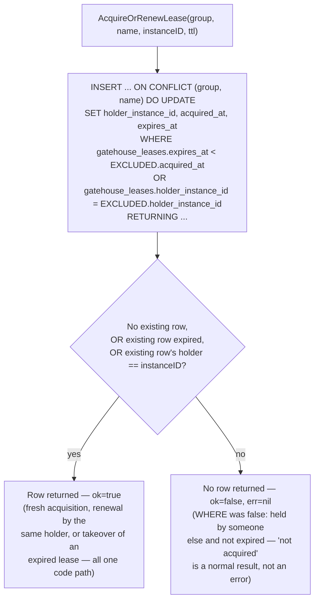
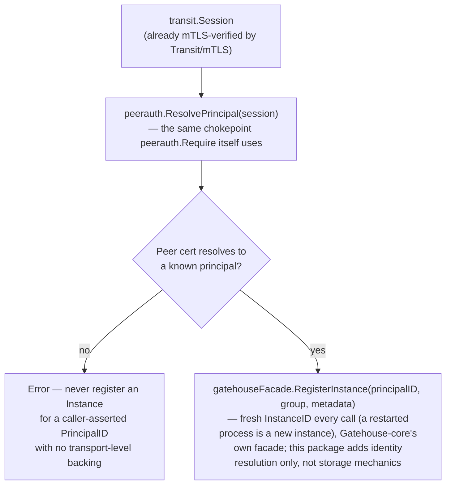

# Registry and leases: the concrete slice of multi-instance coordination

## Where this sits

[`01-build-order.md`](01-build-order.md) names this Layer 3 feature
"Multi-instance coordination (peer discovery, broadcast, locks)," needing
Transit + Gatehouse-core "(registry/grouping concept)." The dependency
graph draws its real inputs as mTLS and Peer authorization specifically,
not raw Transit/Gatehouse-core — coordination only means something once
a connecting peer's identity is already verified and resolved to a
principal, which is exactly what those two integrations already give
for free.

[`03-multi-instance-and-suites.md`](03-multi-instance-and-suites.md) is
the toolkit survey this pins down into actual field shapes and
functions, cheapest-first:

| Tool | This pass |
|---|---|
| Peer discovery | **Built here** — a registry of live instances, grouped |
| Lease-based locks | **Built here** — the same registry's other half |
| Broadcast / pub-sub | **Not new code** — `EventPush` + an already-authenticated Transit session, pointed at peers the registry just helped discover. Nothing to build; see below |
| Shared, slowly-changing state distribution | Same registry mechanism, generalized — not built this pass, no current consumer |
| Gossip fallback, CRDTs, real consensus | Deliberately not built — `03-multi-instance-and-suites.md` already named these out of scope |

## Where the registry concept lives

The build-order row's parenthetical — "Gatehouse-core (registry/grouping
concept)" — is the same shape `Session` already took: a base record that
belongs in Gatehouse-core itself (it's about principals and references
them directly), with the Transit-touching behavior around it built as a
separate integration package, same split as `Session` (lives in
Gatehouse-core) vs. `sessions` (the Gatehouse-core + Transit integration
that binds one to a live connection).

So: `Instance` and `Lease` are new Gatehouse-core structures, storage,
and facade functions — not a new base module. The new integration
package, `registry`, composes Gatehouse-core's `Instance`/`Lease` facade
with `peerauth` (to resolve the registering connection's principal) —
mirroring exactly how `sessions` composes `Session` with Transit's
connection lifecycle.

## Instance: peer discovery

```go
type Instance struct {
    InstanceID      uuid.UUID
    PrincipalID     uuid.UUID // the principal this instance authenticates as
    Group           string    // "app + instance-group" tag, free-form — same registration-free discipline as Alias's Table
    Metadata        json.RawMessage // opaque, never authorized on — same rule as Principal.Metadata
    RegisteredAt    time.Time
    LastHeartbeatAt time.Time
}
```

`InstanceID` is fresh on every registration, generated by the facade the
same way `EnsurePrincipal` generates a `PrincipalID` — a process
restarting gets a new instance identity, which is correct: it's a new
OS process with its own in-memory state, not a resumption of the old
one. `Group` deliberately isn't a registered `ContextType` or any other
pre-declared vocabulary — same free-form discipline Alias's `Table`
field already uses, since the actual set of groups in use is entirely
app-defined and nothing here needs to validate it against anything.

**Liveness is heartbeat-based, computed at query time, with no
background sweep.** `ListInstancesByGroup` takes an `activeSince`
cutoff and simply excludes rows whose `LastHeartbeatAt` is older than
it — the caller decides what "stale" means for its own use (a tight
few-seconds window for "who's alive right now," a looser one for "who's
been around recently"), the same way `Issue`'s `ttl` parameter in
[`12-sso-tickets-model.md`](12-sso-tickets-model.md) left "how short is
short-lived" to the caller rather than hardcoding a policy. No cron, no
expiry job, no DELETE-on-timeout: a dead instance's row simply stops
appearing in any query with a tight enough cutoff, exactly as a
Kubernetes Pod that stops reporting readiness simply stops being routed
to — nothing has to actively notice and remove it for discovery to be
correct. `Deregister` exists for the graceful-shutdown case, which
doesn't need the cutoff mechanism to still cover it correctly.

## Lease: locks

```go
type Lease struct {
    Group            string
    Name             string
    HolderInstanceID uuid.UUID // an Instance, not a Principal — see below
    AcquiredAt       time.Time
    ExpiresAt        time.Time
}
```

Primary key is `(Group, Name)` — one lock per named thing per group.
`HolderInstanceID` names an `Instance`, deliberately not a
`PrincipalID`: "exactly one instance should be doing X right now" is
coordination between *replicas* of the same service (the same
principal, many instances), so the thing a lease has to distinguish
between is instances, not principals.

**Acquisition is a single atomic SQL statement, no read-then-write
race.** `AcquireOrRenewLease` is one
`INSERT ... ON CONFLICT (group, name) DO UPDATE ... WHERE <expired or
same holder> RETURNING ...`: if the conflicting row is held by someone
else and isn't expired, the `WHERE` clause is false, Postgres leaves the
row untouched, and `RETURNING` produces no row — the facade reads that
as "not acquired," no error, no retry loop, no separate read-then-CAS
dance in application code. This is the same "parameterization and the
database's own guarantees protect correctness" discipline
`AGENTS.md`-equivalent conventions already use elsewhere in this
codebase (alias's own `UpsertAlias` conflict handling, grants' active-row
checks) — Postgres is already transactional; there's nothing to
reimplement in Go.

The one `INSERT ... ON CONFLICT ... WHERE ...` statement decides all
three outcomes — first acquisition, renewal by the same holder, and a
rival's rejection — with no branch in Go at all:



**No background expiry sweep here either.** An expired lease is simply
acquirable by the next caller that asks — there's nothing to clean up
for correctness, only for tidiness, and tidiness isn't a requirement
this feature has.

`ReleaseLease` is a conditional `DELETE ... WHERE holder_instance_id =
$holder`, unconditionally successful (no error, no "you didn't hold
this" signal) whether or not it actually held the lease — releasing
something you don't hold changes nothing, the same "already in the
desired end state" idempotency `RevokeSession` and `ReleaseAlias` already
use for their own release-shaped operations. A lease is a liveness
primitive, not a security boundary; the cost of a slightly-too-lenient
release call is a lock contended one cycle sooner, never a
confidentiality or integrity problem.

## Broadcast: not new code

The build-order row lists broadcast alongside discovery and locks, but
[`03-multi-instance-and-suites.md`](03-multi-instance-and-suites.md)
already settled this: "`Event/Push` delivery class + mTLS peer transport
— already built, just pointed at a new audience." Nothing in this
package sends a message to a peer. A caller that has used `registry` to
discover which instances are in a group, and already holds (or opens) a
`transit.Session` to each, pushes to them with the Transit `Push` method
and an `EventPush`-class `wire.Message` exactly as any other event
delivery in this design already works. Building a fan-out helper here
would be building infrastructure for a need nothing in this codebase has
yet — the same restraint `03-multi-instance-and-suites.md` already
applied to CRDTs and consensus, just at a smaller scale.

## What the `registry` integration package actually provides

```go
func RegisterFromSession(ctx context.Context, reader gatehouseFacade.Reader, writer gatehouseFacade.Writer, session transit.Session, group string, metadata json.RawMessage) (structure.Instance, error)
```

Resolves `session`'s peer identity to a principal via
`peerauth.ResolvePrincipal` (the same chokepoint `peerauth.Require`
itself uses), then registers an `Instance` for that principal — an
instance's identity in the registry is only ever as trustworthy as the
mTLS-verified connection that registered it, never a caller-asserted
`PrincipalID` with no transport-level backing.

That one function is the whole of the package's own logic. Since the Router
([`21`](21-router-and-handshake-model.md)) exists it also ships
`RegisterHandler`, which is that function as a `router.Handler` for the
`registry.register` route, and `registry.Register`, the client half. The
request carries a group and optional metadata and deliberately **no
principal**: the instance belongs to whoever the connection's verified
certificate resolves to. Registered with no permission, any peer that
resolves to a principal may register itself into any group, which is what
`RegisterFromSession` always allowed; registering through `routerauth.Handle`
with a permission is how a deployment narrows that, and is the recommended
shape.

`Heartbeat`, `Deregister`,
`ListPeers`, `AcquireOrRenewLease`, and `ReleaseLease` need neither
Transit nor `peerauth`, so they're called directly as
`gatehouse-core/facade` functions and are **not** re-wrapped here —
`registry/doc.go` makes this an explicit decision, not an omission:
pass-through wrappers with no behavior of their own would be
indirection for its own sake. (An earlier draft of this doc described
those as `registry` wrappers, including separate `AcquireLease` and
`RenewLease`; there is one `AcquireOrRenewLease`, since the single
atomic statement above already covers both.)


