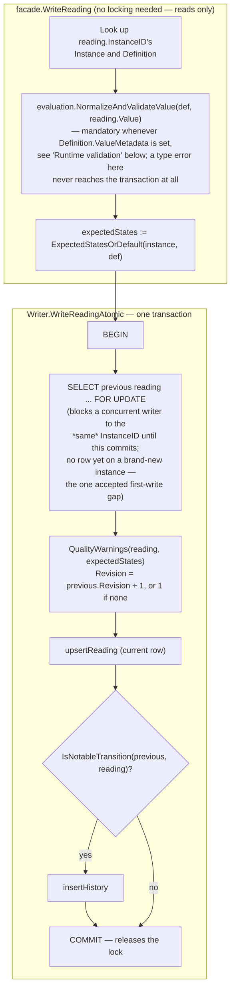

# Vitals: current-condition records, adapted from Lighthouse

## Where this sits, and why it's a base, not a Layer 3 feature

Lighthouse already built this, substantially — not design-only despite
its own supplement doc's header: `pkg/vitals`, a dedicated `vitals` DB
schema, built-in definitions, Gatehouse permissions/contexts, a Policy-
backed default-group resolver, admin handlers, a Go SDK, URI descriptors,
CLI/shell commands, and a Viewer module all exist in the Lighthouse repo
today (`lighthouse-docs/lighthouse_vitals_subsystem_supplement_v1.md`
and `lighthouse_vitals_subsystem_implementation_plan_v1.md`). This doc
ports the model, not the code — Archipelago's topology changes enough of
the shape that a line-for-line port would carry Lighthouse's realm
assumptions straight back in.

An earlier pass through `01-build-order.md` named "Status/health
aggregation" as a Layer 3 feature needing Policy + Transit + the
registry's grouping concept — written before this doc, from the
narrower idea of "roll up N instances' statuses into one computed
value." Lighthouse's actual Vitals is bigger than that: a general
current-condition record system (a service's readiness, a queue's
depth, a job's progress, a storage gauge) that's useful for a *single*
process with no peers at all, the same way Alias is useful standalone.
Cross-instance rollup turns out to be one consumption pattern of
Vitals' own Group + default-group-policy-pointer mechanism, not a
separate thing to build. So Vitals is **Layer 1** (DB only, like Alias),
and Status/health aggregation (`01-build-order.md`'s Layer 3 table) is
now just "use a Vitals Group, scoped to the registry's grouping
concept, with a Policy-pointer default" — no new aggregation engine.

## The one big simplification this topology unlocks: no Scope type

Lighthouse's `vitals.Scope` is a closed four-case enum —
`lighthouse | realm:<id> | app:<id> | app_instance:<app_id>:<instance_id>`
— because Lighthouse has a realm containment hierarchy and Vitals needs
to say which level of it an instance belongs to. Archipelago has no
realm, no containment hierarchy anywhere, and no privileged
built-in/app split baked into its base layer (everything is a
principal). None of the reasons that enum exists apply here.

Gatehouse-core already has the exact primitive Vitals needs for "the
ownership/authorization boundary a thing lives in": `Context`, an open
`(Type, ID)` exact-match pair — literally what Grant already scopes
against. Policy already has the exact primitive Vitals needs for "a
pointer to a scoped config value": `Ref`, an open `(Kind, Key)` pair
Policy resolves against without caring what `Kind` means. These are the
*same shape* — and this doc uses that directly rather than coincidentally:

**Vitals' `Instance.ScopeType` / `Instance.ScopeID` are plain strings,
with no enum and no validation against a closed set.** A caller scopes
an instance however it scopes everything else it does in Gatehouse-core
— reusing an existing Context type, or registering a new one, exactly
like `aliasauth.ContextTypeTable` did for Alias. The *identical* pair
then serves two different jobs depending which integration consumes it:

```text
(ScopeType, ScopeID) --as a Gatehouse-core Context--> vitalsauth's permission checks
(ScopeType, ScopeID) --as a Policy Ref (Kind=ScopeType, Key=ScopeID)--> vitalsdefaults' default-group resolution
```

Vitals' own base package never imports Gatehouse-core or Policy to make
this work — it just stores two opaque strings, the same restraint
Alias's own `Table` field already uses. The two Layer 2 integrations
named below (`vitalsauth`, `vitalsdefaults`) are what actually interpret
the pair, each against exactly the one other base it needs, never
against each other.

## Core model: Definition / Instance / Reading, unchanged

The three-entity split carries over directly — it isn't realm-shaped at
all:

```text
Definition   reusable meaning/type contract ("what kind of vital is this")
Instance     concrete observed thing in a scope ("which concrete thing")
Reading      current observation for one instance ("what is true now")
```

### Definition

```go
type Definition struct {
    DefinitionID          uuid.UUID
    DefinitionKey         string // dotted key, e.g. "vitals.service.liveness"
    DefinitionVersion     int
    SchemaHash            string
    Title                 string
    Description           string
    ValueMetadata         *typedvalue.Definition // nil if this vital carries no typed value
    AppValueMetadata      json.RawMessage         // opaque, never authorized on
    AllowedStates         []State                 // nil = no restriction beyond the closed State enum
    DefaultExpectedStates []State
    DefaultImportance     Importance
    DefaultTTL            *time.Duration
    DefaultDisplayHints   json.RawMessage
    AppMetadata           json.RawMessage
    CreatedAt             time.Time
    UpdatedAt             time.Time
    ArchivedAt            *time.Time
}
```

Two changes from Lighthouse's shape:

- **`ValueMetadata` is `*typedvalue.Definition`** — Archipelago's own
  `typedvalue` module, not a copy of it. This is a direct improvement,
  not just a rename: per the correction that started this module
  (`lighthouse_typedvalue_generalization_design_v1.md` ran ahead of
  Lighthouse's actual `pkg/typedvalue`), Archipelago's `typedvalue` is
  the more general target Lighthouse's own doc gestures toward but
  hasn't built — `Dimension` as a sparse canonical map, `Prefix`
  ladders, a real `Unit` registry — so this is the one subsystem in
  this port that gets *better*, not just *ported*, by construction.
- **No `OwnerKind`/`OwnerAppID`.** Lighthouse needed these because
  "Lighthouse-owned vs. app-owned" is a real, enforced distinction
  there. Archipelago already has a mechanism for exactly this
  question — the reserved-permission-namespace convention
  `gatehouse-core/facade/permission.go` already uses (`defaultReservedNamespaces`,
  extended with `AllowReservedNamespace` for a deliberate override) —
  and this doc reuses it rather than inventing a second one:
  `"vitals"` joins that reserved list, Vitals' own built-in definition
  keys (`vitals.service.liveness`, `vitals.queue.depth`, …) live under
  it, and an app registering its own `definition_key` under a
  different namespace is already distinguished by the namespace
  itself — no separate ownership field needed. `DefinitionKey`+
  `DefinitionVersion`+`SchemaHash` immutability (same key+version+hash
  is an idempotent no-op; same key+version+*different* hash is
  rejected) carries over unchanged — this invariant has nothing to do
  with realms.

Built-in definition keys, renamed from `lighthouse.*` to the reserved
`vitals.*` namespace, otherwise unchanged:

```text
vitals.service.liveness        vitals.service.readiness      vitals.service.uptime
vitals.service.memory_usage    vitals.service.cpu_usage
vitals.queue.depth             vitals.queue.oldest_item_age  vitals.queue.processing_rate
vitals.job.progress            vitals.job.phase
vitals.storage.used            vitals.storage.free           vitals.storage.usage_percent
vitals.connection.liveness      vitals.connection.latency
vitals.generic.health          vitals.generic.count          vitals.generic.duration
vitals.generic.rate            vitals.generic.percent        vitals.generic.bytes
```

### Instance

```go
type Instance struct {
    InstanceID      uuid.UUID
    ScopeType       string // see "no Scope type" above — open, unvalidated against any enum
    ScopeID         string
    InstanceKey     string // stable identity within (ScopeType, ScopeID) — the API/config handle
    DefinitionID    uuid.UUID
    SubjectType     string // free-form: "service", "queue", "job_run", ... — same openness as Policy's Ref.Kind
    SubjectKey      string
    DisplayName     string
    Description     string
    CategoryPath    []string // organizational only, not identity — max depth 8, max segment 64 runes
    ExpectedStates  []State
    Importance      Importance
    ReferenceRanges json.RawMessage
    DisplayHints    json.RawMessage
    ResourceURI     string // opaque; Archipelago has no URI resolver layer yet, see Deferred below
    ExternalURI     string
    DetailRoute     string
    AppMetadata     json.RawMessage
    CreatedAt       time.Time
    UpdatedAt       time.Time
    ArchivedAt      *time.Time
}
```

Uniqueness: `(ScopeType, ScopeID, InstanceKey)` — unchanged from
Lighthouse. Everything here (`CategoryPath`, `Importance`,
`ReferenceRanges`, `DisplayHints`, the three URI-shaped fields) is
topology-independent and carries over as-is.

### Reading

```go
type Reading struct {
    InstanceID       uuid.UUID
    State            State // required, closed enum
    Impact           Impact // optional, advisory
    ImpactScore      *int   // optional, advisory, 0..100
    Value            json.RawMessage
    Summary          string // max 280 runes, single line, no control characters
    ReasonCode       string // max 128 runes, dotted/snake/kebab token
    DetailsJSON      json.RawMessage
    ObservedAt       *time.Time
    UpdatedAt        time.Time
    ExpiresAt        *time.Time
    SourceInstanceID *uuid.UUID // registry's Instance, not a free-string app/app-instance pair
    ActorPrincipalID *uuid.UUID
    TraceContext     *logging.SpanContext
    QualityWarnings  []QualityWarning
    Revision         int64
}
```

Three changes from Lighthouse's shape, each a direct consequence of
what Archipelago already has that Lighthouse didn't when Vitals was
designed:

- **`SourceInstanceID *uuid.UUID` replaces `SourceAppID`/
  `SourceAppInstanceID`.** `06-logging-and-observability.md`'s own
  Resource table already identifies `registry`'s `Instance` as
  `service.instance.id` — "matches the grouping concept in
  `03-multi-instance-and-suites.md`." A reading reports where it came
  from the same way a log line's Resource does: a real reference to a
  real `registry.Instance` row, not a second free-string identity
  vocabulary for the same concept.
- **`TraceContext *logging.SpanContext` replaces `CorrelationID`/
  `CausationID`.** Archipelago already standardized on OTel's
  trace/span vocabulary over Lighthouse's own ad hoc
  narrative/correlation terms (`06-logging-and-observability.md`'s
  "Standard terms, not invented ones" section) — a Reading's
  correlation story is the same `logging.TraceID`/`SpanID` pair every
  other cross-process event in this design already carries, not a new
  one.
- **`LogEntryID`/`NarrativeID` dropped; `RequestedByPrincipalID`/
  `AuthoritySource` dropped.** The first pair references Lighthouse's
  Logbook, which has no equivalent here — nothing to link to. The
  second pair is real Gatehouse/Beacon vocabulary Lighthouse needed for
  delegation/assertion distinctions; Archipelago's own delegation story
  so far is `Session.AssertedByPrincipalID`, and no concrete Vitals
  write path yet needs to distinguish "who wrote this" from "whose
  authority was it written under." Keeping `ActorPrincipalID` alone and
  deferring the rest follows the project's own rule against fields for
  hypothetical future requirements — easy to add back the moment a
  real asserted-write case shows up, per `04-facades-and-ergonomics.md`'s
  additive-field discipline.

`State`/`Impact`/`ImpactScore`/`Summary`/`ReasonCode`/`QualityWarnings`/
`Revision` and their exact validation rules (280/128-rune limits,
0..100 score range, the `ok`+`critical`-impact / `none`-impact-with-score
/ expected-state-with-high-impact warning triggers) port unchanged from
`pkg/vitals/validation.go` — none of it is realm-shaped.

## History

One current-reading row per instance (upsert), a separate history table
capturing notable transitions — unchanged from Lighthouse. "Notable,"
narrowed to match the trimmed Reading shape above:

```text
state changes
impact changes
impact_score changes
summary changes
reason_code changes
```

(Lighthouse's own trigger function also checked `LogEntryID`/
`NarrativeID` changes — dropped along with those fields.) Retention
stays conservative by default, deferred to a future Beacon-equivalent
scheduled job if one is ever built; nothing here requires it to exist.

## Groups

Explicit members, composition (a group may include child groups) but no
inheritance, cycle rejection via the same recursive-CTE shape Lighthouse's
own `validateVitalGroupMembershipCycle` uses — ported directly, since
none of it is realm-shaped:

```go
type Group struct {
    GroupID      uuid.UUID
    ScopeType    string
    ScopeID      string
    GroupKey     string
    Title        string
    Description  string
    SortOrder    int
    DisplayHints json.RawMessage
    AppMetadata  json.RawMessage
    CreatedAt    time.Time
    UpdatedAt    time.Time
    ArchivedAt   *time.Time
}

type GroupMember struct {
    GroupID         uuid.UUID
    MemberKey       string
    MemberKind      MemberKind // vital_instance | vital_group
    VitalInstanceID *uuid.UUID
    ChildGroupID    *uuid.UUID
    Label           string
    SortOrder       int
    Required        bool
    DisplayHints    json.RawMessage
    AppMetadata     json.RawMessage
}
```

## Default-group resolution: Policy, via the same scope pair

This is where the "no Scope type" simplification pays for itself.
Lighthouse needed four separate policy keys
(`lighthouse.vitals.lighthouse.default_group`, `...realm...`,
`...app...`, `...app_instance...`) because its Scope enum has four
cases that each need their own policy key namespace. Archipelago's
scope is an open pair, not a four-case enum, so there's one Policy
definition (`vitals.default_group`) and resolution targets whatever
`Ref{Kind: ScopeType, Key: ScopeID}` the caller's actual scope pair
produces — plus the usual `TargetKindGlobal` instance for the
Archipelago-wide fallback. Policy's own resolution already takes a
*set* of Refs (per `10-typedvalue-and-policy-model.md`), so this needs
nothing new from Policy either — it's an ordinary consumer.

Resolution order, unchanged in spirit from Lighthouse's:

```text
explicit UUID/key wins (an exact GetInstance/GetGroup lookup)
Policy resolves a default for the scope pair, if a PolicyInstance targets it
Policy resolves the global default, if one exists
otherwise: empty result, not an error — a scope with no default group configured
  is a valid state, the same way Alias's "no DB check needed" model treats
  absence as data, not failure
```

This resolver is `vitalsdefaults`, a Layer 2 integration over Vitals +
Policy — not folded into Vitals' own facade, per
`02-package-boundaries.md`'s rule that an integration imports exactly
the two bases it combines.

## Authorization

Same permission families as Lighthouse, renamed into the `vitals.*`
reserved namespace:

```text
vitals.read
vitals.write
vitals.definition.manage
vitals.group.read
vitals.group.manage
```

Context-scoped exactly like `aliasauth` already scopes Alias's own
permissions — `RequireContextPermission(ctx, store, principalID,
permissionKey, instance.ScopeType, instance.ScopeID)` for instance/
reading operations. Definition management is the one exception: a
`Definition` carries no scope field (ownership of a `DefinitionKey` is
the reserved-namespace convention above), so there's no scope pair to
check against, and `vitals.definition.manage` is a plain global
`RequirePermission`. This is `vitalsauth`, the second Layer 2
integration, over Vitals + Gatehouse-core only — never importing
Policy, same one-pair-per-package discipline as every other
integration in this design.

## What's deliberately out of scope (this pass)

- **Notification hints.** Lighthouse deferred these past its own v0;
  this port defers them past its own first pass for the same reason —
  nothing here currently needs to reference a reading from a
  notification/alert system that doesn't exist yet.
- **CLI, Go/Swift SDK packages, URI resolver descriptors.** Lighthouse
  built all three for Vitals, but *nothing* in Archipelago has any of
  them yet — not Gatehouse-core, not Policy, not Alias. Vitals stops at
  the same altitude every other base in this project has stopped at:
  structure/evaluation/storage/facade. `ResourceURI`/`ExternalURI`/
  `DetailRoute` stay as opaque string fields a future SDK/URI layer can
  interpret; nothing resolves them yet.
- **Logbook-equivalent linking.** No durable queryable entry/narrative
  store exists in Archipelago to link to; `LogEntryID`/`NarrativeID`
  are dropped rather than kept as fields pointing at nothing.
- **A Beacon-equivalent for history retention cleanup.** Retention stays
  a future scheduled-job concern, exactly as Lighthouse's own doc
  already deferred it.

## Build order for this base

Structure → evaluation (notable-transition check, quality-warning
derivation, nothing DB-touching) → storage/dbstore (migrations +
segmented Reader/Writer, cycle-check CTE) → facade (Ensure/Write
idempotency, history capture on notable transitions) — the same four-
layer shape every other base in this project already uses. `vitalsauth`
and `vitalsdefaults` follow as their own Layer 2 integrations once the
base is real and tested, never built into Vitals' own facade.

## Concurrency: multiple writers to the same Instance

Vitals exists partly to let different services — and, within a
service, different instances of it — advertise and report whatever
vital types their own work needs. That means a Reading's write path
can't assume it's the only writer for a given `InstanceID`, the way a
narrower "one reporter per instance" design might.

`WriteReading`'s real implementation, `Writer.WriteReadingAtomic`,
reads the previous reading, computes the next Revision and quality
warnings, upserts the current row, and conditionally inserts a history
row, all inside one transaction with the previous row locked via
`SELECT ... FOR UPDATE` for the duration. Two concurrent writers to the
same instance serialize correctly — the second's read waits for the
first's write to commit, so it always decides against the real current
state, never a stale one. The one gap this doesn't close is a brand-new
instance's very first write (there's no row yet to lock), which is the
same accepted, first-moment-only race every `Ensure*`-style facade in
this codebase carries — see `GroupMember`'s own concurrency note below
for why that class of race is tolerated elsewhere but a *recurring*
one on every write would not have been.



This base deliberately does not enforce "exactly one writer per
instance" at the schema level — nothing here prevents two services from
racing to report the same `InstanceID`, only guarantees the race
resolves consistently rather than corrupting state. Whether a given
`InstanceID` *should* have one writer or many is a policy the caller
imposes (typically: each instance owns and writes its own `Instance`,
and a coordinator computes any fleet-wide rollup as its own write
against a separate, coordinator-owned `Instance` — never multiple
peers writing toward one shared row). `vitalsauth` is where that
policy actually gets enforced, via whatever permission
scoping a caller sets up for `vitals.write` against a given Instance's
`(ScopeType, ScopeID)`; Vitals' own base layer has no opinion on it.

`UpsertGroupMember`'s cycle check has the same shape of race for a
different reason: two concurrent calls adding complementary group
edges could each run the recursive cycle-check against the other's
pre-commit state and both pass, writing an actual cycle into the data.
Closed the same way — the check and the insert run inside one
transaction, serialized this time by a `pg_advisory_xact_lock` (global,
not per-group, since membership changes are rare administrative
operations, not a hot path worth finer-grained locking for).

## Runtime validation of Reading.Value against Definition.ValueMetadata

`Definition.ValueMetadata` is optional — nil means this vital carries
no typed value, and a caller free to put whatever JSON it wants into
`Reading.Value`, or to use the fully opaque `AppValueMetadata` instead
for a meaning `typedvalue` doesn't model at all. That's already the
answer to "isn't `typedvalue` overkill for a generic, app-defined
vital": the generic case is the cheap path that never touches
`typedvalue`.

The remaining question is what happens once a `Definition` *does* set
`ValueMetadata`. Enforcement there is mandatory, not a second opt-in
setting layered on top of the first: declaring a typed shape at all is
already the declaration of intent for what this vital's value is, the
same reasoning that already lets Policy's own `typeconstraints.Set.Check`
run unconditionally in `SetPolicyInstance` whenever a `PolicyDefinition`
carries constraints, with no separate "should I enforce this" flag.
Mirroring that instead of inventing a new per-vital setting, an SDK-
level runtime toggle, or a Policy pointer for enforcement itself avoids
a second knob that could silently contradict the first (a typed
`ValueMetadata` that isn't actually enforced because some other
setting turned enforcement off somewhere else).

Mechanically: `WriteReading` (`vitals/facade/reading.go`) already looks
up the `Instance`'s `Definition` to resolve `expectedStates`; it uses
that same lookup to call `evaluation.NormalizeAndValidateValue(def,
reading.Value)` before delegating to `Writer.WriteReadingAtomic`.
`ValueMetadata == nil`, or an empty `Value`, both pass through
unchanged — a `Reading` with no `Value` at all is not itself a
violation of a `Definition` that declares one; that's a presence rule,
a different question this function doesn't answer. When both are
present, the stored `Value` becomes `typedvalue.NormalizeValue`'s
canonical form (coerced/trimmed, re-marshaled), not the caller's raw
bytes — the same "store the normalized value, not the raw input"
behavior `SetPolicyInstance` already has, so any consumer that already
knows a `Definition`'s `ValueMetadata` shape can trust `Value`'s stored
form without re-normalizing it itself.

This lives in `vitals/evaluation`, not `storage/dbstore` or inline in
the writer: it's pure decision logic over `structure.Definition`/
`typedvalue.Definition`, no database involved, the same split
`QualityWarnings`/`IsNotableTransition` already follow in that
package. `Writer.WriteReadingAtomic`'s own signature is untouched —
`facade.WriteReading` already had the `Definition` in hand for
`expectedStates`, so no new interface surface was needed to add this.
