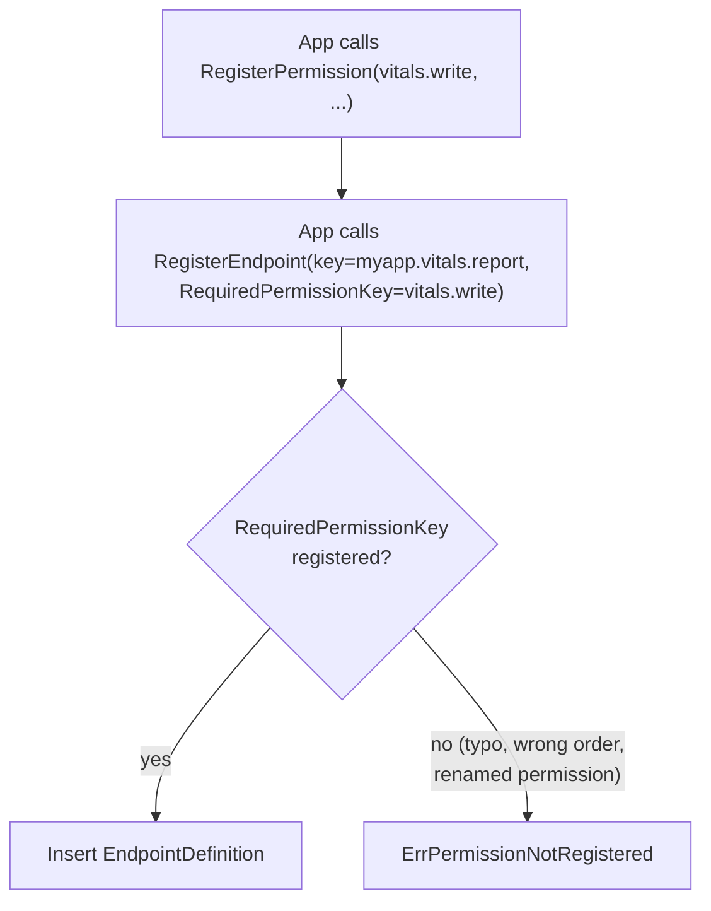
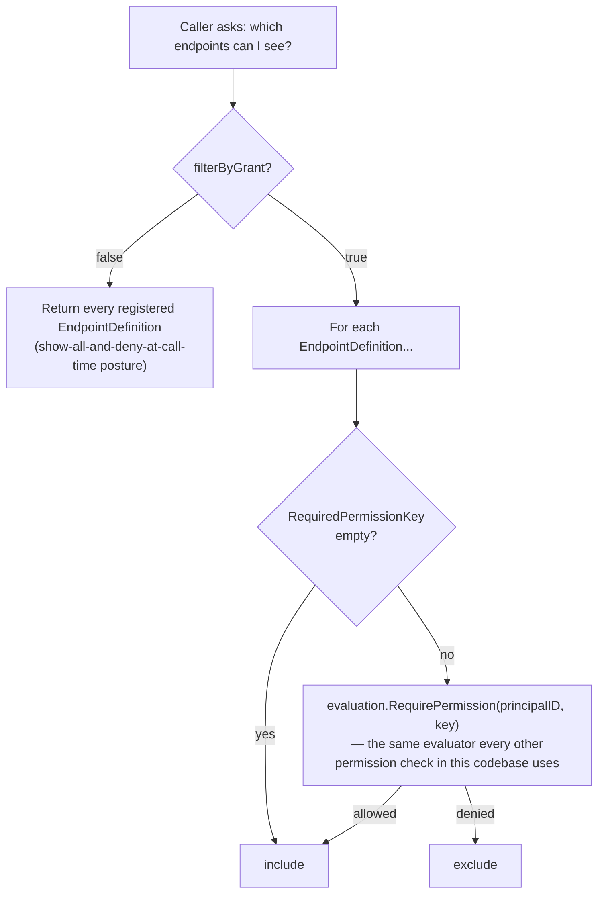

# Endpoint self-advertisement

## Where this sits

[`01-build-order.md`](01-build-order.md) names this a Layer 3 compound
feature, and [`04-facades-and-ergonomics.md`](04-facades-and-ergonomics.md)
already states the motivating story: Lighthouse's `adminTokenMessageTypes`
— a hand-maintained list of which message types the SDK would attach a
bearer token to — drifted from the agent's own real endpoint set
repeatedly, because "which endpoints exist" and "which endpoints need
what" lived in two places with no reason to stay in sync. This doc pins
that down into actual field shapes and functions.

The build-order table's "Needs" column lists Gatehouse-core *and* "the
registry" for this feature; the dependency graph right below it draws
only `GH --> ENDPOINT`. The graph is the accurate one — this pass fixes
the table to match. Nothing here needs `registry`'s `Instance`/`Group`
concept: registration happens once, at app startup, the same
non-connection-bound way `RegisterPermission` already works, not tied to
an authenticated Transit session the way `registry.RegisterFromSession`
is. A fleet where different instances expose different endpoint sets
(version skew, optional plugins) is a real possible future case, and it
would compose with `registry`'s `Group` the same way Status aggregation
composes with it — but nothing in this codebase needs that yet, so it
isn't built. Same restraint this design already applies to CRDTs,
consensus, and a broadcast fan-out helper: build what has a real,
current consumer.

## Why this lives in Gatehouse-core, not a new base module

An endpoint's one load-bearing fact is "what permission does calling
this require," and that fact already has a home: `PermissionDefinition`,
registered via `RegisterPermission`. An `EndpointDefinition` is a second,
descriptive record that *points at* a permission key rather than
duplicating anything about it — the same "point at, don't copy" relationship
Vitals' `vitals.default_group` Policy value has to the Group it names, or
a `Lease.HolderInstanceID` has to the `Instance` it names. This is new
Gatehouse-core structure, storage, and facade — not a new Layer 1 base —
the same shape `Instance`/`Lease` took in
[`13-registry-and-leases-model.md`](13-registry-and-leases-model.md):
"a base record that belongs in Gatehouse-core itself... with no
Transit-touching behavior needed around it."

## EndpointDefinition

```go
type EndpointDefinition struct {
    EndpointKey           string          // dotted key, e.g. "sso.ticket.issue", "myapp.importer.run"
    Description           string
    RequiredPermissionKey string          // "" means no permission is required — publicly listed and callable
    Metadata              json.RawMessage // opaque, app-defined (e.g. request/response hints), never authorized on
}
```

Deliberately as minimal as `PermissionDefinition` itself — no risk
class, no HTTP-shaped routing metadata, no versioning. `Validate()`
only requires `EndpointKey` to be non-empty, the same minimalism
`PermissionDefinition.Validate` already applies to `PermissionKey`; a
dotted-key format isn't enforced there either, so `EndpointDefinition`
doesn't invent a stricter rule for itself.

`RequiredPermissionKey` empty is a real, valid state — not every
endpoint needs authorization (a health check, a public capability list).
It is never validated as a *format* at the structure level; whether it
names something real is a cross-row fact `RegisterEndpoint` checks, the
same split `Definition`/`Writer` already use everywhere else in this
codebase (structure checks shape, facade checks relationships).

## Registration: the drift fix, made structural

```go
func RegisterEndpoint(ctx context.Context, reader Reader, writer Writer, def structure.EndpointDefinition, opts RegisterEndpointOptions) error
```

Mirrors `RegisterPermission` exactly: idempotent by `EndpointKey` (a
second call with the identical definition is a no-op; a second call
under the same key with a different definition is `ErrConflict`), reuses
the *same* reserved-namespace map and override (`AllowReservedNamespace`)
`RegisterPermission` already has — one namespace-hygiene mechanism, not
a second one invented for a second kind of key.

The one new check `RegisterEndpoint` adds, that `RegisterPermission`
has no analog for: if `RequiredPermissionKey` is non-empty, it must
already be a registered `PermissionDefinition` — `ErrPermissionNotRegistered`
otherwise. This is the actual fix for the motivating drift story: an
endpoint can't silently claim a permission that was never registered
(a typo, or a permission that got renamed and left one caller behind),
because registration itself refuses to let the two lists disagree. It
also fixes the *order* dependency into something explicit rather than
hoped-for: an app registers its permissions before the endpoints that
require them, and a reversed order fails loudly at startup instead of
producing an endpoint that silently requires nothing.



## Advertisement: a live query, with visibility as a policy choice

```go
func ListEndpoints(ctx context.Context, reader Reader) ([]structure.EndpointDefinition, error)
func AdvertiseEndpoints(ctx context.Context, reader Reader, principalID uuid.UUID, filterByGrant bool) ([]structure.EndpointDefinition, error)
```

`ListEndpoints` is the unfiltered query against the same registration
data `RegisterEndpoint` writes — "what exists, what does each one need"
can never drift from the real set, because there is no second list to
maintain.

`AdvertiseEndpoints` is where
[`04-facades-and-ergonomics.md`](04-facades-and-ergonomics.md)'s
"visibility is a policy choice, not a fixed philosophy" becomes code,
not a sentence. `filterByGrant=false` returns every registered endpoint
— an app that wants to show all and deny at call time. `filterByGrant=true`
calls `evaluation.RequirePermission(ctx, reader, principalID, def.RequiredPermissionKey)`
per endpoint and keeps only the ones that succeed (an empty
`RequiredPermissionKey` always passes — nothing to check). This reuses
the exact same evaluator every permission check in this codebase already
goes through; there is no second, advertisement-specific authorization
path to keep correct, the same "one evaluator, two entry points" rule
[`04-facades-and-ergonomics.md`](04-facades-and-ergonomics.md) opens
with for facades generally.



## What's deliberately out of scope (this pass)

- **Per-instance/per-fleet endpoint variance via `registry`.** Composes
  cleanly later (scope an `EndpointDefinition` by `registry.Group` the
  same way `Instance.Group` already works) if a real heterogeneous-fleet
  case shows up; nothing in this codebase has one yet.
- **Request/response schema, beyond the opaque `Metadata` field.**
  `typedvalue` exists for exactly this kind of shape description, the
  same way it's available to Vitals' own `ValueMetadata` — an app that
  wants a typed request/response contract can put a `typedvalue.Definition`
  in `Metadata` itself, the same "opaque, app-defined" escape hatch Vitals'
  `AppValueMetadata` already demonstrates. Not built in here by default,
  since not every endpoint needs it.
- **Revocation/archival of an `EndpointDefinition`.** `PermissionDefinition`
  itself has no archive/lifecycle field yet either — `EndpointDefinition`
  doesn't invent one its closest sibling doesn't have.
- **A real, wire-callable advertisement endpoint.** `04-facades-and-
  ergonomics.md`'s original mermaid diagram pictures a caller asking
  "list available" of an actual network endpoint. What's built here —
  `ListEndpoints`/`AdvertiseEndpoints` — is an ordinary Go function a
  caller invokes in-process; nothing wires it to a Transit message a
  remote peer could send. That's the same Router/dispatch gap
  `16-trace-log-aggregation-model.md` already named as unbuilt, not a
  separate omission — whichever feature gets a real Router first,
  `AdvertiseEndpoints` is a one-line handler on top of it, not new logic.
