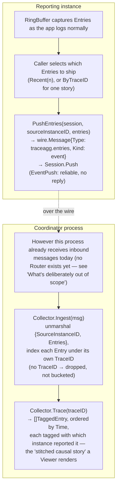

# Trace/log aggregation

## Where this sits, and a correction before any code

`01-build-order.md` names this a Layer 3 feature needing "Transit
(propagation envelope's trace-context field) + the same registry/
grouping concept Multi-instance coordination uses... a consumer of
existing infrastructure, not new plumbing." Checking that claim
against the actual code first — the same discipline that caught
Endpoint self-advertisement's opposite mistake (a dependency claimed
that wasn't real) — turned up the reverse problem here: the
infrastructure it claims already exists, doesn't. (Both gaps below are
what this pass found *before* building; sections further down describe
what was then built to close them.)

- `wire.Message` (`Type`, `Payload`, `ID`, `Kind`, `Channel`) had no
  trace-context field. `06-logging-and-observability.md`'s "Transit
  carries correlation for free" section describes one being added,
  but it never was.
- `logging` was pure write-only: `NewTextLogger`/`NewJSONLogger` wrap an
  `io.Writer` sink via `slog` handlers, tagging every record with
  trace/span/resource attributes, and that's the whole surface. There
  is no way to capture, buffer, or later re-export what's already been
  logged — nothing for a "ship my recent entries elsewhere" caller to
  call.

So this pass is genuinely new plumbing in two Layer 0 bedrock packages,
plus the Layer 3 integration itself — not a thin composition of what's
already there the way Status aggregation turned out to be. Worth
saying plainly: this is the second build-order claim this project has
had to correct against real code, the other being Endpoint self-
advertisement's — a reminder that this doc's own prose is a plan, not
a fact, until the code backs it up.

## `wire.Message` gains trace context — additive, like `ID`/`Channel`

```go
type Message struct {
    Type         string
    Payload      json.RawMessage
    ID           string
    Kind         Kind
    Channel      string
    TraceID      string // hex, W3C Trace Context format, omitempty
    SpanID       string // hex, omitempty
    ParentSpanID string // hex, omitempty — empty means this is the trace's root span
}
```

Three more flat, optional, hex-encoded strings — the same shape `ID`
and `Channel` already use, not a nested struct: `wire` stays a plain
JSON envelope with no opinion beyond "is this hex the right length,"
the actual `logging.SpanContext` type (and its `TraceID`/`SpanID`
byte-array types, generation, parsing) stays owned by `logging`, which
`wire` imports for exactly two small helpers:

```go
func (m Message) WithTraceContext(sc logging.SpanContext) Message
func (m Message) TraceContext() (logging.SpanContext, bool) // false if none of the three fields are set
```

`wire` importing `logging` is not a new kind of coupling — `logging`
is Layer 0 bedrock explicitly meant to be used directly by everything
above it (`01-build-order.md`), and `vitals/structure.Reading` already
imports `logging.SpanContext` the same way. An old message with none
of the three fields decodes exactly as before (the additive-envelope
property `message_test.go` already asserts for `ID`/`Channel`/`Kind`);
`TraceContext()` returning `false` is that case, not an error.

**What this buys beyond this one feature:** every message that
crosses a Transit hop — SSO ticket delivery, a future mTLS-authenticated
request, anything — can carry trace correlation with nothing extra to
remember, exactly `06`'s original motivation. A receiving handler that
wants its own subsequent log lines to join the sender's trace calls
`logging.ContextWithSpan(ctx, msg.TraceContext())` before it logs
anything; nothing forces it to. This is the half of the feature with
the broadest payoff and the least code.

## `logging` gains an opt-in capture buffer — still not a database

`06`'s own split stands: operational logging stays ambient and
write-only by default, and durable, queryable storage stays reserved
for audit logging specifically. A capture buffer for trace aggregation
is neither of those — it's a small, bounded, in-memory, lossy-under-
rotation record of recently emitted entries, opt-in per logger, that
exists only so something can be exported before it's evicted:

```go
type Entry struct {
    Time         time.Time
    Level        slog.Level
    Message      string
    TraceID      string // "" if the record carried none
    SpanID       string
    ParentSpanID string
    Attrs        json.RawMessage // every attribute — resource + With()-chained + call-site — flattened for export
}

type RingBuffer struct { /* fixed capacity, oldest evicted first, concurrency-safe */ }

func NewRingBuffer(capacity int) *RingBuffer
func (b *RingBuffer) Recent(n int) []Entry   // most recent n (or fewer), oldest first
func (b *RingBuffer) ByTraceID(id string) []Entry // every captured entry for one trace, oldest first

func NewJSONLoggerWithCapture(w io.Writer, resource Resource, minLevel slog.Level, buf *RingBuffer) *slog.Logger
func NewTextLoggerWithCapture(w io.Writer, resource Resource, minLevel slog.Level, buf *RingBuffer) *slog.Logger
```

Capture is additive to the real sink, never a replacement for it —
`RingBufferHandler` (the same wrapping shape `FallbackHandler` already
uses: `Enabled`/`Handle`/`WithAttrs`/`WithGroup` delegating to an inner
`slog.Handler`) appends an `Entry` to the buffer and then unconditionally
calls the real handler. A caller that never asks for a buffer gets
`NewTextLogger`/`NewJSONLogger` exactly as before — this is a new,
parallel constructor, not a change to the existing ones.

**Known limitation, stated once rather than discovered by surprise:**
`WithGroup` delegates to the inner handler for real output, but
captured `Entry.Attrs` doesn't reflect group namespacing — nothing
here currently groups attributes, so there's nothing to get wrong yet,
but a future caller that does should know the capture path doesn't
model it.

**Why bounded and lossy is the right default, not a cut corner:** this
buffer exists to answer "what just happened, recently, across a
handful of instances" for a coordinator/Viewer — not to be a backup of
everything ever logged. A caller that wants durability layers a real
sink underneath (the JSON `io.Writer` the buffer already sits beside)
and ships that through whatever log pipeline it already has; the
buffer's only job is "hold enough to export before it rotates out."

## `traceagg`: Transit + registry, the actual Layer 3 integration

Two halves, deliberately not a Router — see "What's deliberately out
of scope" below for why a dispatch layer isn't built here even though
it would make the receiving half more convenient.

```go
// Send side: an instance ships some of its own captured entries to a peer
// it already has an open transit.Session to (discovered via registry —
// ListPeers/ListInstancesByGroup — the same "already built, just pointed
// at a new audience" reasoning 13-registry-and-leases-model.md's own
// Broadcast section used for Status aggregation).
func PushEntries(ctx context.Context, session transit.Session, sourceInstanceID uuid.UUID, entries []logging.Entry) error

// Receive side: a caller hands traceagg a message it already received,
// however it received it — traceagg never calls Session.Next or any
// backend-specific receive method itself.
type Collector struct { /* in-memory, trace-ID-indexed */ }

func NewCollector() *Collector
func (c *Collector) Ingest(msg wire.Message) error

type TaggedEntry struct {
    logging.Entry
    SourceInstanceID uuid.UUID
}

func (c *Collector) Trace(traceID string) []TaggedEntry // every captured entry for one trace, across every instance that reported one, ordered by Time
```

`PushEntries` marshals `{SourceInstanceID, Entries}` as the payload of
a `wire.Message{Type: "traceagg.entries", Kind: wire.KindEvent}` and
calls `Session.Push` — `EventPush`'s own guarantee (reliable,
no reply expected) is exactly right for "here's what happened, no
response needed." `Collector.Ingest` is the inverse: given a message
of that type, unmarshal and index each entry by its own `TraceID` —
entries with no `TraceID` are dropped, not stored under an empty-string
bucket, since "which causal story does this belong to" is the one
thing `Trace` exists to answer.



## What's deliberately out of scope

- **A real Router/dispatch layer.** `11-transit-model.md`'s own
  deferred list already names this: "a real router sitting above
  `Backend.Accept` isn't designed here." `Collector.Ingest` takes an
  already-received `wire.Message` for the same reason `sso.Verify`
  takes an already-received `Ticket` — it owns what to do with a
  message, never how one arrived. Today, a caller wires this in the
  same ad hoc way `sso`'s own integration test receives a delivered
  ticket (calling the concrete backend's own receive method directly);
  that stays true until a Router actually gets built.
- **Durable storage of collected entries.** `Collector` is in-memory,
  unbounded by nothing but process lifetime — a coordinator restart
  loses what it collected. This is consistent with the capture
  buffer's own "recent causal story, not a backup" framing; a caller
  that wants durability already has the real JSON sink each reporting
  instance's logger writes to, independent of this package.
- **Implicit trace-context propagation.** Nothing automatically calls
  `WithTraceContext` on an outbound message or `ContextWithSpan` on an
  inbound one — every propagation point is a caller choosing to, the
  same "additive, opt-in, nothing forced" property `ID`/`Channel`
  already have. A future middleware layer could make this automatic;
  nothing here assumes one exists.
- **Querying by anything other than trace ID.** `ByTraceID`/`Trace`
  are the only lookups — no full-text search, no time-range scan
  across all traces, no severity filter. Nothing currently needs more
  than "give me this one causal story," so nothing more is built.
