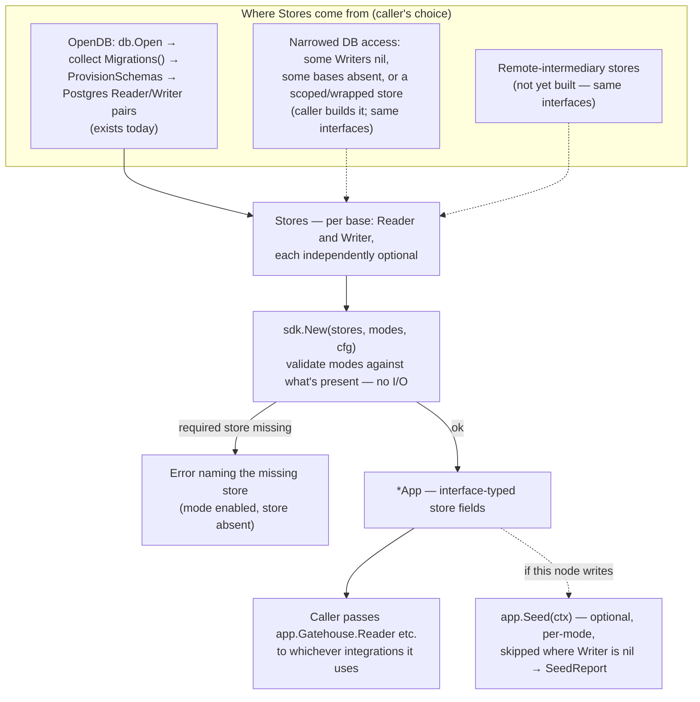

# The SDK: a composition root, not a second API

## Where this sits

[`08-repo-scaffolding.md`](08-repo-scaffolding.md) names `sdk/` as the
composed, ergonomic entry point — "the module most apps would import" —
and says it depends on every base and integration while leaving each of
those independently importable. [`00-overview.md`](00-overview.md)'s
thesis is that every capability is "a mode of the same SDK." Neither says
what the SDK *contains*. This doc pins that down against what the
modules actually look like today, and is deliberately smaller than the
phrase "the SDK" suggests.

## What an app has to do today, without it

Every base and integration is built and tested, and each is usable on
its own. Assembling several of them into a real app means repeating the
same wiring by hand. Today the only storage implementation is
Postgres-backed, so that wiring looks like:

1. Open a `db.Pool`, collect `Migrations()` from each base's
   `storage/dbstore` (gatehouse-core, policy, certstore, alias, vitals —
   each keyed by its own module name, so they don't collide), and call
   `ProvisionSchemas` once.
2. Construct a `PostgresReader`/`PostgresWriter` pair per base.
3. Hand the right store to each integration's own narrowly declared
   interface (`peerauth.Store`, `certcred.GatehouseStore`,
   `sso.PrincipalStore`, `sessions.Store`, …).
4. On every startup, run the idempotent seeding steps:
   `gatehouse/facade.RegisterAssumePermissions`,
   `aliasauth.RegisterPermissions`, `vitalsauth.RegisterPermissions`,
   `jobsauth.RegisterPermissions`, `vitals/facade.SeedBuiltinDefinitions`,
   `vitalsdefaults.EnsurePolicyDefinition`.

Steps 1 and 2 are *the DB-backed way of obtaining stores*, not something
every node does. Steps 3 and 4 are storage-agnostic — they only ever
see `Reader`/`Writer`/`Store` interfaces. **That split is the key design
constraint on the SDK**, because a node with no direct database access
at all is an expected future shape, not an edge case
([`02-package-boundaries.md`](02-package-boundaries.md) names the
remote-intermediary and direct-read/remote-write `Store` implementations;
[`03-multi-instance-and-suites.md`](03-multi-instance-and-suites.md)
covers the asymmetric topology). Those implementations don't exist yet —
"not yet", not "never" — but the SDK must not make them impossible.

## A checked fact the design rests on

The "consumer declares its own thin interface" rule
([`04-facades-and-ergonomics.md`](04-facades-and-ergonomics.md)) was
chosen so one concrete store could satisfy many consumers. That's worth
confirming rather than assuming, because the whole SDK shape depends on
it. A compile-time probe (not committed — it would only duplicate what
the SDK's own build will assert) confirmed that gatehouse-core's single
`PostgresReader` satisfies `evaluation.Store`, `peerauth.Store`,
`certcred.GatehouseStore`, `sso.PrincipalStore`, and `facade.Reader`; its
`PostgresWriter` satisfies `sessions.Store` and `facade.Writer`; and
certstore's and alias's reader/writer pairs satisfy their own consumers
the same way. So the SDK holds **one reader/writer pair per base**, not
one adapter per integration — and, since each base's `facade.Reader`/
`facade.Writer` is an interface, nothing about that claim requires the
pair to be Postgres-backed.

## What `sdk` is

### The access shapes it has to tolerate

"Has a database" isn't one condition. The SDK must work for each of
these, none of which can be a special case bolted on later:

| Shape | What it means for the SDK |
|---|---|
| **Full read/write** | Today's only case. |
| **Read-only** | `Reader` present, `Writer` absent for some or all bases. |
| **Scoped** | Access to only *some* bases (a node that holds vitals + alias but not gatehouse-core), or to a subset of rows within one. |
| **Conditional** | Access that comes and goes — unreachable at startup, credentials that expire, connect-on-demand. |
| **None** | Everything goes through a remote implementation of the same interfaces. |

Two consequences shape the design below. First, **every `Reader` and
every `Writer`, for every base, is independently optional** — read-only
isn't a global flag, it's "this base's `Writer` is nil." Second, the
SDK core **performs no storage I/O in its constructor**, so a node whose
access is conditional can still build an `App` and find out about
availability the moment it actually uses a store.

### Two layers, plus an explicit seeding step

```go
// Storage-agnostic core: wiring only, no I/O.
type Stores struct {
    Gatehouse struct{ Reader gatehouseFacade.Reader; Writer gatehouseFacade.Writer }
    Policy    struct{ Reader policyFacade.Reader;     Writer policyFacade.Writer }
    // ... Alias, Certs, Vitals — each side of each pair independently nil-able
}

func New(stores Stores, modes Modes, cfg Config) (*App, error) // validates, never touches a store
func (a *App) Seed(ctx context.Context) (SeedReport, error) // the only step that writes

// DB-backed provider: the one storage implementation that exists today.
func OpenDB(ctx context.Context, dbCfg db.Config, modes Modes) (Stores, *db.Pool, error)
```

- **`New` validates what each mode *requires*, up front, and names what's
  missing.** Turning on the Vitals mode with a nil gatehouse `Reader` (so
  `vitalsauth` has nothing to authorize against) is a construction-time
  error listing the absent store, not a nil dereference three calls
  later. This is the scoped-access case: a node that legitimately lacks
  gatehouse-core simply doesn't enable modes that need it.
- **`Seed` is separate from `New` on purpose.** Seeding is the one thing
  that writes, and read-only, scoped and conditional nodes each want to
  decline or defer it differently (a read-only node never seeds; a
  scoped writer may be allowed to seed vitals definitions but not
  register gatehouse permissions; a conditional node seeds when its
  access is actually up). `Seed` runs each mode's idempotent steps
  independently and returns a `SeedReport` — which steps ran, which were
  skipped for lack of a `Writer`, which failed — rather than collapsing
  everything into one pass/fail. In the asymmetric topology only the
  designated writer calls it at all; which node that is stays the
  caller's topology decision, as in `03`.
- **`OpenDB` is a convenience, not the entry point.** It does steps 1 and
  2 above and hands back `Stores` — read/write, because that's what a
  DSN with full privileges gives. A node with narrower access passes a
  `Stores` built from whatever it actually has (e.g. `OpenDB`'s result
  with `Writer`s zeroed, or a different provider entirely).



### A store-implementation contract the SDK relies on

Scoped and conditional access only stay safe if a narrowed store reports
*why* it can't answer. `evaluation.Store` already distinguishes "absent"
(`found == false`, a plain denial) from `err != nil` (propagated up, never
turned into an allow) — checked in `Evaluate`. So a store that can't see
something, or can't currently reach its backend, **must return an error,
not an empty result.** An empty result is indistinguishable from "this
permission/grant doesn't exist" and would fail closed but for the wrong
reason, which makes a misconfigured scoped node look like a node whose
users are simply unauthorized. This isn't stated on the base interfaces'
doc comments yet — a "not yet" to add alongside the first narrowed store
implementation, since that's when it becomes testable rather than
asserted.

Conditional access itself (retry, reconnect, circuit-breaking) belongs in
the store implementation or a wrapper around it, not in the SDK core —
the interfaces already give a caller everything it needs to build one.

## What `sdk` deliberately is *not*

- **Not a pass-through facade.** `AdvertiseEndpoints`, `peerauth.Require`,
  `vitalsauth.WriteReading` and the rest are already the ergonomic
  surface; `App` doesn't re-wrap them as `app.WriteReading(...)`.
  `registry/doc.go` already made this decision once, explicitly, for the
  same reason: a wrapper with no behavior of its own is indirection, and
  a second place for an argument list to drift. The SDK adds *wiring*,
  never a parallel API for something that already has one.
- **Not a lock-in.** An app that wants only `transit`, or only `alias`,
  imports that module and never touches `sdk` — `08` already says this.
  Nothing `App` holds is reachable only through it.

## Modes

[`00-overview.md`](00-overview.md) describes registry, SSO-provider, and
coordinator behavior as "the same SDK with a few more modes turned on."
Concretely, a mode gates (a) which `Stores` entries `New` requires, (b)
which steps `Seed` attempts, and — only for `OpenDB` — (c) which
migrations run. It's never a reason for the core to touch a database
itself.

Modes name **bases**, and **integrations switch on when both bases they
combine are enabled** — there's no separate flag for them. That keeps a
scoped node expressible: one holding Vitals but not Gatehouse-core
enables just `Vitals` and gets the narrower set of seeding steps.

| Enabled | Requires | Seeding steps it adds |
|---|---|---|
| `Gatehouse` | `Stores.Gatehouse.Reader` | `RegisterAssumePermissions` (registry/leases need no mode of their own: `Instance`/`Lease` are Gatehouse-core records) |
| `Policy` | `Stores.Policy.Reader` | — |
| `Alias` | `Stores.Alias.Reader` | with `Gatehouse`: `aliasauth.RegisterPermissions` |
| `Vitals` | `Stores.Vitals.Reader` | `SeedBuiltinDefinitions`; with `Gatehouse`: `vitalsauth.RegisterPermissions`; with `Policy`: `vitalsdefaults.EnsurePolicyDefinition` |
| `Jobs` | `Stores.Jobs.Reader` | with `Gatehouse`: `jobsauth.RegisterPermissions`. Also enables `App.JobsAuth()`, which assembles `jobsauth.Deps` from the App's own stores (it needs both modes; a node holding only the jobs base uses its facade directly) |
| `Certs` | `Stores.Certs.Reader` | — |
| `SSOProvider` | the `Gatehouse` and `Certs` modes, plus `Config.SSOSigner` — the SDK never generates or stores this key itself, matching `12-sso-tickets-model.md`'s "never the mTLS key" rule | — |

Only the **Reader** is required by `New`; a Writer is only needed by the
`Seed` steps that write, and their absence is a skip, not an error.

## Status

**Built:** the `sdk` module (`Stores`, `Modes`, `Config`, `New`,
`App.Seed`, `SeedReport`) and the separate `sdkdb` module (`OpenDB`).
`sdk`'s tests prove `New` performs no store I/O (the stores in those
tests are nil-embedding fakes that panic on any call), that every
missing store is reported together and wraps `ErrMissingStore`, that
read-only seeding skips every step with a reason, and that a store
error reaches the caller of `evaluation.RequirePermission` instead of
becoming a denial. `sdkdb`'s tests run against real Postgres: a full app
seeded twice in a row with one real cross-module flow
(`EnsurePrincipal` → grant → `vitalsauth.WriteReading`), a read-only app
over data a writer node seeded, and a scoped Vitals-only app.

**A correction to the intent above, found while building:** the goal was
that `sdk` never depend on `db` or pgx. The first half holds —
Archipelago's own `db` module is not in `sdk`'s dependency graph, and
nothing in `sdk` opens a connection. The second does not: pgx *does*
appear in the build graph, transitively, because `certstore/evaluation`
imports smallstep's CA library (`smallstep/certificates/authority`),
which pulls in `smallstep/nosql/postgresql`. That is certstore's own
dependency, present for any certstore user, not something `sdk` adds.
It affects binary size, not behavior — nothing connects to a database
unless a caller supplies stores that do. Removing it would mean
splitting certstore's `facade` types away from its CA-backed
`evaluation` package, which isn't worth doing for this alone.

## What stays in-process until a Router exists

Several things an app would reasonably want to call *remotely* are, today,
ordinary Go functions: `AdvertiseEndpoints`
([`15`](15-endpoint-advertisement-model.md)), `traceagg.Collector.Ingest`
([`16`](16-trace-log-aggregation-model.md)), and the receiving half of SSO
delivery. [`11-transit-model.md`](11-transit-model.md) lists a Router /
dispatch layer above `Backend.Accept` as deliberately undesigned, and
`Session` has no generic receive method — concrete backends do, which is
why tests call them directly.

This matters for the SDK's scope: **it can't give these a wire surface
without inventing the Router as a side effect**, which is a Transit-level
design in its own right (message-type → handler registration, per-handler
auth via `peerauth.Require`, how it composes with trace-context
propagation). So `sdk` v0 exposes them as the in-process functions they
are. A Router, when designed, is its own doc and module; the SDK then
gains one more field on `App` and a registration step, and
`AdvertiseEndpoints`/`Ingest` become one-line handlers on top — no new
logic, as `15` and `16` already say.

## Not yet built, and not this pass

Kept as confirmed-but-deferred rather than dropped, per the project's
own distinction between "not yet" and "never":

- **Login primitives** (`verifyPassword`, `verifyOTP`, `doPasskeyCeremony`,
  `completeSession`) from `00-overview.md` §6. The credential *kinds*
  exist in gatehouse-core's structure; no verification logic does. The
  SDK would host these once they exist; they are not SDK-shaped work
  until then.
- **OIDC relying-party mode and JWKS/`.well-known` discovery** (`00` §6).
  Same status.
- **A CLI** (`cmd/archipelago`, `08`). Depends on `sdk`; nothing to wrap
  yet.
- **Policy-gated mTLS auto-provisioning**
  (`01-build-order.md`'s Peer authorization row). Needs `Policy` wired
  into `peerauth`'s caller; once `sdk` exists it is the natural place
  for that wiring, but the design for it isn't done.

## Build order for the module (all built; see Status)

1. `sdk/` module scaffold + `Stores`/`Config`/`Modes`/`New`: mode-vs-store
   validation, no I/O, no `archipelago/db` dependency.
2. `Seed` + `SeedReport`: each step independent, skipped (and reported)
   where its Writer is nil.
3. `sdkdb`'s `OpenDB` — the Postgres provider, its own module so `sdk`
   never requires `db`.
4. Tests across the access shapes, not just the happy path: full,
   read-only, scoped, and a store that errors.

Not covered by a test yet: a *conditional* store (reachable at some
moments and not others) beyond the single-call error case, because no
such store implementation exists to test against — the same "not yet"
as the remote-intermediary stores themselves.
