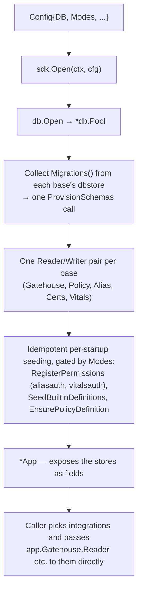

# The SDK: a composition root, not a second API

## Where this sits

[`08-repo-scaffolding.md`](08-repo-scaffolding.md) names `sdk/` as the
composed, ergonomic entry point — "the module most apps would import" —
and says it depends on every base and integration while leaving each of
those independently importable. [`00-overview.md`](00-overview.md)'s
thesis is that every capability is "a mode of the same SDK." Neither says
what the SDK *contains*. This doc pins that down against what the
modules actually look like today, and is deliberately smaller than the
phrase "the SDK" suggests.

## What an app has to do today, without it

Every base and integration is built and tested, and each is usable on
its own. Assembling several of them into a real app means repeating the
same wiring by hand:

1. Open a `db.Pool`, collect `Migrations()` from each base's
   `storage/dbstore` (gatehouse-core, policy, certstore, alias, vitals —
   each keyed by its own module name, so they don't collide), and call
   `ProvisionSchemas` once.
2. Construct a `PostgresReader`/`PostgresWriter` pair per base.
3. Hand the right store to each integration's own narrowly declared
   interface (`peerauth.Store`, `certcred.GatehouseStore`,
   `sso.PrincipalStore`, `sessions.Store`, …).
4. On every startup, run the idempotent seeding steps:
   `aliasauth.RegisterPermissions`, `vitalsauth.RegisterPermissions`,
   `vitals/facade.SeedBuiltinDefinitions`,
   `vitalsdefaults.EnsurePolicyDefinition`.

None of that is hard, and none of it is interesting — which is exactly
the shape a composition root is for.

## A checked fact the design rests on

The "consumer declares its own thin interface" rule
([`04-facades-and-ergonomics.md`](04-facades-and-ergonomics.md)) was
chosen so one concrete store could satisfy many consumers. That's worth
confirming rather than assuming, because the whole SDK shape depends on
it. A compile-time probe (not committed — it would only duplicate what
the SDK's own build will assert) confirmed that gatehouse-core's single
`PostgresReader` satisfies `evaluation.Store`, `peerauth.Store`,
`certcred.GatehouseStore`, `sso.PrincipalStore`, and `facade.Reader`; its
`PostgresWriter` satisfies `sessions.Store` and `facade.Writer`; and
certstore's and alias's reader/writer pairs satisfy their own consumers
the same way. So the SDK holds **one reader/writer pair per base**, not
one adapter per integration.

## What `sdk` is

```go
type Config struct {
    DB      db.Config
    Modes   Modes
    // ... only what a mode genuinely needs (e.g. the SSO signer — see below)
}

func Open(ctx context.Context, cfg Config) (*App, error)
func (a *App) Close()
```

`Open` does steps 1, 2 and 4 above, in that order, and returns an `App`
whose exported fields are the already-built stores — `App.Gatehouse`,
`App.Policy`, `App.Alias`, `App.Certs`, `App.Vitals`, each a
`{Reader, Writer}` pair — plus the `*db.Pool` for callers that need it.
Step 3 stays the *caller's* call, made against those fields.



## What `sdk` deliberately is *not*

- **Not a pass-through facade.** `AdvertiseEndpoints`, `peerauth.Require`,
  `vitalsauth.WriteReading` and the rest are already the ergonomic
  surface; `App` doesn't re-wrap them as `app.WriteReading(...)`.
  `registry/doc.go` already made this decision once, explicitly, for the
  same reason: a wrapper with no behavior of its own is indirection, and
  a second place for an argument list to drift. The SDK adds *wiring*,
  never a parallel API for something that already has one.
- **Not a lock-in.** An app that wants only `transit`, or only `alias`,
  imports that module and never touches `sdk` — `08` already says this.
  Nothing `App` holds is reachable only through it.

## Modes

[`00-overview.md`](00-overview.md) describes registry, SSO-provider, and
coordinator behavior as "the same SDK with a few more modes turned on."
Concretely, a mode is a `Config` switch that gates (a) which migrations
run and (b) which seeding steps run — nothing more:

| Mode | What turning it on does |
|---|---|
| (always) | gatehouse-core + db schema, permission registry |
| Policy | policy schema; required by Vitals' default-group resolution |
| Alias | alias schema + `aliasauth.RegisterPermissions` |
| Vitals | vitals schema, `vitalsauth.RegisterPermissions`, `SeedBuiltinDefinitions`; with Policy also on, `EnsurePolicyDefinition` |
| Certs | certstore schema; required for mTLS identity and SSO |
| SSO provider | needs a ticket-signing `certstoreEvaluation.Signer` supplied in `Config` — the SDK never generates or stores the key itself, matching `12-sso-tickets-model.md`'s "never the mTLS key" rule |

Registry/leases need no mode of their own: `Instance` and `Lease` are
gatehouse-core tables, always present.

## What stays in-process until a Router exists

Several things an app would reasonably want to call *remotely* are, today,
ordinary Go functions: `AdvertiseEndpoints`
([`15`](15-endpoint-advertisement-model.md)), `traceagg.Collector.Ingest`
([`16`](16-trace-log-aggregation-model.md)), and the receiving half of SSO
delivery. [`11-transit-model.md`](11-transit-model.md) lists a Router /
dispatch layer above `Backend.Accept` as deliberately undesigned, and
`Session` has no generic receive method — concrete backends do, which is
why tests call them directly.

This matters for the SDK's scope: **it can't give these a wire surface
without inventing the Router as a side effect**, which is a Transit-level
design in its own right (message-type → handler registration, per-handler
auth via `peerauth.Require`, how it composes with trace-context
propagation). So `sdk` v0 exposes them as the in-process functions they
are. A Router, when designed, is its own doc and module; the SDK then
gains one more field on `App` and a registration step, and
`AdvertiseEndpoints`/`Ingest` become one-line handlers on top — no new
logic, as `15` and `16` already say.

## Not yet built, and not this pass

Kept as confirmed-but-deferred rather than dropped, per the project's
own distinction between "not yet" and "never":

- **Login primitives** (`verifyPassword`, `verifyOTP`, `doPasskeyCeremony`,
  `completeSession`) from `00-overview.md` §6. The credential *kinds*
  exist in gatehouse-core's structure; no verification logic does. The
  SDK would host these once they exist; they are not SDK-shaped work
  until then.
- **OIDC relying-party mode and JWKS/`.well-known` discovery** (`00` §6).
  Same status.
- **A CLI** (`cmd/archipelago`, `08`). Depends on `sdk`; nothing to wrap
  yet.
- **Policy-gated mTLS auto-provisioning**
  (`01-build-order.md`'s Peer authorization row). Needs `Policy` wired
  into `peerauth`'s caller; once `sdk` exists it is the natural place
  for that wiring, but the design for it isn't done.

## Build order for the module

1. `sdk/` module scaffold + `Config`/`Modes`/`Open`/`Close`, with the
   migration-collection and store-construction steps.
2. Seeding gated by modes, each step already idempotent in its own
   module.
3. An integration test against real Postgres that opens an `App` twice
   in a row (proving startup seeding is idempotent end to end) and runs
   one real cross-module flow through the exposed fields — e.g.
   register a permission, `EnsurePrincipal`, grant, then
   `vitalsauth.WriteReading` — so the SDK's tests exercise composition,
   not each base's own behavior again.
