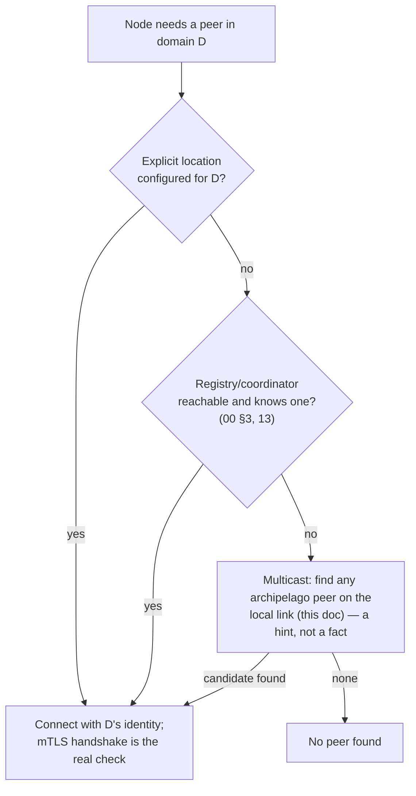
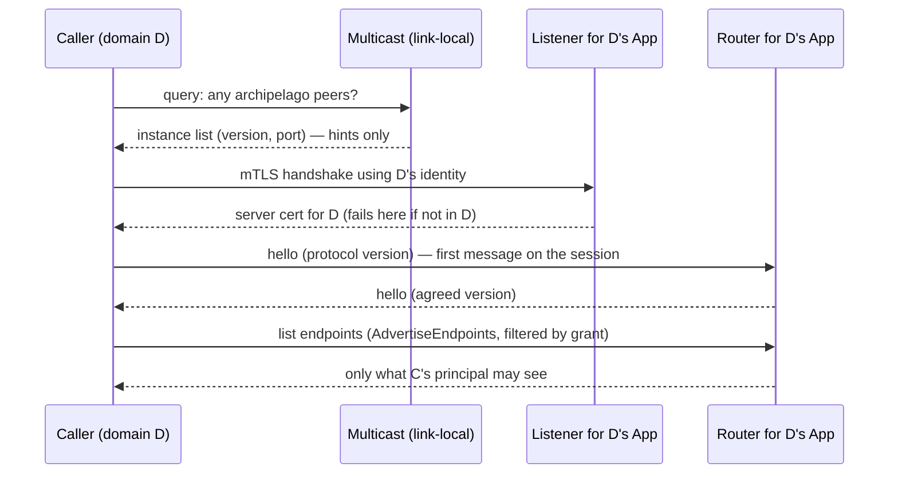

# Peer discovery, domains, and what a peer offers

**Status: design draft, with one part built: the multicast bootstrap tier
(`discovery`, below).** Everything else here (node role, label and
capability claims, the per-domain connection process, the label type) is
still design and should not be built until the open questions at the end are
settled. The document was written to pin the vocabulary and the boundaries
before any implementation, in the order the conversation that produced it
reached them. Where it revises an earlier statement, it says so.

## Where this sits

[`03-multi-instance-and-suites.md`](03-multi-instance-and-suites.md)
lists peer discovery as "registry-backed by default, optional SWIM-style
gossip fallback." [`13-registry-and-leases-model.md`](13-registry-and-leases-model.md)
built the registry half, but `registry.RegisterFromSession` only runs over
an already-authenticated Transit session, so it can't help a node find its
*first* peer. [`15-endpoint-advertisement-model.md`](15-endpoint-advertisement-model.md)
built "what does this peer expose, and what does each thing need" as an
in-process query. [`11-transit-model.md`](11-transit-model.md) defers
protocol versioning and a Router. This doc connects those pieces and adds
the one missing tier: how a node with no configured peer location finds
one.

## Vocabulary: "capabilities" is already taken

`transit.Capabilities` (`NativeStreams`, `Datagrams`) describes what a
*backend* can realize, and `11` is explicit that it is for logging and
realization choices, never for handler branching. It is local, never
negotiated, and unrelated to what follows. This doc uses **capability**
only in the sense below, and refers to the existing type as *realization
capabilities* when both appear together.

| Layer | Answers | Status |
|---|---|---|
| Realization capabilities | What can this transport do? | Built, local-only |
| Protocol version | Can we talk at all? | Not built (`11` defers it) |
| Node roles, labels, capabilities | What does this peer do, and how do I select it? | This doc |

## The archipelago domain

An **archipelago domain** is one deployment: the set of nodes that trust
the same root(s) and share authority. A node may operate in more than
one, and **its node roles, labels and capabilities are then independent per
domain** — the same process can be an SSO provider in one and a plain
worker in another, with different endpoints, different grants and
different signing keys.

### One App per domain

[`17-sdk-model.md`](17-sdk-model.md)'s `App` already has the right shape
for this: it is built from one set of stores, one set of modes and one
`Config` (including its own `SSOSigner`). A node straddling two domains
holds **two `App`s**, each over its own stores. Nothing about
node roles/labels/capabilities needs a domain column; the domain *is* which
`App` you are talking to.

This is deliberate, and it is the project's own earlier lesson applied
again. Lighthouse's alias table had to retrofit `realm_id NOT NULL` after
the fact ([`01-build-order.md`](01-build-order.md)), and `00-overview.md`
§1 records how expensive cross-boundary identity got. Isolating domains by
construction — separate stores, separate identity — means a bug in one
domain's endpoint registry cannot leak into another's, because they never
shared a table.

*Not yet:* two domains deliberately sharing one database. That would need
a per-domain filter on the registries (the same shape as `registry`'s
`Group` scoping) and is not designed here. Nothing needs it today.

### Consequences of per-domain scoping

- **Endpoint registry** (`15`): per `App`, because it lives in that
  domain's Gatehouse store. A multi-domain node advertises a different
  set in each, with no extra mechanism.
- **Trace aggregation** (`16`): one `Collector` per domain. Stitching
  entries across domains would leak one domain's activity into another;
  it must not happen implicitly.
- **Trace-context propagation across a domain boundary** is an open
  question (below). The default must be *not* to propagate.
- **SSO signer, seeding, modes:** already per-`App` in `17`.

## Node roles, labels, capabilities — and core vs. app-defined

Three distinct concepts:

| Concept | Meaning | How a claim is checked |
|---|---|---|
| **Capability** | Something the peer can do: an endpoint it serves, a task kind it can execute, a protocol feature. An executable task kind is *not* an endpoint (see `19`). | Call it; failure is the answer. |
| **Node role** | A responsibility it holds. *Exclusive* node roles (leader) are exactly the leases `13` already built; *non-exclusive* node roles (SSO provider) are declared and imply a capability. | Exclusive: check the lease holder. Non-exclusive: check the implied capability. |
| **Label** | Free-form selector metadata (environment, zone). Never authorized on — the same rule `Principal.Metadata` and `Instance.Metadata` already follow. | Not verified. |

**Core vs. app-defined reuses the reserved-namespace mechanism.**
`gatehouse-core/facade`'s `defaultReservedNamespaces` already lists
`archipelago` plus one entry per base. A *core* node role, label or
capability is a key under one of those namespaces; an *app-defined* one is
anything else. `RegisterPermission` and `RegisterEndpoint` already share
this map and its explicit override; no second naming mechanism is
introduced.

**The prefix means different things locally and on the wire.** `09`
describes the reservation as hygiene, "not a security boundary", because
an app already owns its own database. That reasoning ends at the network
edge: a remote peer claiming an `archipelago.*` key proves nothing, since
anyone can type it. So **every peer-asserted claim, core or app-defined, is
an unverified hint until checked** (the right-hand column above), and what a
verified claim is *worth* is decided only by the receiving node's own
Gatehouse — the same rule `00` §4 states for the coordinator.

**Forward compatibility.** The core set is closed, documented, and
versioned with the protocol. An unknown key in a core namespace from a
newer peer is ignored, not an error; an unknown app-defined key is just
data.

A node *adopting* a node role, and the resource bounds that keep adopted
node roles from overwhelming it, are designed in
[`19-node-roles-and-resource-governance-model.md`](19-node-roles-and-resource-governance-model.md).

*Open:* labels have no type today — only `Instance.Group` and opaque
`Metadata`. Selection like "peers with `env=prod`" needs a queryable shape,
so a small namespaced key/value type is likely warranted; not designed.

## Three discovery tiers

Multicast is the **bootstrap** tier only. `03`'s SWIM gossip is a
different layer — ongoing membership after bootstrap — and is not
replaced or required by this.

## The multicast announcement: protocol version, and nothing else

The announcement says one thing: *"an Archipelago peer is here, and it
speaks protocol version N."* The location comes from the discovery
record itself; everything else is learned over the connection.

**Deliberately not in it:**

- **The domain.** Revises an earlier suggestion in this design
  conversation. The mTLS handshake already answers "is this peer in my
  domain" with a verified result — a peer from another archipelago fails
  the handshake because its cert doesn't chain to a root this node
  trusts — so announcing the domain would only add an unverifiable hint.
  A node in several domains has no clean single value to announce, and a
  passive LAN observer should not learn which deployments a node belongs
  to. The cost: a node on a LAN shared by several archipelagos will try,
  and fail, some connections to unrelated peers. Each is one cheap
  handshake, and negatives can be cached. An opt-in hint (truncated hashes
  of trusted roots) is possible later for deployments where that noise
  matters; it is not part of the first version.
- **Node roles, labels, capabilities** — core or app-defined. App-defined ones
  would leak to the LAN and have no bounded size; core ones are
  per-domain, so there is no single set to announce. Both arrive
  post-connection, filtered by the same `filterByGrant` visibility policy
  `AdvertiseEndpoints` already uses.

**The announcement is a hint and is never trusted.** Anyone on the link
can forge one. Its only effect is to make a node *try a connection*; trust
is established by mTLS and the endpoint query afterwards.

**Independence.** Discovery must not depend on gatehouse-core or any
database, so a node with no direct database access (`17`) can announce and
discover. It would be a zero-dependency module, like `alias`.

**Carrier: DNS-SD over mDNS (RFC 6762/6763), service `_archipelago._tcp`,
the port in SRV and the protocol range in one TXT key** (`proto=<min>-<max>`,
the same range the router's handshake negotiates), rather than a custom
packet. mDNS is link-local only and commonly blocked in cloud VPCs and
Kubernetes pod networks, which is acceptable for an optional fallback.

**Verified against the real libraries before building,** on a machine with
no IPv6 and a hostname that does not resolve:

1. **`hashicorp/mdns` v1.0.7** (released 2026-06, maintained) announced and
   was found. It needs explicit addresses: with none it resolves the
   hostname and fails if that does not resolve. It logs and carries on
   when IPv6 is unavailable.
2. **`grandcat/zeroconf` v1.0.0** (last release 2020) also worked, but its
   resolver refuses to start at all without IPv6 unless told IPv4-only, and
   its announcer has no such option.
3. **Chosen: `hashicorp/mdns`.** It is maintained, takes explicit
   addresses, and a failure to listen on IPv6 is a log line instead of an
   error. Its cost is a `go 1.25` requirement (the workspace is already
   there) and `miekg/dns`.
4. **Its context handling is wrong for us.** `QueryContext` closes its
   sockets on cancellation but the query loop only ends on its own timer, so
   a 300ms context with a 5s timeout returned after 5s (confirmed in
   source). `discovery.Browse` therefore runs each query in a goroutine it
   can walk away from, and bounds each one by its share of the window.
5. **A query is one packet and one wait.** Browse asks several times within
   its window and merges, so one lost packet does not hide a peer.
6. **An entry is delivered only when complete** (SRV, TXT and an address), so
   an announcement without addresses is invisible; `Announce` always
   supplies some. The library drops a result if the receiver's channel is
   full, so Browse reads from a buffered channel continuously.
7. **There is no deregistration:** closing an announcer just stops it
   answering, and a later browse does not find it.

## The connection process, per domain

A multi-domain node must present the right identity to a caller without
the caller naming the domain in the clear.

**Revises an earlier suggestion.** Selecting a certificate by TLS server
name (`tls.Config.GetCertificate` sees `ClientHelloInfo.ServerName`) would
work mechanically, but in TLS 1.3 the server name is sent unencrypted
(absent Encrypted Client Hello), so a client naming a domain-derived
identifier would announce its domain to every observer on the link at
connect time — recreating, for real connections, the leak the announcement
was designed to avoid.

**Preferred: one listener per domain.** Each `App` owns its own
`transit.Backend` listener on its own port, presenting only that domain's
certificate. The multicast layer then lists several instances — each just
"Archipelago peer, version N, port P" with no domain — and the caller
simply tries them with the identity of the domain it is looking for.
There is no mux and no server-name convention to get wrong, and it
matches "one `App` per domain". The cost is more ports.

Everything after the handshake is that domain's `App` alone. Note the
`hello` and the Router are **not built**: `11` lists the Router as
deliberately undesigned and defers versioning until the first peer that
cannot update in lockstep. Advertising a version in multicast is
effectively that trigger, so the hello/versioning design and the Router
design should be done together.

## Not yet / open questions

1. **Router and `hello`.** Designed together, per above. Also what a
   handler can see: the `App` for its domain, and nothing from another.
2. **How a caller picks a domain's identity** when it has several `App`s
   and finds a peer through domain-less multicast — try each in turn, or
   remember which instance names belong to which domain once learned.
3. **Labels as a type** (above).
4. **Cross-domain trace propagation.** Default no; whether any explicit
   opt-in exists is undecided.
5. **Listener-per-domain vs. a single shared listener with some other
   domain selector.** The preferred option above has a real cost in
   ports; a shared listener needs a selector that does not leak the
   domain in the clear.
6. **Domain identity's concrete form** — "the root(s) a node trusts" is
   the working definition; how it is represented in config (and how a node
   enumerates its domains) is not designed. The announcement does not need
   it, which is why this can wait.
7. **Two domains sharing one database** (see "Not yet" above).
8. **The SWIM-style gossip fallback** `03` names: relation to this tier
   once membership beyond bootstrap is wanted.

## Status of the discovery module

**Built: `discovery`,** the announce and browse halves of this tier and
nothing else. `Announce` publishes a listener (port, protocol range) under a
random opaque instance name; `Browse` returns the distinct well-formed
candidates heard within a window, with `Candidate.AddrPorts` and
`Candidate.Speaks(min, max)`. It depends on no other Archipelago module.

1. **What it announces is exactly the protocol range.** A test reads the raw
   answer and requires the TXT to be only `proto=<min>-<max>` and the
   instance name to be random, so a passive observer learns nothing about a
   node's domains, node roles or labels.
2. **Everything heard is a hint, and Browse is built for a hostile link.**
   It discards entries with no or malformed `proto`, an impossible port, no
   usable address (unspecified, multicast, broadcast), the wrong service, or
   an oversized or empty instance name; looks at no more than eight TXT
   fields of 255 bytes; keeps at most 64 candidates and eight addresses per
   candidate; and lets the first sighting of an instance fix its port and
   protocol range, so a later forgery cannot rewrite it. Unknown TXT keys
   (from a newer peer) are ignored.
3. **Tested** over real multicast on the local machine, skipped where
   multicast does not work: a single announcement, several listeners on one
   node, forged and malformed announcements next to a good one, a flood
   against the candidate limit, a closed announcer, `Found` called once
   per candidate across repeated queries, and Browse returning when its
   context ends instead of when the window does. Accepting any `proto`
   value, removing the candidate cap, or waiting out the library's timer
   instead of the context each fail a test.

**Not built:** trying candidates with a domain's identity and caching the
negatives (that is the connection process, which needs the domain identity
form of open question 6); an opt-in hint of trusted-root hashes; any use of
the SWIM-style gossip fallback; and the label type.

## Suggested order

1. Settle this doc (the open questions above).
2. Router + `hello`/versioning design, domain-aware. *(Done: `21`.)*
3. Zero-dependency discovery module (announce/query only). *(Done.)*
4. The label type, if selection by label turns out to be needed.
