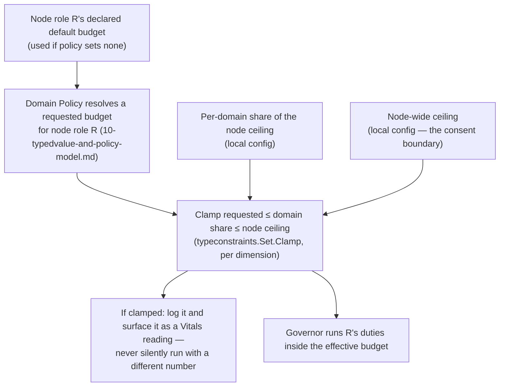
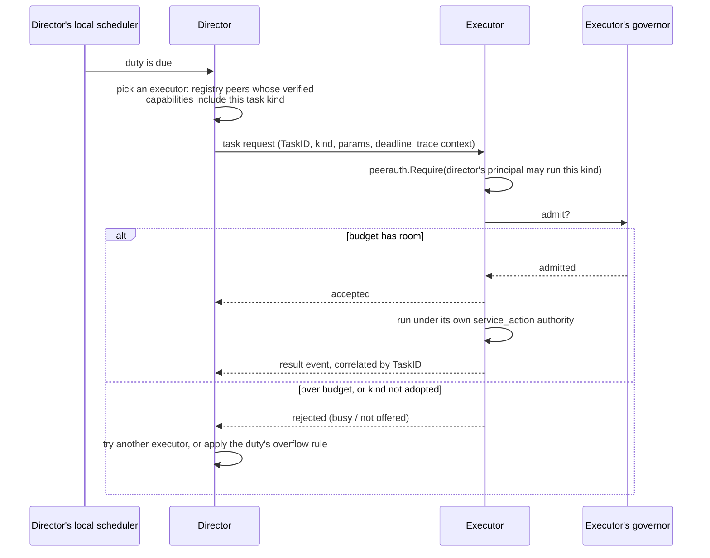

# Adopting node roles, and bounding what they cost

**Status: design draft; the resource governor is built** (see "Status of the
governor" near the end). The scheduler, the node role runtime and every
integration are still design. Like
[`18-peer-discovery-and-capabilities-model.md`](18-peer-discovery-and-capabilities-model.md),
which this builds on, it pins vocabulary and boundaries first.

## The idea

A node can **adopt a node role** — "retention sweeper", "task executor",
"task director", an app-defined one — and by doing so agree to run that
node role's **duties** automatically, configured by the domain's policy,
without the app being heavily involved. Duties are often *scheduled*:
database maintenance, clean-ups, heartbeats, or generic tasks the node
carries out for others, or hands to another node. The counterpart
requirement is that the node is never overwhelmed by node roles outside its own
application work without its consent. So there are three cooperating
pieces, deliberately separate:

| Piece | Question it answers | Scope |
|---|---|---|
| **Node role runtime** | *Which* duties exist, under whose authority, configured how? | Per domain (one per `App`) |
| **Local scheduler** | *When* is a duty due? | Per domain's node roles, one clock |
| **Resource governor** | *Whether and how much* may it run right now? | **Per node**, across every domain |

The scheduler decides a duty is due and submits it; the governor admits,
queues or sheds it against the node's budget. Neither knows what the work
is.

The governor is node-wide on purpose. A node in two domains
([`18`](18-peer-discovery-and-capabilities-model.md#the-archipelago-domain))
has one machine's worth of capacity, and consent is the *node's*, not a
domain's. Per-domain budgets without a shared ceiling would let two
domains each take "their share" and together exceed what the node agreed
to.

## Vocabulary

- **Node role definition** — a key, a description, its duties, the permissions
  those duties need, the Policy definitions that configure it, whether it
  is exclusive (**no, unless it says so** — see below), and a *default
  budget*. Core node roles live under a reserved
  namespace owned by the base that defines them; app-defined node roles are
  anything else, exactly the core/app split `18` already makes, using the
  same reserved-namespace map.
- **Duty** — one unit of automatic work within a node role: a trigger and a
  function. What triggers it is the local scheduler's business (below).
- **Task** — a duty's unit of execution: it has an id, a kind, parameters
  and a deadline. A local duty creates its own tasks; a *directed* task
  arrives from another node.
- **Executor** — a node role: this node carries out tasks of stated kinds,
  including ones directed at it by others.
- **Director** — a node role: this node decides that a task should run and
  sends it to an executor, rather than running it itself.
- **Adoption** — a node-local decision, per domain, to run a node role. It is
  **configuration, not database state**, so a node with no direct
  database access ([`17`](17-sdk-model.md)) can adopt node roles. It may also
  be advertised to peers as a node role claim, which `18` already treats as an
  unverified hint.
- **Budget** — the limits a node role's work runs under (below).

## Two keys, not one

Adoption needs **both**:

1. **The node opts in** (local configuration). Nothing a domain's policy
   says can make a node run a node role it did not adopt.
2. **Policy configures it** (the domain's Policy values, resolved with the
   existing machinery in [`10`](10-typedvalue-and-policy-model.md)):
   intervals, targets, what "applicable" means.

Opt-in without policy runs the node role's declared defaults. Policy without
opt-in does nothing. *Not yet:* a domain *inviting* nodes (by label) to
adopt a node role. That would be a request the node still has to accept, and it
needs the label type `18` leaves open.

## The consent rule, and why Policy's clamp direction is inverted here

Policy's `typeconstraints.Set.Clamp` lets a *wider* scope bound a
*narrower* one — a global ceiling silently limits a per-app override, and
the caller is told it happened. Consent needs the opposite: the **node**,
the narrowest scope, must be able to cap what the **domain**, a wider
one, asks of it.

So the node's ceiling is **not a Policy value**. It is local
configuration applied *after* policy resolution, in code:

Nothing is run with an unstated budget either. A node role declares a default
budget, and **adopting it requires acknowledging one**: the node's config
either sets an explicit budget or says "use the node role's default." There is
no silent default — adoption is consent to *this much* work.

## What a budget can actually bound

Go has no per-goroutine CPU or memory limit, and "threads" are goroutines
multiplexed by a process-wide scheduler. So the governor's limits are
**cooperative** and are stated in terms the runtime can really enforce:

- **Concurrency** — at most N of a node role's duties running at once (a
  bounded worker pool or semaphore). This is the practical meaning of
  "how many threads or tasks."
- **Queue depth, with a stated overflow behavior** — when work arrives
  faster than the budget allows: drop, defer, or coalesce (e.g. collapse
  repeated "run the sweep" triggers into one). Which one is part of the
  duty's definition, not an accident of an unbounded channel.
- **Rate** — at most N starts per interval.
- **Per-run timeout** — via context deadline.

**Budgets are tiers first, numbers second.** Rather than asking a node to
reason about bytes, the common vocabulary is a coarse tier — `low`,
`medium`, `high` — and the node's config says `budget = low`. The node role
author, who knows what its own work costs, declares what each tier means
for *that node role* (for example a batch size, a concurrency, a queue depth
and a rate); the node ceiling then clamps those numbers as usual. Explicit
numbers remain available for the dimensions the governor can really
enforce (concurrency, queue depth, rate, timeout) as an escape hatch.

This is also why memory is **not** accounted. A tier is a hint a duty can
honor (a smaller batch at `low`), not an enforced limit, and nothing in
the governor tries to measure what a duty holds. Hard memory protection
remains the operating system's job.

### Priority: "I care about this more"

When resources are genuinely limited, the app can say which node role or task
it cares about more. Priority is a small, named, ordered set rather than a
number — `background`, `normal`, `important`, `critical` — in the same
coarse spirit as the budget tiers. The app sets it per adopted node role and per
registered task kind.

1. **Priority only matters under contention.** With room to spare, it does
   nothing.
2. **It orders admission.** When capacity frees up and work is waiting, the
   governor admits the highest priority first.
3. **It orders shedding.** Under queue overflow or app pressure (the yield
   signal), the lowest priority is shed or deferred first. Rising pressure
   raises the cutoff: at *elevated*, `background` goes; at *high*, anything
   below `important`.
4. **It does not preempt.** Running work is not killed to make room unless
   that duty explicitly opted into cancellation.
5. **It does not buy extra budget.** A `critical` node role still runs inside
   its tier and the node ceiling. Priority orders work inside the budget; it
   never raises it.
6. **A remote party cannot set it.** A job may carry a priority hint, but
   the executor's effective priority is the lower of the hint and the cap
   the executor has configured for that task kind. A director cannot push
   work to the front of a node that did not agree to give it that standing —
   the same consent rule as the budget ceiling.
7. **Low priority must not starve forever.** Waiting work gains effective
   priority with age, up to a cap one level below the top, so aged
   `background` work eventually runs but never displaces `critical`. The
   exact aging rule is left open.

Real CPU and memory isolation belongs to the operating system (cgroups,
container limits). The governor is compatible with that and does not
replace it; this doc does not try to.

**The app's own work is protected by construction.** Node role work runs in
the governor's pools, separate from whatever the app runs for its own
functions, and the node ceiling is sized so those pools cannot starve the
rest. The app can also tell the governor it is busy through a yield hook,
and node role work then pauses or sheds — the "without its consent" half of the
requirement made concrete.

Budget values themselves are natural `typedvalue`s (a count, a rate, a
size in bytes) with `typeconstraints` bounds, so they need no new value
vocabulary.

## Whose authority duties run under

[`09`](09-gatehouse-core-model.md)'s background-work model already
answers this. A duty runs as a real principal, never a bare string, and
records `actor_principal`, `requested_by_principal` and
`authority_source`:

- Duties run under `service_action` — the node acting under its own
  standing authority in that domain — or `scheduled_task` when a
  scheduler triggered them.
- A node role declares the permissions its duties need and registers them like
  any other (`RegisterPermission`). An adopted node role whose node's principal
  lacks the grants **fails closed and says so**; it does not silently
  skip.
- `recovery_elevation` is never delegable to scheduled work (`09`), so no
  node role can acquire it.

## Exclusive node roles use leases

**Node roles are not unique unless they say so, and exclusive node roles are
permitted but discouraged:** prefer a design where several nodes can hold
the node role at once. Most node roles — an executor, a retention sweeper — are safe,
and often better, run by many nodes at once. Exclusivity is an explicit,
opt-in property of a node role definition, for the cases where a single holder
really is the simplest correct design.

A node role that must have exactly one holder per group (a leader) is a
[`13`](13-registry-and-leases-model.md) lease:
`(Group, Name)` held by one `Instance`. Its duties run only while the
lease is held, and losing it cancels them through their context.

`13` calls a lease "a liveness primitive, not a security boundary," and
the same reasoning means it is not a fencing token either. That matters
here: after expiry, a slow previous holder can
briefly overlap with a new one. So **a duty of an exclusive node role must be
idempotent**, rather than assuming the lease alone guarantees single
execution. Fencing tokens are not designed in; if a duty cannot be made
idempotent it is probably the wrong thing to make exclusive.

## The local scheduler

The first revision of this doc treated scheduling as a separate,
deferred "Beacon-equivalent" system. That undersold it: a node role that runs
duties automatically *needs* something that says when each is due, so a
local scheduler is part of this design. The durable side — queues,
retries, work handed across boundaries — is the job system, also in
scope, described further below.

**Triggers.**

- *Interval*, with jitter, so a fleet that started together does not all
  fire together.
- *Calendar* (cron-like expressions, wall-clock).
- *One-shot* at a time.
- *Event*: a message arrived, a lease was acquired or lost, a Policy
  value changed, the node started or is shutting down.

**Per-duty policies, declared by the duty, not left to chance:**

| Question | Choices |
|---|---|
| Previous run still going when the next is due? | skip · queue one · allow (up to the budget's concurrency) |
| Node was down or paused and missed runs? | skip · run once on catch-up · run each, bounded |
| Governor has no room? | the overflow behavior from the budget section: drop · defer · coalesce |

Catching up on missed runs needs a record of the last run. A node with no
storage simply gets *skip* semantics, because it cannot know what it
missed; the choice is therefore not available to every node, and the doc
for a duty has to say which it needs.

**Schedules are configuration.** A node role declares a default schedule, and
the domain's Policy may override it. A node role can also declare a *floor*
(for example "no more often than every ten seconds") as a
`typeconstraints` bound, so a policy value cannot ask for a schedule the
node role was never designed to withstand. Clamps are reported, as for budgets.

**What the scheduler is not.** It is in-process. It has no durable
queue, no cross-node deduplication, and no workflow. Anything that must
survive a restart, be handed across a boundary, or be retried belongs to
the job system below, which the scheduler feeds rather than replaces.

## Three kinds of scheduled work

| Kind | Node role | Example | Needs Transit? |
|---|---|---|---|
| **Local duty** | any node role | prune this node's own history tables; renew a lease; heartbeat | No |
| **Executor** | task executor | carry out a task of an advertised kind that someone else sent | Yes, to receive |
| **Director** | task director | decide a task is due and send it to an executor | Yes, to send |

Local duties are the immediately useful kind and have no Transit
dependency, so they can be built before the Router exists. A concrete
first candidate: `registry`'s `Heartbeat` and lease renewal are today the
*caller's* job to remember ([`13`](13-registry-and-leases-model.md) built
the mechanism and no background driver); a core node role could own that.

### Directing a task to another node

**Revised for durable jobs.** When the task is a job, `20` now delivers it by
*pull through a director*, not by the push below: the executor calls the
director and asks for as much work as its governor can admit, so "rejected
(busy / not offered)" never needs to happen, because nothing is sent that
was not asked for. The consent rule below holds, more strongly. The push
sequence stays as the design for a *non-durable* directed task (a duty a
scheduler wants another node to carry out without a stored job), which is
not built.

Design points that follow from earlier docs:

- **The request is the checked boundary.** [`09`](09-gatehouse-core-model.md)
  already says it: "the moment an operation needs to ask another node to
  act, that request is the checked boundary (ordinary Peer
  authorization)." The executor authorizes the director's principal
  against the queue-context permissions from `20` with the existing
  `peerauth.Require`; no new authorization concept.
- **The executor consents.** Which kinds it executes is its own adoption;
  its governor can reject on budget. A director is never able to force
  work onto a node. "Rejected" is a normal, expected reply the director
  must handle.
- **Whose authority.** By default the task runs under the *executor's*
  `service_action` standing authority, recording the director as
  `requested_by_principal` and the schedule as a `scheduled_task` source.
  `delegated_authority` applies only when the task acts on behalf of
  another principal, and then `09`'s rule holds: the effective authority
  is the *intersection* of that principal's current permissions and what
  was delegated, checked at execution time.
- **Delivery is at-least-once.** A director that gets no acknowledgement
  must be able to try again, possibly elsewhere, so the same task can
  arrive twice. Exactly-once is not attempted. The executor deduplicates by
  `TaskID` within a bounded window, and tasks must be idempotent where
  duplicate execution would matter, the same requirement exclusive node roles
  have.
- **Discovery of executors** is `18`'s: ask a peer what it offers, after
  the connection. An executable task kind is a capability, and "executor
  of kind K" is a node role claim that is verified by the executor accepting
  the task.
- **A task kind is not an endpoint.** Being able to perform a kind of job
  does not mean exposing an additional endpoint for it. Task kinds have
  their own registry, separate from `15`'s `EndpointDefinition`s, with their
  own authorization (queue-context permissions, per `20`) and their own
  advertisement as a capability. Directed tasks arrive through one generic
  delivery mechanism, not a route per kind. A job's handler *may* call an
  endpoint, or need one to exist, but that is the handler's business; the
  job itself is a separate thing.
- **Router dependency.** The executor half needs inbound dispatch, which
  is the same undesigned Router that `11`, `15` and `16` are waiting on.
  So local duties, then the director's *sending* path, can come first;
  the executor's receiving side lands with the Router.

## The job system

**In scope.** The purpose is to let an application defer work across
boundaries — hand it to another node, or to later — and have it survive
restarts and be retried. (An earlier revision of this doc listed it as out
of scope; that was wrong, and is corrected here.)

**The one hard constraint: no arbitrary code execution.** A node performs
only task kinds it has *registered a handler for*. A job carries **data**:
a task kind and parameters validated against that kind's `typedvalue`
schema. It never carries code, a script, or a command line. A job naming a
kind the node has no handler for is rejected, not interpreted. Registering
a handler *is* adopting the executor node role for that kind, which is also what
makes "executor of kind K" a capability worth advertising (`18`). It does
**not** create an endpoint: a task kind is registered in its own task
registry, separate from `15`'s endpoint registry, and a job is delivered
by one generic mechanism rather than a route per kind. A handler may
call an endpoint if its work calls for one, but nothing requires it.

**Direction** (the design itself is in [`20-jobs-model.md`](20-jobs-model.md)):

1. **A new base, `jobs`**, with the project's usual structure / evaluation /
   storage / facade layers and a Postgres store. A job records its task
   kind, validated parameters, a schedule (one-shot, or recurring), a
   deadline, a retry policy, an idempotency key, a target selector (any
   executor of the kind, by label, or a named node), its state, its
   attempts, who requested it and under what authority source, and trace
   context. Principals are opaque UUIDs here, as in Vitals, so the base
   needs no Gatehouse-core.
2. **Claiming is atomic with an expiry**, the same single-statement pattern
   `AcquireOrRenewLease` already uses: a claimed job whose claim lapses
   returns to pending with its attempt count raised, and after the retry
   policy's maximum it becomes a terminal failure that is reported. This is
   what makes delivery at-least-once without a separate retry loop.
3. **Executors with store access claim directly; nodes without it are
   pushed to.** A node with store access can claim on another's behalf and
   push the task over Transit. That unifies the "director" above with
   "a node that can reach the store".
4. **Deferring across a boundary means submitting through a node that has
   the store.** For a node with no direct database access this is the
   remote-intermediary `Store` implementation `02` already names as a later
   implementation of the same interface; it needs the Router.
5. **A durable recurring schedule is a recurring job definition**, so the
   scheduler's catch-up record ("last run") is just the last instance that
   definition produced. This is why the catch-up question does not need its
   own table.
6. **Authority:** who may submit, claim, read and cancel is decided by
   generic permissions on a queue context, checked by an integration
   (`jobs` + Gatehouse-core), the same shape as `vitalsauth`. Whose
   authority the work runs under (actor, requester, effective principal)
   is worked out in `20`.

**A side finding that bears on this.** `13`'s `AcquireOrRenewLease` stamps
`acquired_at` and `expires_at` from the *calling* instance's clock, and the
SQL compares them against other callers' stamps — so two instances with
skewed clocks can disagree about whether a lease expired. A job store
should use the database's own clock for claim and expiry times instead.
The lease code is worth the same fix; it is not part of this doc's scope.

## Likely shape (not decided)

Following the project's module-per-dependency-unit rule:

- **`governor`** — a zero-dependency base: budgets, bounded pools, the
  overflow behaviors, the yield hook. No database, no domain concept.
- **`scheduler`** — a zero-dependency base too: triggers, per-duty overlap
  and catch-up policy, submitting due work to a governor. No storage unless
  a catch-up record is wired in by an integration.
- **`jobs`** — the durable job base described above; no dependency on any
  other base.
- **`noderoles`** — node role definitions, adoption, and the runner, depending on
  `governor`, `scheduler` and `logging` only.
- Integrations, each importing exactly the two bases it combines:
  `noderoles` + Policy (resolve budgets, schedules, config), `noderoles` +
  Gatehouse-core (principal and permission checks), `noderoles` +
  registry/leases (exclusivity), `noderoles` + Vitals (report duty health and
  clamps), `noderoles` + `jobs` (executors claiming work), `jobs` +
  Gatehouse-core (queue-context permissions and assumed sessions), and `noderoles` + Transit
  (executor receiving and director sending, once a Router exists).
- **`sdk`**: `Config` gains a *shared* `Governor` handed to every `App` on
  the node, and a list of adopted node roles per `App`.

## Status of the governor

**Built: `governor`,** the zero-dependency node-wide governor and nothing
above it. A `Governor` is created once per node from a node `Ceiling` and
optional per-domain `Ceiling`s; a node role registers a `RoleSpec` (key,
domain, requested `Limits`, priority) and gets back a `Role` whose `Limits`
are what it will really run under and whose `Clamps` list every dimension a
ceiling reduced (also logged at warn, never silent). `Role.Submit` offers a
piece of `Work` and returns a `Ticket`. `ResolveBudget` turns an `Adoption`
(a tier, "use the default", and/or explicit overrides) into the requested
limits, and refuses an adoption that states nothing.

1. **Three nested capacity levels,** node, domain share, node role. Work
   starts only when all three have room, so two domains cannot each take
   "their share" and together exceed the node's. Queue depth, rate and run
   timeout are per node role, each capped by the ceilings.
2. **Admission is best-first and does not block.** Highest effective
   priority, then oldest. Work that is held back (a full level, the role's
   rate, pressure) never blocks work behind it that can run.
3. **The aging rule (an open question, now settled):** waiting work counts as
   one level more urgent per `AgeStep` (default 30s), never above
   `important`, and work already at `important` or `critical` does not age.
   Aging orders work **only**. Whether work may start under pressure is
   judged on its base priority, otherwise waiting would defeat the cutoff;
   a test pins that. Whether any kind may be marked non-sheddable is still
   open.
4. **Overflow is per piece of work:** `Drop` (forget it), `Defer` (not now;
   ask again), or `Coalesce` (merge into an identical waiting piece by key and
   hand back *that* piece's ticket, raising its priority if the new trigger is
   more urgent; with nothing to merge into and no room it drops). A queue
   depth of zero means "start at once or be shed".
5. **Pressure holds, it does not shed or kill.** At `elevated`, background is
   not started; at `high`, nothing below `important`. Held work stays queued
   (and counts against the queue depth) and runs when the pressure drops.
   Running work is never touched.
6. **No preemption and no memory accounting,** as designed. A run is bounded
   by its context deadline, a panic in a duty is a failed result, and
   `Close` sheds the queue, cancels the running work's context and waits.
7. **Clamping is a per-dimension minimum in the governor itself.** This
   departs from the earlier sketch of using `typeconstraints.Set.Clamp`, and
   the reason is the shape of the data: `Limits` and `Ceiling` are
   permanently fixed types (a count, a depth, a rate, a duration), so
   `typedvalue` would add machinery and nothing else. (The governor is also
   kept free of other bases because it should be usable on a node that adopts
   nothing else, but `typedvalue` would not have been a dependency worth
   avoiding on that ground.)
   `typedvalue` and `typeconstraints` are the intended type system wherever
   values are complex or dynamic, and this design still uses them there: the
   `noderoles` + Policy integration resolves what a domain *asks for*, which
   is Policy-held and dynamic, with `typedvalue` and `typeconstraints`, then
   hands the result in as `Requested`. The same applies to tier tables and
   floors on schedules when those are built.
8. **`Stats()`** gives running and waiting counts and cumulative counters per
   node role (submitted, started, completed, failed, cancelled, coalesced, shed
   by reason) for the Vitals integration to report. Nothing reports them yet.

**Tested** with real goroutines under the race detector: no level is ever
over its cap; priority and age ordering; pressure holding work and not
killing it, including that aged work stays held; each overflow behaviour;
rate spacing without blocking other roles; run timeouts; panic recovery;
close and unregister; and a randomized stress run over several roles and
domains with pressure changing, which also checks that every ticket
resolves and that the counters account for every submission. Removing the
node ceiling, the domain share, the queue depth, priority ordering, the rate
limit, or the base-priority rule for pressure each fails a test.

**Not built:** the `scheduler`, `noderoles` runner, the Policy, Gatehouse-core,
Vitals, registry and jobs integrations, SDK `Config` carrying a shared
governor, and executor admission through the governor (`jobsexec` still has
only a plain concurrency limit). The governor has no clock injection, so its
rate and aging tests use short real durations.

## Status of recurrence

**Built: `recurrence`,** the shared "next occurrence after t" answer for the
scheduler and for recurring jobs (`20`). `Every(d, anchor)` is real elapsed
time, anchored so a restart does not shift it; `Once(at)`; `Calendar(expr,
loc)` matches a cron expression on the wall clock of a location; `Between`
lists what fell in a window, for catch-up. It is a pure module whose only
dependency is the cron *parser*.

1. **The library was chosen by trying it.** `go-cron` needs Go 1.26 and a
   1.27 toolchain, which this workspace cannot use. Of `robfig/cron` v3.0.1
   (unmaintained since 2020) and `gronx`: on a daily job across the fall-back
   night one fires it twice and one once; on an hourly job across it one
   fires both 01:00s and one drops one; both skip a 02:30 job on the
   spring-forward day. Since the two disagree on exactly the case that
   matters, `recurrence` defines the behaviour itself and uses `robfig`'s
   parser only for matching in civil time, where there is no daylight saving.
2. **The rule:** a civil time that exists once is that instant; one that
   happens twice (clocks back) fires once, at the first occurrence; one that
   never happens (clocks forward) fires at the first instant after the gap,
   and several in one gap are one instant. A daily calendar schedule
   therefore fires exactly once on every day it matches, including transition
   days, in every zone tested (including a 30-minute shift, the southern
   hemisphere and zones without DST). The cost, stated in the package doc: an
   hourly wall-clock schedule has a two-hour gap on a fall-back night, and
   `Every` is the tool for "each N hours of real time".
3. **`Next` is strictly increasing,** including when asked from inside a
   repeated hour, where mapping to the first occurrence would otherwise
   return something already past.
4. **Hardening against the library:** it panics on `TZ=` / `CRON_TZ=`
   input, so those prefixes are rejected up front and the parse is wrapped
   in a recover; it accepts empty list elements (`1,,2`), which are
   rejected here; `@every` is refused in favour of `Every`.
5. **Tested** against real zones (New York, Sydney, Lord Howe, Kolkata, London,
   St John's, UTC): the transition days, a year of daily occurrences in each
   zone (365, one per day, strictly increasing), and `Next` from every
   quarter hour of both New York transition days. Removing the monotonic
   guard, choosing the later of a repeated time, ending a gap by shifting
   instead of at its end, allowing zone prefixes, or removing the panic
   guard each fails a test.

## Decisions so far

1. **Node roles are non-unique by default**, and exclusive node roles are permitted
   but discouraged in favor of designs that several nodes can hold. Duties
   of an exclusive node role must be idempotent; fencing tokens are not
   designed in.
2. **Budgets are tiers** (`low`/`medium`/`high`) that the node role author
   defines in concrete terms, with explicit numbers only for what the
   governor can enforce. No memory accounting.
3. **Priority** is a small named set (`background`, `normal`, `important`,
   `critical`) the app assigns per node role and per task kind. It orders
   admission and shedding under contention, never preempts, never raises a
   budget, and cannot be set by a remote party. Aging rule left open.
4. **The yield signal** is a small pressure level the app sets (none,
   elevated, high). It lowers *admission* only and never kills a running
   duty unless that duty opted into cancellation. Pressure and priority
   interact as in the priority section.
5. **Policy-invited adoption** is ignored by default; a node acts on an
   invitation only if it holds a standing allow-list it set in advance.
   Needs the label type from `18`, so it is blocked on that.
6. **No silent default budget.** Adoption states a tier or says
   `budget = default`; a node role with no statement fails *that node role only*,
   loudly, not the node.
7. **First consumers of the node role runtime:** `registry`'s heartbeat and
   lease renewal first (a local duty, no Transit, a real existing gap,
   testable against real Postgres); the `vitals` history retention sweep
   second; executor and director once the job system and Router exist.
   Build order: governor, scheduler, node role runner, then the registry
   membership node role.
8. **Catch-up record:** a small interface in `scheduler` (get and put the
   last run per node role and duty), in-memory by default so nodes with no
   storage get skip semantics; the durable implementation comes with the
   job system rather than a separate table.
9. **Task identity and dedup:** the job ID plus an attempt number; an
   executor remembers recent IDs for roughly the task's deadline plus a
   margin and answers a repeat with the earlier outcome. The job store is
   the durable memory, and tasks are idempotent regardless.
10. **Result delivery:** a correlated result event by default; a channel
    only for task kinds that declare they stream progress.
11. **Deadlines are relative durations from receipt**, not absolute
    timestamps. The executor computes its own absolute deadline from its
    own clock. Calendar schedules are evaluated only on the node that owns
    them and are never shipped as absolute times to others. Job timestamps
    use the database's clock.
12. **The durable job system is in scope**, under the no-arbitrary-code
    constraint above, and a task kind is separate from an endpoint.
13. **Terminology: "node role", always qualified.** Bare "role" keeps
    meaning Gatehouse's permission bundle (`09`, `07`'s HCL section). This
    follows common practice: Kubernetes lives with both RBAC `Role` and
    node roles by qualifying, and Elasticsearch, Kafka and Akka all speak
    of node roles. The cost is vigilance — every type, module and config
    key for this concept carries the qualifier (the planned module is
    `noderoles`). `CLAUDE.md` records the rule so it does not drift.

## Still open

1. **Where node-local adoption config lives, and in what format.** Doc
   `07` assigns flat operational settings, including SDK-init options, to
   TOML, and reserves HCL for "ensure this exists" reference graphs. By
   that rule the node's own settings (ceiling, tier mapping, adopted node roles,
   priorities) are TOML or code-defined structs, while the store-resident
   side (grants a node role's principal needs, Policy values that configure a
   node role, recurring job definitions) is a natural extension of what HCL
   is already used for. See the note added to `07`.
2. **Whether any task kind may be marked non-sheddable.** (The aging rule is
   settled; see "Status of the governor".)
3. **The job system's own design** — drafted in
   [`20-jobs-model.md`](20-jobs-model.md); its open questions are tracked
   there.
