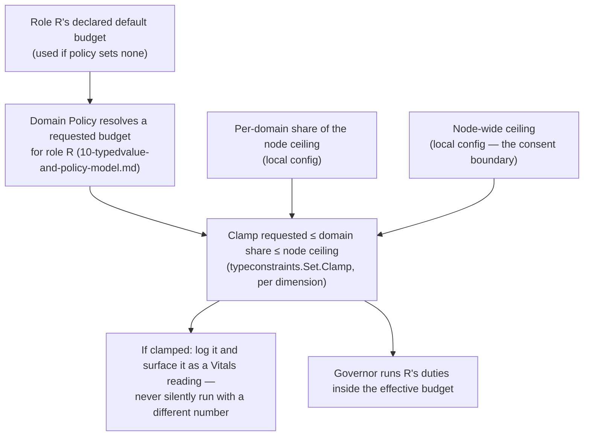
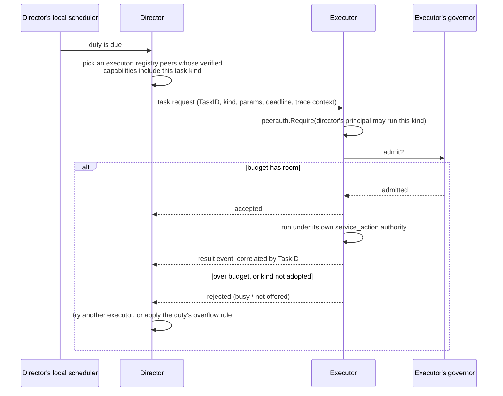

# Adopting roles, and bounding what they cost

**Status: design draft. Nothing here is built.** Like
[`18-peer-discovery-and-capabilities-model.md`](18-peer-discovery-and-capabilities-model.md),
which this builds on, it pins vocabulary and boundaries first.

## The idea

A node can **adopt a role** — "retention sweeper", "task executor",
"task director", an app-defined one — and by doing so agree to run that
role's **duties** automatically, configured by the domain's policy,
without the app being heavily involved. Duties are often *scheduled*:
database maintenance, clean-ups, heartbeats, or generic tasks the node
carries out for others, or hands to another node. The counterpart
requirement is that the node is never overwhelmed by roles outside its own
application work without its consent. So there are three cooperating
pieces, deliberately separate:

| Piece | Question it answers | Scope |
|---|---|---|
| **Role runtime** | *Which* duties exist, under whose authority, configured how? | Per domain (one per `App`) |
| **Local scheduler** | *When* is a duty due? | Per domain's roles, one clock |
| **Resource governor** | *Whether and how much* may it run right now? | **Per node**, across every domain |

The scheduler decides a duty is due and submits it; the governor admits,
queues or sheds it against the node's budget. Neither knows what the work
is.

The governor is node-wide on purpose. A node in two domains
([`18`](18-peer-discovery-and-capabilities-model.md#the-archipelago-domain))
has one machine's worth of capacity, and consent is the *node's*, not a
domain's. Per-domain budgets without a shared ceiling would let two
domains each take "their share" and together exceed what the node agreed
to.

## Vocabulary

- **Role definition** — a key, a description, its duties, the permissions
  those duties need, the Policy definitions that configure it, whether it
  is exclusive, and a *default budget*. Core roles live under a reserved
  namespace owned by the base that defines them; app-defined roles are
  anything else, exactly the core/app split `18` already makes, using the
  same reserved-namespace map.
- **Duty** — one unit of automatic work within a role: a trigger and a
  function. What triggers it is the local scheduler's business (below).
- **Task** — a duty's unit of execution: it has an id, a kind, parameters
  and a deadline. A local duty creates its own tasks; a *directed* task
  arrives from another node.
- **Executor** — a role: this node carries out tasks of stated kinds,
  including ones directed at it by others.
- **Director** — a role: this node decides that a task should run and
  sends it to an executor, rather than running it itself.
- **Adoption** — a node-local decision, per domain, to run a role. It is
  **configuration, not database state**, so a node with no direct
  database access ([`17`](17-sdk-model.md)) can adopt roles. It may also
  be advertised to peers as a role claim, which `18` already treats as an
  unverified hint.
- **Budget** — the limits a role's work runs under (below).

## Two keys, not one

Adoption needs **both**:

1. **The node opts in** (local configuration). Nothing a domain's policy
   says can make a node run a role it did not adopt.
2. **Policy configures it** (the domain's Policy values, resolved with the
   existing machinery in [`10`](10-typedvalue-and-policy-model.md)):
   intervals, targets, what "applicable" means.

Opt-in without policy runs the role's declared defaults. Policy without
opt-in does nothing. *Not yet:* a domain *inviting* nodes (by label) to
adopt a role. That would be a request the node still has to accept, and it
needs the label type `18` leaves open.

## The consent rule, and why Policy's clamp direction is inverted here

Policy's `typeconstraints.Set.Clamp` lets a *wider* scope bound a
*narrower* one — a global ceiling silently limits a per-app override, and
the caller is told it happened. Consent needs the opposite: the **node**,
the narrowest scope, must be able to cap what the **domain**, a wider
one, asks of it.

So the node's ceiling is **not a Policy value**. It is local
configuration applied *after* policy resolution, in code:

Nothing is run with an unstated budget either. A role declares a default
budget, and **adopting it requires acknowledging one**: the node's config
either sets an explicit budget or says "use the role's default." There is
no silent default — adoption is consent to *this much* work.

## What a budget can actually bound

Go has no per-goroutine CPU or memory limit, and "threads" are goroutines
multiplexed by a process-wide scheduler. So the governor's limits are
**cooperative** and are stated in terms the runtime can really enforce:

- **Concurrency** — at most N of a role's duties running at once (a
  bounded worker pool or semaphore). This is the practical meaning of
  "how many threads or tasks."
- **Queue depth, with a stated overflow behavior** — when work arrives
  faster than the budget allows: drop, defer, or coalesce (e.g. collapse
  repeated "run the sweep" triggers into one). Which one is part of the
  duty's definition, not an accident of an unbounded channel.
- **Rate** — at most N starts per interval.
- **Per-run timeout** — via context deadline.
- **Cooperative accounting** for memory and bytes — a duty that processes
  data reports what it holds, and the governor refuses to start more once
  a limit is reached. It cannot reclaim memory a duty already allocated.

Real CPU and memory isolation belongs to the operating system (cgroups,
container limits). The governor is compatible with that and does not
replace it; this doc does not try to.

**The app's own work is protected by construction.** Role work runs in
the governor's pools, separate from whatever the app runs for its own
functions, and the node ceiling is sized so those pools cannot starve the
rest. The app can also tell the governor it is busy through a yield hook,
and role work then pauses or sheds — the "without its consent" half of the
requirement made concrete.

Budget values themselves are natural `typedvalue`s (a count, a rate, a
size in bytes) with `typeconstraints` bounds, so they need no new value
vocabulary.

## Whose authority duties run under

[`09`](09-gatehouse-core-model.md)'s background-work model already
answers this. A duty runs as a real principal, never a bare string, and
records `actor_principal`, `requested_by_principal` and
`authority_source`:

- Duties run under `service_action` — the node acting under its own
  standing authority in that domain — or `scheduled_task` when a
  scheduler triggered them.
- A role declares the permissions its duties need and registers them like
  any other (`RegisterPermission`). An adopted role whose node's principal
  lacks the grants **fails closed and says so**; it does not silently
  skip.
- `recovery_elevation` is never delegable to scheduled work (`09`), so no
  role can acquire it.

## Exclusive roles use leases

A role that must have exactly one holder per group (a leader, the cluster
scheduler) is a [`13`](13-registry-and-leases-model.md) lease:
`(Group, Name)` held by one `Instance`. Its duties run only while the
lease is held, and losing it cancels them through their context.

`13` calls a lease "a liveness primitive, not a security boundary," and
the same reasoning means it is not a fencing token either. That matters
here: after expiry, a slow previous holder can
briefly overlap with a new one. So **a duty of an exclusive role must be
idempotent**, or carry its own fencing, rather than assuming the lease
alone guarantees single execution.

## The local scheduler

The first revision of this doc treated scheduling as a separate,
deferred "Beacon-equivalent" system. That undersold it: a role that runs
duties automatically *needs* something that says when each is due, so a
local scheduler is part of this design, and the larger durable job
machinery is what remains out of scope (see the end of this section).

**Triggers.**

- *Interval*, with jitter, so a fleet that started together does not all
  fire together.
- *Calendar* (cron-like expressions, wall-clock).
- *One-shot* at a time.
- *Event*: a message arrived, a lease was acquired or lost, a Policy
  value changed, the node started or is shutting down.

**Per-duty policies, declared by the duty, not left to chance:**

| Question | Choices |
|---|---|
| Previous run still going when the next is due? | skip · queue one · allow (up to the budget's concurrency) |
| Node was down or paused and missed runs? | skip · run once on catch-up · run each, bounded |
| Governor has no room? | the overflow behavior from the budget section: drop · defer · coalesce |

Catching up on missed runs needs a record of the last run. A node with no
storage simply gets *skip* semantics, because it cannot know what it
missed; the choice is therefore not available to every node, and the doc
for a duty has to say which it needs.

**Schedules are configuration.** A role declares a default schedule, and
the domain's Policy may override it. A role can also declare a *floor*
(for example "no more often than every ten seconds") as a
`typeconstraints` bound, so a policy value cannot ask for a schedule the
role was never designed to withstand. Clamps are reported, as for budgets.

**What the scheduler is not.** It is in-process. It has no durable queue,
no cross-node deduplication, and no workflow (dependencies, fan-out,
priorities). A schedule that must survive restarts with its history
intact, or tasks chained into a pipeline, is the larger job system that
remains deferred.

## Three kinds of scheduled work

| Kind | Role | Example | Needs Transit? |
|---|---|---|---|
| **Local duty** | any role | prune this node's own history tables; renew a lease; heartbeat | No |
| **Executor** | task executor | carry out a task of an advertised kind that someone else sent | Yes, to receive |
| **Director** | task director | decide a task is due and send it to an executor | Yes, to send |

Local duties are the immediately useful kind and have no Transit
dependency, so they can be built before the Router exists. A concrete
first candidate: `registry`'s `Heartbeat` and lease renewal are today the
*caller's* job to remember ([`13`](13-registry-and-leases-model.md) built
the mechanism and no background driver); a core role could own that.

### Directing a task to another node

Design points that follow from earlier docs:

- **The request is the checked boundary.** [`09`](09-gatehouse-core-model.md)
  already says it: "the moment an operation needs to ask another node to
  act, that request is the checked boundary (ordinary Peer
  authorization)." The executor authorizes the director's principal
  against a per-kind permission with the existing `peerauth.Require`; no
  new authorization concept.
- **The executor consents.** Which kinds it executes is its own adoption;
  its governor can reject on budget. A director is never able to force
  work onto a node. "Rejected" is a normal, expected reply the director
  must handle.
- **Whose authority.** By default the task runs under the *executor's*
  `service_action` standing authority, recording the director as
  `requested_by_principal` and the schedule as a `scheduled_task` source.
  `delegated_authority` applies only when the task acts on behalf of
  another principal, and then `09`'s rule holds: the effective authority
  is the *intersection* of that principal's current permissions and what
  was delegated, checked at execution time.
- **Delivery is at-least-once.** A director that gets no acknowledgement
  must be able to try again, possibly elsewhere, so the same task can
  arrive twice. Exactly-once is not attempted. The executor deduplicates by
  `TaskID` within a bounded window, and tasks must be idempotent where
  duplicate execution would matter, the same requirement exclusive roles
  have.
- **Discovery of executors** is `18`'s: ask a peer what it offers, after
  the connection. The task kind is an ordinary capability, and "executor
  of kind K" is a role claim that is verified by the executor accepting
  the task.
- **Router dependency.** The executor half needs inbound dispatch, which
  is the same undesigned Router that `11`, `15` and `16` are waiting on.
  So local duties, then the director's *sending* path, can come first;
  the executor's receiving side lands with the Router.

## Likely shape (not decided)

Following the project's module-per-dependency-unit rule:

- **`governor`** — a zero-dependency base: budgets, bounded pools, the
  overflow behaviors, the yield hook. No database, no domain concept.
- **`scheduler`** — a zero-dependency base too: triggers, per-duty overlap
  and catch-up policy, submitting due work to a governor. No storage unless
  a catch-up record is wired in by an integration.
- **`roles`** — role definitions, adoption, and the runner, depending on
  `governor`, `scheduler` and `logging` only.
- Integrations, each importing exactly the two bases it combines:
  `roles` + Policy (resolve budgets, schedules, config), `roles` +
  Gatehouse-core (principal and permission checks), `roles` +
  registry/leases (exclusivity), `roles` + Vitals (report duty health and
  clamps), and `roles` + Transit (executor receiving and director
  sending, once a Router exists).
- **`sdk`**: `Config` gains a *shared* `Governor` handed to every `App` on
  the node, and a list of adopted roles per `App`.

## Open questions

1. **Fencing for exclusive roles** — idempotency required (above), or
   fencing tokens designed in.
2. **The yield signal** — what the app calls, and whether roles pause or
   shed.
3. **Policy-invited adoption** — needs the label type from `18`; the
   consent step is not designed.
4. **Defaults vs. refusing to start** — recommended: no silent default,
   adoption acknowledges one. Confirm.
5. **Memory accounting** — cooperative only; whether that is worth
   building before a duty actually needs it.
6. **Where adoption config lives** and how a node enumerates its roles
   across domains, alongside the open "domain identity's form" question in
   `18`.
7. **Core roles' first consumers** — candidates: `registry`'s heartbeat
   and lease renewal (`13`), the deferred retention sweep in `14`, and
   the task executor/director pair.
8. **Catch-up record.** Where "last run" lives for nodes that have
   storage, without making it a requirement for nodes that don't.
9. **Task identity and dedup window.** How long an executor remembers a
   `TaskID`, and what happens to a duplicate that arrives after it
   forgot.
10. **Result delivery.** A correlated result event versus a long-lived
    channel for tasks that stream progress; `11`'s delivery classes allow
    either.
11. **Clock skew** between director and executor when a task carries a
    deadline: absolute time versus a duration relative to receipt.
12. **A durable job system** — schedules and queues that survive restarts,
    workflow, priorities — remains deliberately out of scope for this
    design and is the natural next layer if a real consumer needs it.
