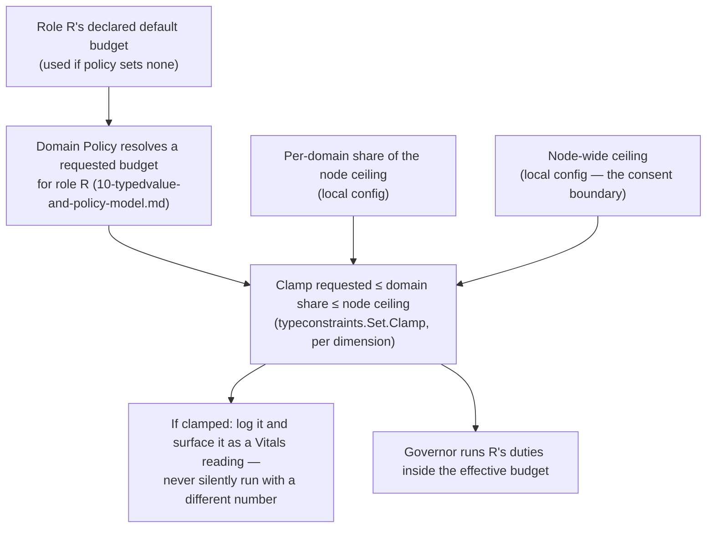

# Adopting roles, and bounding what they cost

**Status: design draft. Nothing here is built.** Like
[`18-peer-discovery-and-capabilities-model.md`](18-peer-discovery-and-capabilities-model.md),
which this builds on, it pins vocabulary and boundaries first.

## The idea

A node can **adopt a role** — "scheduler", "retention sweeper", an
app-defined one — and by doing so agree to run that role's **duties**
automatically, configured by the domain's policy, without the app being
heavily involved. The counterpart requirement is that the node is never
overwhelmed by roles outside its own application work without its
consent. So there are two cooperating pieces, deliberately separate:

| Piece | Question it answers | Scope |
|---|---|---|
| **Role runtime** | *What* runs automatically, under whose authority, configured how? | Per domain (one per `App`) |
| **Resource governor** | *How much* may that work use? | **Per node**, across every domain |

The governor is node-wide on purpose. A node in two domains
([`18`](18-peer-discovery-and-capabilities-model.md#the-archipelago-domain))
has one machine's worth of capacity, and consent is the *node's*, not a
domain's. Per-domain budgets without a shared ceiling would let two
domains each take "their share" and together exceed what the node agreed
to.

## Vocabulary

- **Role definition** — a key, a description, its duties, the permissions
  those duties need, the Policy definitions that configure it, whether it
  is exclusive, and a *default budget*. Core roles live under a reserved
  namespace owned by the base that defines them; app-defined roles are
  anything else, exactly the core/app split `18` already makes, using the
  same reserved-namespace map.
- **Duty** — one unit of automatic work within a role: a trigger
  (interval, event, or "lease acquired") and a function.
- **Adoption** — a node-local decision, per domain, to run a role. It is
  **configuration, not database state**, so a node with no direct
  database access ([`17`](17-sdk-model.md)) can adopt roles. It may also
  be advertised to peers as a role claim, which `18` already treats as an
  unverified hint.
- **Budget** — the limits a role's work runs under (below).

## Two keys, not one

Adoption needs **both**:

1. **The node opts in** (local configuration). Nothing a domain's policy
   says can make a node run a role it did not adopt.
2. **Policy configures it** (the domain's Policy values, resolved with the
   existing machinery in [`10`](10-typedvalue-and-policy-model.md)):
   intervals, targets, what "applicable" means.

Opt-in without policy runs the role's declared defaults. Policy without
opt-in does nothing. *Not yet:* a domain *inviting* nodes (by label) to
adopt a role. That would be a request the node still has to accept, and it
needs the label type `18` leaves open.

## The consent rule, and why Policy's clamp direction is inverted here

Policy's `typeconstraints.Set.Clamp` lets a *wider* scope bound a
*narrower* one — a global ceiling silently limits a per-app override, and
the caller is told it happened. Consent needs the opposite: the **node**,
the narrowest scope, must be able to cap what the **domain**, a wider
one, asks of it.

So the node's ceiling is **not a Policy value**. It is local
configuration applied *after* policy resolution, in code:

Nothing is run with an unstated budget either. A role declares a default
budget, and **adopting it requires acknowledging one**: the node's config
either sets an explicit budget or says "use the role's default." There is
no silent default — adoption is consent to *this much* work.

## What a budget can actually bound

Go has no per-goroutine CPU or memory limit, and "threads" are goroutines
multiplexed by a process-wide scheduler. So the governor's limits are
**cooperative** and are stated in terms the runtime can really enforce:

- **Concurrency** — at most N of a role's duties running at once (a
  bounded worker pool or semaphore). This is the practical meaning of
  "how many threads or tasks."
- **Queue depth, with a stated overflow behavior** — when work arrives
  faster than the budget allows: drop, defer, or coalesce (e.g. collapse
  repeated "run the sweep" triggers into one). Which one is part of the
  duty's definition, not an accident of an unbounded channel.
- **Rate** — at most N starts per interval.
- **Per-run timeout** — via context deadline.
- **Cooperative accounting** for memory and bytes — a duty that processes
  data reports what it holds, and the governor refuses to start more once
  a limit is reached. It cannot reclaim memory a duty already allocated.

Real CPU and memory isolation belongs to the operating system (cgroups,
container limits). The governor is compatible with that and does not
replace it; this doc does not try to.

**The app's own work is protected by construction.** Role work runs in
the governor's pools, separate from whatever the app runs for its own
functions, and the node ceiling is sized so those pools cannot starve the
rest. The app can also tell the governor it is busy through a yield hook,
and role work then pauses or sheds — the "without its consent" half of the
requirement made concrete.

Budget values themselves are natural `typedvalue`s (a count, a rate, a
size in bytes) with `typeconstraints` bounds, so they need no new value
vocabulary.

## Whose authority duties run under

[`09`](09-gatehouse-core-model.md)'s background-work model already
answers this. A duty runs as a real principal, never a bare string, and
records `actor_principal`, `requested_by_principal` and
`authority_source`:

- Duties run under `service_action` — the node acting under its own
  standing authority in that domain — or `scheduled_task` when a
  scheduler role triggered them.
- A role declares the permissions its duties need and registers them like
  any other (`RegisterPermission`). An adopted role whose node's principal
  lacks the grants **fails closed and says so**; it does not silently
  skip.
- `recovery_elevation` is never delegable to scheduled work (`09`), so no
  role can acquire it.

## Exclusive roles use leases

A role that must have exactly one holder per group (a leader, the cluster
scheduler) is a [`13`](13-registry-and-leases-model.md) lease:
`(Group, Name)` held by one `Instance`. Its duties run only while the
lease is held, and losing it cancels them through their context.

`13` calls a lease "a liveness primitive, not a security boundary," and
the same reasoning means it is not a fencing token either. That matters
here: after expiry, a slow previous holder can
briefly overlap with a new one. So **a duty of an exclusive role must be
idempotent**, or carry its own fencing, rather than assuming the lease
alone guarantees single execution.

## "Scheduler role" is two different things

- The **governor** and **role runtime** above are a node-local execution
  framework. They have no notion of cluster-wide jobs.
- A **scheduler role** — the cluster-level job scheduling that Lighthouse
  called Beacon, and that `14` repeatedly defers ("a future Beacon-
  equivalent") — is one role *built on* this framework, not part of it.
  Designing it (job definitions, persistence, retry semantics) is a
  separate effort and is not attempted here.

Keeping them apart is what lets a node adopt, say, a retention-sweeper
role without pulling in a job system, and lets an *app* define its own
background roles and have them governed the same way.

## Likely shape (not decided)

Following the project's module-per-dependency-unit rule:

- **`governor`** — a zero-dependency base: budgets, bounded pools, the
  overflow behaviors, the yield hook. No database, no domain concept.
- **`roles`** — role definitions, adoption, and the runner, depending on
  `governor` and `logging` only.
- Integrations, each importing exactly the two bases it combines:
  `roles` + Policy (resolve budget and config), `roles` + Gatehouse-core
  (principal and permission checks), `roles` + registry/leases
  (exclusivity), `roles` + Vitals (report duty health and clamps).
- **`sdk`**: `Config` gains a *shared* `Governor` handed to every `App` on
  the node, and a list of adopted roles per `App`.

## Open questions

1. **Fencing for exclusive roles** — idempotency required (above), or
   fencing tokens designed in.
2. **The yield signal** — what the app calls, and whether roles pause or
   shed.
3. **Policy-invited adoption** — needs the label type from `18`; the
   consent step is not designed.
4. **Defaults vs. refusing to start** — recommended: no silent default,
   adoption acknowledges one. Confirm.
5. **Memory accounting** — cooperative only; whether that is worth
   building before a duty actually needs it.
6. **Where adoption config lives** and how a node enumerates its roles
   across domains, alongside the open "domain identity's form" question in
   `18`.
7. **Core roles' first consumers** — the candidates are the deferred
   retention sweep in `14`, and the scheduler role itself.
