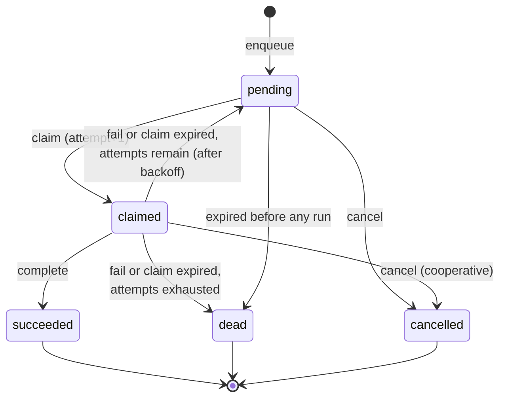
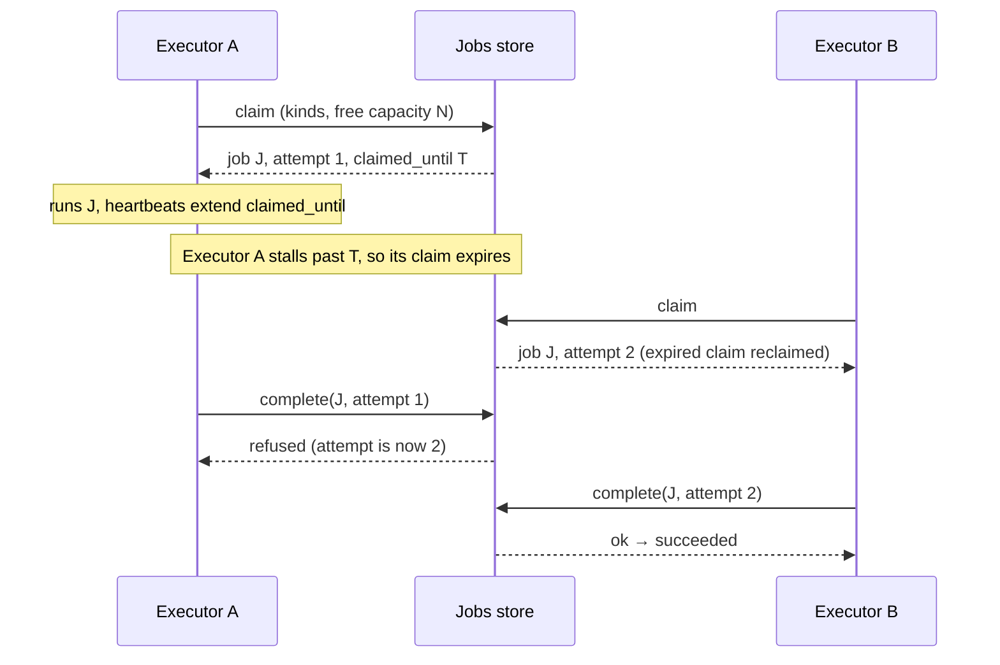

# Jobs: durable deferred work

**Status: design draft. Nothing here is built.** It turns the direction
sketched in
[`19-node-roles-and-resource-governance-model.md`](19-node-roles-and-resource-governance-model.md)
into field shapes, a state machine and boundaries, and lists what is still
open. Vocabulary follows `CLAUDE.md`: a *duty* is one unit of automatic
work inside a node role, a *task* is one execution of it, and a *job* is a
task made durable.

## What a job is, and is not

A job lets an application **defer work across boundaries** — to later, to
another node, past a restart — and have it retried until it succeeds or is
declared dead.

A job is **data, never code.** It names a task kind and carries parameters
validated against that kind's schema. There is no field that holds a
script, a command line, or anything a node would interpret as instructions.
A node runs a job only if it has registered a handler for that kind; a job
for an unknown kind is not interpreted, it is left for a node that does, or
rejected.

A job is also **not an endpoint call.** Being able to perform a kind of job
does not require exposing a callable endpoint for it
([`15`](15-endpoint-advertisement-model.md)). A handler may call an
endpoint if its work needs one, but the job is a separate concept with its
own registry and its own authorization.

## Two levels: the task definition and the handler

Like permissions (a registered definition, enforced by code), a task kind
exists at two levels:

1. **`TaskDefinition`** — a record in the domain's jobs store: the kind's
   key, a description, its parameter schema, the permission needed to
   *submit* one, and default retry, timeout and priority-cap settings.
   Submitters need this to validate parameters before enqueueing, even when
   they cannot run the kind themselves.
2. **The handler** — code on an executor node, registered at startup.
   Registering one is how a node adopts the executor node role for that
   kind, and it is the only thing that makes a node able to run it.

```go
type TaskDefinition struct {
    TaskKey               string       // dotted key, e.g. "myapp.report.render"; reserved namespaces as elsewhere
    Description           string
    Params                []ParamSpec  // see below
    RequiredPermissionKey string       // permission needed to submit; "" = none
    DefaultMaxAttempts    int
    DefaultAttemptTimeout time.Duration
    PriorityCap           Priority     // the most urgent a submitter may ask for
    Metadata              json.RawMessage // opaque, never authorized on
}

type ParamSpec struct {
    Name       string
    Definition typedvalue.Definition
    Required   bool
}
```

**Parameters are a list of named typed values, not a nested schema.**
`typedvalue` has an `object` storage type but a `Definition` describes one
value and carries no field schema, so a task's parameters are expressed as
a flat list of `ParamSpec`s, each normalized with `typedvalue`'s existing
`NormalizeValue`. Unknown parameter names are rejected. Both the submitter
(against the `TaskDefinition`) and the executor (against its own handler's
expectation) validate; neither trusts the other.

## The job

```go
type Job struct {
    JobID               uuid.UUID
    TaskKey             string
    Params              json.RawMessage // validated against the TaskDefinition
    State               State
    Priority            Priority        // a hint; the executor applies its own cap (19)
    TargetInstanceID    *uuid.UUID      // optional: a specific node; nil = any executor of the kind
    IdempotencyKey      string          // "" = none
    RunAt               time.Time       // earliest start, database clock
    ExpiresAt           *time.Time      // give up if still pending, database clock
    MaxAttempts         int
    AttemptTimeout      time.Duration
    Attempt             int             // incremented at each claim; doubles as the claim token
    ClaimedBy           *uuid.UUID      // an executor Instance
    ClaimedUntil        *time.Time
    Backoff             BackoffPolicy
    RequestedBy         *uuid.UUID      // principal who submitted
    AuthoritySource     AuthoritySource // type + optional reference, per 09
    OnBehalfOf          *uuid.UUID      // only for delegated_authority
    TraceContext        *logging.SpanContext
    ScheduleID          *uuid.UUID      // set if materialized from a recurring definition
    ScheduledSlot       *time.Time      // which slot of that schedule
    Result              json.RawMessage // bounded
    LastError           string          // bounded
    CreatedAt           time.Time
    UpdatedAt           time.Time
    FinishedAt          *time.Time
}
```

Principals are opaque UUIDs, the same discipline `vitals` follows
(`ActorPrincipalID`), so this base needs no Gatehouse-core. Timestamps are
set by the **database clock**, never a node's, which sidesteps the skew
problem `19` records for the current lease code. A job carries
`TraceContext` so its execution joins the submitter's trace, but only
inside one domain (`18`: no implicit cross-domain propagation).

### States



Transition legality is pure logic in the base's `evaluation` package,
as certstore's ceremony transitions are, so it is testable without a
database.

## Claiming: one atomic statement, with a built-in fence

Claiming follows the pattern `AcquireOrRenewLease` already uses: the
database decides, in a single statement, not a read-then-write in Go. In
Postgres terms, a claim is an `UPDATE ... WHERE job_id IN (SELECT ... FOR
UPDATE SKIP LOCKED LIMIT n) RETURNING ...`, selecting jobs that are
`pending` with `run_at` due, **or** `claimed` with an expired
`claimed_until`, ordered by priority then `run_at`, filtered to the kinds
and (optionally) target the claimer can serve. `SKIP LOCKED` lets many
executors claim concurrently without blocking each other.

`attempt` increments at each claim and is the **claim token**. Completing
or failing a job is `... WHERE job_id = $1 AND state = 'claimed' AND
attempt = $2`, so a slow earlier holder whose claim expired and was
reclaimed finds its completion refused. That is a real fence for the
*job record*. It is not a fence for the handler's side effects, so
**handlers must still be idempotent** (`19`).

Claiming is **pull**, which gives consent for free: an executor claims only
as many jobs as its governor can admit right now, so back-pressure is "do
not claim," not "reject after receiving."



## Recurring jobs: safe with any number of schedulers

A `RecurringJob` is a durable schedule — task kind, parameters,
recurrence (interval, or a calendar expression), overlap policy and
missed-run policy from `19`, and `enabled`. It is a record in the store,
so it survives restarts and answers `19`'s catch-up question: "last run" is
the last slot materialized.

**Materializing** a slot inserts a `Job` with `(schedule_id, scheduled_slot)`
under a unique constraint. If several nodes hold the scheduling duty, they
may all try to insert the same slot; exactly one insert wins and the rest
are no-ops. So recurring jobs need no leader election, which fits the
rule that node roles should tolerate many holders.

## Submission, idempotency, authority

1. **Submit is an enqueue.** It validates parameters, checks the kind
   exists, and inserts. With an `IdempotencyKey`, a repeat for the same
   `(task_key, key)` returns the existing job, and a repeat whose
   parameters differ is `ErrConflict`, matching `RegisterEndpoint`'s rule.
2. **Who may submit** is a permission per kind
   (`TaskDefinition.RequiredPermissionKey`), checked by an integration
   (`jobsauth`) with `evaluation.RequirePermission`, the same shape as
   `vitalsauth`.
3. **Whose authority a job runs under** is recorded at submission:
   `service_action` by default, `scheduled_task` (with the schedule as
   reference) for materialized jobs, and `delegated_authority` plus
   `OnBehalfOf` only when acting for another principal, where `09`'s rule
   holds — the effective authority is the intersection, checked at
   execution time.
4. **A node claiming jobs** needs a claim permission for itself, so a
   compromised or misconfigured node cannot start pulling work it was
   never meant to run.

## Crossing boundaries

The store interface is deliberately made of **coarse commands** — enqueue,
claim, heartbeat, complete, fail, cancel, and a few reads — each one
atomic. That is what lets a remote implementation exist
([`02`](02-package-boundaries.md): the remote-intermediary `Store`),
because a thin network call per command is feasible and a fine-grained SQL
surface would not be.

1. **A node with store access** submits and claims directly.
2. **A node without it** (`17`: no direct database access) submits through a
   node that has it. That is the remote store implementation and needs the
   Router (`11`).
3. **An executor with no store access** is *pushed to*: a node with access
   claims on its behalf and delivers the task over Transit as a
   `request`, answered with an `ack` or a rejection (busy, or kind not
   offered), and later a `result` event. If the claiming node dies, the
   claim expires and the job is retried; delivery stays at-least-once.
4. **Cancellation** sets the state if pending; if already claimed it is
   cooperative — the executor learns on its next heartbeat and cancels the
   handler's context (`wire` already has a `cancel` kind for the pushed
   case).

## Observability and housekeeping

1. **Queue health is Vitals.** `vitals.queue.depth`,
   `vitals.queue.oldest_item_age` and `vitals.queue.processing_rate` already
   exist as built-in definitions; the jobs integration reports against
   them instead of inventing counters.
2. **Housekeeping is node roles**, which makes them the natural first
   consumers of `19`'s runtime: pruning finished jobs past their retention
   period, and moving a job whose last claim expired at the attempt limit
   to `dead` (otherwise it would sit in `claimed` forever, since reclaiming
   is lazy). Both are idempotent single statements, so many nodes may hold
   them at once.
3. **A dead job is surfaced,** not silently kept: as a Vitals reading and a
   structured log entry carrying its trace context.

## Module shape

1. **`jobs`** — a new base with structure / evaluation / storage / facade
   and a Postgres store. It depends on `logging` (for the span type) and
   `typedvalue` (parameter schemas) and on no other base.
2. **`jobsauth`** — `jobs` + Gatehouse-core: submit and claim permissions.
3. **`noderoles` + `jobs`** — the executor node role claims through the
   governor's admission; the housekeeping node roles live here.
4. **`jobs` + Transit** — the pushed-delivery path, once a Router exists.
5. **`sdk`** — `Stores` gains a `Jobs` pair and `Modes` gains `Jobs`. As
   with every base, a node may hold its `Reader` without its `Writer`, or
   neither.
6. `jobs` is added to the reserved-namespace list when built.

## Decisions made here

1. Parameters are a flat list of named typed values; no nested schema.
2. Claim is pull, atomic, with `attempt` as the claim token for the job
   record; handlers remain idempotent.
3. Recurring materialization is a unique `(schedule, slot)` insert, so any
   number of nodes may do it.
4. The task registry is its own record type; a task kind is not an
   endpoint.
5. All timestamps are the database's.

## Open questions

1. **Where recurrence math lives.** `scheduler` (the in-process one) and
   `jobs` both need "next occurrence after t." A small shared zero-dependency
   module would avoid duplicating it and avoid one base importing another.
   For calendar expressions a library such as `robfig/cron` is the obvious
   candidate, to be checked against its real behavior before anything is
   chosen.
2. **Reserved-namespace check.** `jobs` cannot import Gatehouse-core's
   unexported list. Either `jobs` takes the list as an option, `jobsauth`
   performs the check, or the list moves somewhere shared.
3. **A local outbox for submissions.** A node with conditional store access
   (`17`) might want to buffer submissions while the store is unreachable.
   That is at-least-once from the application's view and raises ordering
   and duplication questions; not designed.
4. **Target selection beyond a named instance.** By label needs the label
   type from `18`.
5. **Size limits** for `Params`, `Result` and `LastError`, and how long
   finished jobs are retained by default.
6. **Result delivery for streaming tasks** (`19` decided events by default,
   channels only for kinds that declare streaming); how that interacts with
   the stored `Result`.
7. **Fairness across kinds.** Priority orders claiming, but nothing yet
   stops one busy kind from filling every claim slot.
8. **Heartbeat cost.** How often an executor extends a claim, and whether
   the interval derives from `AttemptTimeout`.
