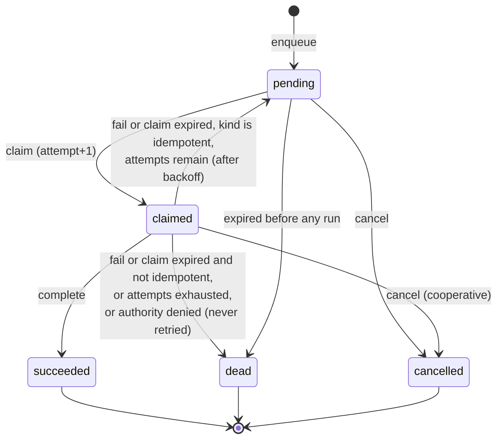
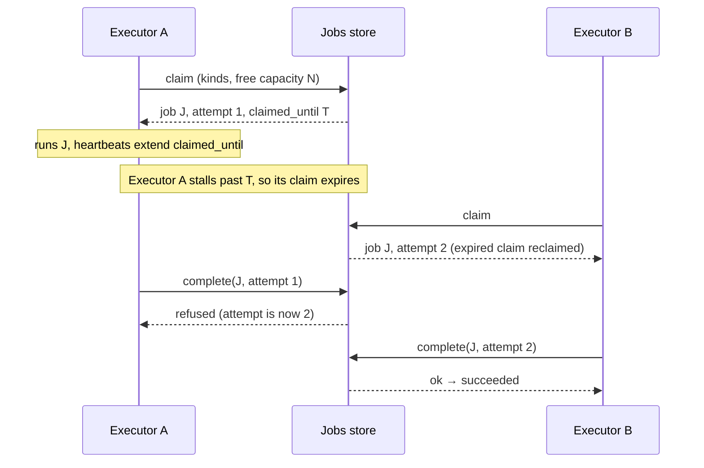
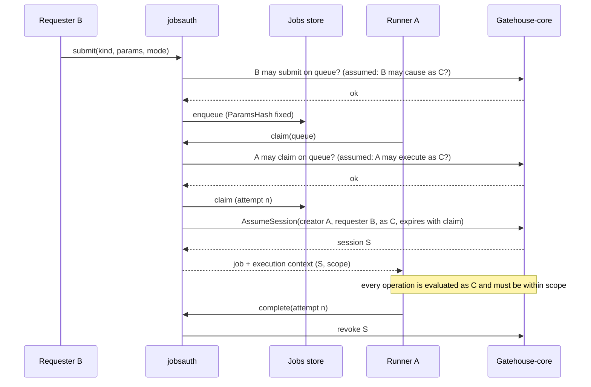

# Jobs: durable deferred work

**Status: design draft. Nothing here is built.** It turns the direction
sketched in
[`19-node-roles-and-resource-governance-model.md`](19-node-roles-and-resource-governance-model.md)
into field shapes, a state machine and boundaries, and lists what is still
open. Vocabulary follows `CLAUDE.md`: a *duty* is one unit of automatic
work inside a node role, a *task* is one execution of it, and a *job* is a
task made durable.

## What a job is, and is not

A job lets an application **defer work across boundaries** — to later, to
another node, past a restart — and have it retried until it succeeds or is
declared dead.

A job is **data, never code.** It names a task kind and carries parameters
validated against that kind's schema. There is no field that holds a
script, a command line, or anything a node would interpret as instructions.
A node runs a job only if it has registered a handler for that kind; a job
for an unknown kind is not interpreted, it is left for a node that does, or
rejected.

A job is also **not an endpoint call.** Being able to perform a kind of job
does not require exposing a callable endpoint for it
([`15`](15-endpoint-advertisement-model.md)). A handler may call an
endpoint if its work needs one, but the job is a separate concept with its
own registry and its own authorization.

## Two levels: the task definition and the handler

Like permissions (a registered definition, enforced by code), a task kind
exists at two levels:

1. **`TaskDefinition`** — a record in the domain's jobs store: the kind's
   key, a description, its parameter schema, the **scope** it may
   exercise (below), a default queue, whether it is idempotent, and default
   retry, timeout and priority-cap settings.
   Submitters need this to validate parameters before enqueueing, even when
   they cannot run the kind themselves.
2. **The handler** — code on an executor node, registered at startup.
   Registering one is how a node adopts the executor node role for that
   kind, and it is the only thing that makes a node able to run it.

```go
type TaskDefinition struct {
    TaskKey               string       // dotted key, e.g. "myapp.report.render"; reserved namespaces as elsewhere
    Description           string
    Params                []ParamSpec  // see below
    DefaultQueueKey       string       // the queue context jobs of this kind go to unless the submitter names one
    Scope                 []ScopeEntry // the permissions (and context templates) the handler may exercise; see "Whose authority"
    Idempotent            bool         // true = safe to run more than once; the ONLY way automatic retry is enabled
    DefaultMaxAttempts    int          // ignored (treated as 1) unless Idempotent
    DefaultAttemptTimeout time.Duration
    PriorityCap           Priority     // the most urgent a submitter may ask for
    Metadata              json.RawMessage // opaque, never authorized on
}

type ScopeEntry struct {
    PermissionKey string
    ContextType   string // optional; with ContextIDParam, scopes the permission to a context named by a parameter
    ContextIDParam string
}

type ParamSpec struct {
    Name       string
    Definition typedvalue.Definition
    Required   bool
}
```

**Parameters are a list of named typed values, not a nested schema.**
`typedvalue` has an `object` storage type but a `Definition` describes one
value and carries no field schema, so a task's parameters are expressed as
a flat list of `ParamSpec`s, each normalized with `typedvalue`'s existing
`NormalizeValue`. Unknown parameter names are rejected. Both the submitter
(against the `TaskDefinition`) and the executor (against its own handler's
expectation) validate; neither trusts the other.

## The job

```go
type Job struct {
    JobID               uuid.UUID
    TaskKey             string
    QueueKey            string          // the authorization scope (a context ID); see "Whose authority"
    Params              json.RawMessage // validated against the TaskDefinition
    ParamsHash          string          // fixed at submission; binds the authority to these exact parameters
    State               State
    Priority            Priority        // a hint; the executor applies its own cap (19)
    TargetInstanceID    *uuid.UUID      // optional: a specific node; nil = any executor of the kind
    IdempotencyKey      string          // "" = none
    RunAt               time.Time       // earliest start, database clock
    ExpiresAt           *time.Time      // give up if still pending, database clock
    MaxAttempts         int
    AttemptTimeout      time.Duration
    Attempt             int             // incremented at each claim; doubles as the claim token
    ClaimedBy           *uuid.UUID      // an executor Instance
    ClaimedUntil        *time.Time
    Backoff             BackoffPolicy
    RequestedBy         uuid.UUID       // B: the principal who submitted, and the job's owner
    AuthorityMode       AuthorityMode   // owner | service | assumed
    RunAs               *uuid.UUID      // C: set only for AuthorityMode = assumed
    ActorPrincipalID    *uuid.UUID      // A: the executor's principal, recorded at claim
    AssumedSessionID    *uuid.UUID      // the assumed session minted for the current claim, if any
    AuthoritySourceRef  string          // optional reference, e.g. the schedule, per 09
    TraceContext        *logging.SpanContext
    ScheduleID          *uuid.UUID      // set if materialized from a recurring definition
    ScheduledSlot       *time.Time      // which slot of that schedule
    Result              json.RawMessage // bounded
    LastError           string          // bounded
    CreatedAt           time.Time
    UpdatedAt           time.Time
    FinishedAt          *time.Time
}
```

Principals are opaque UUIDs, the same discipline `vitals` follows
(`ActorPrincipalID`), so this base needs no Gatehouse-core. Timestamps are
set by the **database clock**, never a node's, which sidesteps the skew
problem `19` records for the current lease code. A job carries
`TraceContext` so its execution joins the submitter's trace, but only
inside one domain (`18`: no implicit cross-domain propagation).

### States



Transition legality is pure logic in the base's `evaluation` package,
as certstore's ceremony transitions are, so it is testable without a
database.

## Claiming: one atomic statement, with a built-in fence

Claiming follows the pattern `AcquireOrRenewLease` already uses: the
database decides, in a single statement, not a read-then-write in Go. In
Postgres terms, a claim is an `UPDATE ... WHERE job_id IN (SELECT ... FOR
UPDATE SKIP LOCKED LIMIT n) RETURNING ...`, selecting jobs that are
`pending` with `run_at` due, **or** `claimed` with an expired
`claimed_until`, ordered by priority then `run_at`, filtered to the kinds
and (optionally) target the claimer can serve. `SKIP LOCKED` lets many
executors claim concurrently without blocking each other.

`attempt` increments at each claim and is the **claim token**. Completing
or failing a job is `... WHERE job_id = $1 AND state = 'claimed' AND
attempt = $2`, so a slow earlier holder whose claim expired and was
reclaimed finds its completion refused. That is a real fence for the
*job record*. It is not a fence for the handler's side effects, so
**handlers must still be idempotent** (`19`).

When the job needs an assumed session, **the claim mints one** (below) and
the end of the claim revokes it. That extends the fence beyond the job
record: a stale executor's late operations that pass through authorization
find its session expired or revoked and are denied. It still does not
cover effects outside authorization — a file written, a message sent — so
handlers stay idempotent.

Claiming is **pull**, which gives consent for free: an executor claims only
as many jobs as its governor can admit right now, so back-pressure is "do
not claim," not "reject after receiving."



## Recurring jobs: safe with any number of schedulers

A `RecurringJob` is a durable schedule — task kind, parameters,
recurrence (interval, or a calendar expression), overlap policy and
missed-run policy from `19`, and `enabled`. It is a record in the store,
so it survives restarts and answers `19`'s catch-up question: "last run" is
the last slot materialized.

**Materializing** a slot inserts a `Job` with `(schedule_id, scheduled_slot)`
under a unique constraint. If several nodes hold the scheduling duty, they
may all try to insert the same slot; exactly one insert wins and the rest
are no-ops. So recurring jobs need no leader election, which fits the
rule that node roles should tolerate many holders.

## Submission and idempotency

1. **Submit is an enqueue.** It validates parameters, checks the kind
   exists, fixes `ParamsHash`, and inserts. With an `IdempotencyKey`, a
   repeat for the same `(task_key, key)` returns the existing job, and a
   repeat whose parameters differ is `ErrConflict`, matching
   `RegisterEndpoint`'s rule.
2. **Retry is opt-in.** Lighthouse's v1 jobs deliberately marked a lapsed
   claim `abandoned` and did not requeue, to avoid surprise duplicate
   execution. The same caution applies here: a kind is retried
   automatically only if its definition says `Idempotent`. Otherwise an
   expired claim ends in `dead`, visible and deliberate, and a retry is a
   new submission.

## Whose authority: actor, requester, effective principal

Authority comes from **contexts, with no second ACL for jobs** — the same
choice Lighthouse made, and the same pattern `aliasauth` and `vitalsauth`
already use. A job belongs to a **queue**, whose key is a context ID under
the context type `jobs.queue`. The generic permissions are `jobs.submit`,
`jobs.read`, `jobs.claim` and `jobs.cancel`, each evaluated on that queue
context. An app picks its granularity: one queue, or one per kind of work.
Listing filters to queues the caller may read. Queue contexts are optional
records but mandatory authorization scopes. (A claimant needs no separate
"update" permission: holding the current claim token is what lets it
heartbeat and complete.)

A job's execution involves four facts, defined in `09`'s "Assumed
sessions": **A** the actor (the runner), **B** the requester (the owner),
**C** the effective principal whose permissions apply, and the authority
source. `AuthorityMode` selects among the cases that matter:

| Mode | C is | Authority source (`09`) | Example |
|---|---|---|---|
| `owner` | B | `delegated_authority` | a user's own export job |
| `service` | A | `service_action` (or `scheduled_task` for materialized jobs) | refresh a cache |
| `assumed` | a third principal | `assumed_authority` | restore a backup as a dedicated principal |

1. **Effective authority** is C's *current* grants intersected with the
   task kind's declared `Scope`, checked at execution time. A handler can
   therefore never use something else the owner happens to hold, such as
   their admin rights. The submitter may narrow the scope per job, never
   widen it.
2. **Nothing credential-like moves.** The runner is not given the owner's
   secrets. Its operations are authorized by asking the authority store
   whether C holds a permission, identified by principal ID.
3. **`owner` needs no extra grant:** a principal can always run its own
   work, narrowed. **`assumed` needs both edges** from `09` — the requester
   may cause work as C, and the claimant may execute as C — checked at
   submission and again at claim.
4. **At claim, `jobsauth` calls `AssumeSession`** with A as creator, B as
   requester and C as principal, expiring with the claim, bound to
   `(job, attempt)`. The handler's execution context carries that session
   and the scope. It is never given A's own identity for that job.
5. **Ownership.** B can read and cancel their own jobs without queue-wide
   grants, so a lower-level principal stays in control of what it
   submitted. Who is credited with data the handler creates, B or C, is the
   application's decision; the framework hands the handler both.
6. **A denial at run time is terminal.** If B, C or an edge has lost the
   needed permission by the time the job runs, it ends `dead` with an
   authority-denied reason and is not retried. Retrying a permission failure
   never helps.
7. **A claimant needs `jobs.claim` on the queue it pulls from,** so a
   misconfigured node cannot start taking work it was never meant to run.
8. **The runner is trusted within the scope** of the jobs it holds. A
   compromised runner could misuse those scopes; the blast radius is limited
   by keeping each kind's declared scope narrow and claim windows short. A
   stronger setting that keeps a runner away from direct data access
   (`mediated`) is a possible later hardening and is not designed here.



## Crossing boundaries

The store interface is deliberately made of **coarse commands** — enqueue,
claim, heartbeat, complete, fail, cancel, and a few reads — each one
atomic. That is what lets a remote implementation exist
([`02`](02-package-boundaries.md): the remote-intermediary `Store`),
because a thin network call per command is feasible and a fine-grained SQL
surface would not be.

1. **A node with store access** submits and claims directly.
2. **A node without it** (`17`: no direct database access) submits through a
   node that has it. That is the remote store implementation and needs the
   Router (`11`).
3. **An executor with no store access** is *pushed to*: a node with access
   claims on its behalf and delivers the task over Transit as a
   `request`, answered with an `ack` or a rejection (busy, or kind not
   offered), and later a `result` event. If the claiming node dies, the
   claim expires and the job is retried; delivery stays at-least-once.
4. **Cancellation** sets the state if pending; if already claimed it is
   cooperative — the executor learns on its next heartbeat and cancels the
   handler's context (`wire` already has a `cancel` kind for the pushed
   case).

## Observability and housekeeping

1. **Queue health is Vitals.** `vitals.queue.depth`,
   `vitals.queue.oldest_item_age` and `vitals.queue.processing_rate` already
   exist as built-in definitions; the jobs integration reports against
   them instead of inventing counters.
2. **Housekeeping is node roles**, which makes them the natural first
   consumers of `19`'s runtime: pruning finished jobs past their retention
   period, and moving a job whose last claim expired at the attempt limit
   to `dead` (otherwise it would sit in `claimed` forever, since reclaiming
   is lazy). Both are idempotent single statements, so many nodes may hold
   them at once.
3. **A dead job is surfaced,** not silently kept: as a Vitals reading and a
   structured log entry carrying its trace context.

## Module shape

1. **`jobs`** — a new base with structure / evaluation / storage / facade
   and a Postgres store. It depends on `logging` (for the span type) and
   `typedvalue` (parameter schemas) and on no other base.
2. **`jobsauth`** — `jobs` + Gatehouse-core: queue-context permissions,
   the authority modes above, and minting and revoking the assumed session
   at claim.
   Gatehouse-core itself gains the `assumed` session kind and
   `AssumeSession` (`09`); that is a prerequisite and is not part of `jobs`.
3. **`noderoles` + `jobs`** — the executor node role claims through the
   governor's admission; the housekeeping node roles live here.
4. **`jobs` + Transit** — the pushed-delivery path, once a Router exists.
5. **`sdk`** — `Stores` gains a `Jobs` pair and `Modes` gains `Jobs`. As
   with every base, a node may hold its `Reader` without its `Writer`, or
   neither.
6. `jobs` is added to the reserved-namespace list when built.

## Decisions made here

1. Parameters are a flat list of named typed values; no nested schema.
2. Claim is pull, atomic, with `attempt` as the claim token for the job
   record; handlers remain idempotent.
3. Recurring materialization is a unique `(schedule, slot)` insert, so any
   number of nodes may do it.
4. The task registry is its own record type; a task kind is not an
   endpoint.
5. All timestamps are the database's.
6. Authorization is by queue context with generic `jobs.*` permissions; no
   per-kind permission keys and no second ACL.
7. Three authority modes — `owner`, `service`, `assumed` — realized by an
   assumed session minted per claim and revoked at its end; scope declared by
   the task kind.
8. Retry only for kinds declared `Idempotent`; authority denials are
   terminal.
9. Delegation of a *subset* to a different principal, and chained
   delegation, remain deferred.

## Open questions

1. **Per-owner limits.** If users can submit freely, one could flood a
   queue; a cap on a single owner's pending jobs fits the consent idea in
   `19`. Not designed.
2. **A per-job event trail.** Lighthouse kept a `job_events` table for
   debugging; here only logs and Vitals exist.
3. **Where recurrence math lives.** `scheduler` (the in-process one) and
   `jobs` both need "next occurrence after t." A small shared zero-dependency
   module would avoid duplicating it and avoid one base importing another.
   For calendar expressions a library such as `robfig/cron` is the obvious
   candidate, to be checked against its real behavior before anything is
   chosen.
4. **Reserved-namespace check.** `jobs` cannot import Gatehouse-core's
   unexported list. Either `jobs` takes the list as an option, `jobsauth`
   performs the check, or the list moves somewhere shared.
5. **A local outbox for submissions.** A node with conditional store access
   (`17`) might want to buffer submissions while the store is unreachable.
   That is at-least-once from the application's view and raises ordering
   and duplication questions; not designed.
6. **Target selection beyond a named instance.** By label needs the label
   type from `18`.
7. **Size limits** for `Params`, `Result` and `LastError`, and how long
   finished jobs are retained by default.
8. **Result delivery for streaming tasks** (`19` decided events by default,
   channels only for kinds that declare streaming); how that interacts with
   the stored `Result`.
9. **Fairness across kinds.** Priority orders claiming, but nothing yet
   stops one busy kind from filling every claim slot.
10. **Heartbeat cost.** How often an executor extends a claim, and whether
   the interval derives from `AttemptTimeout`.
