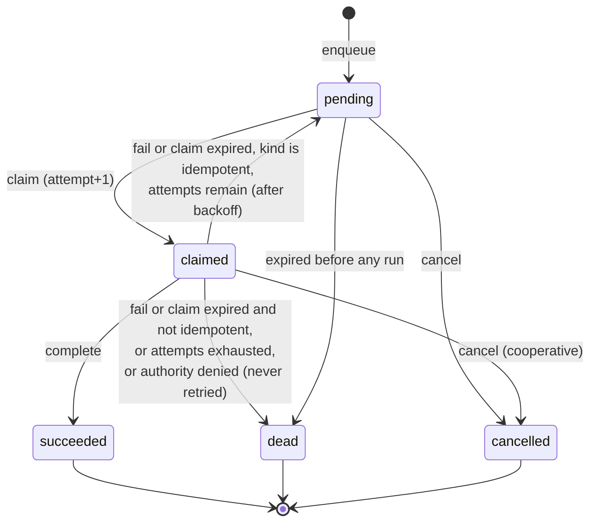
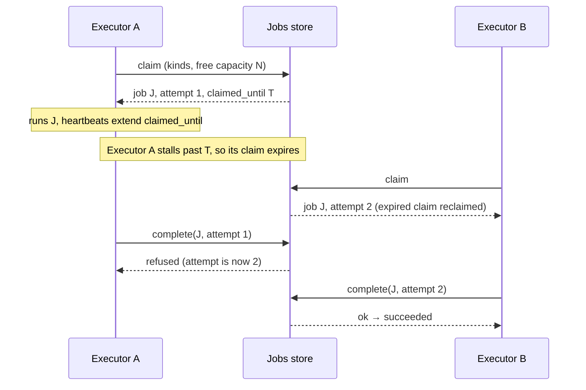
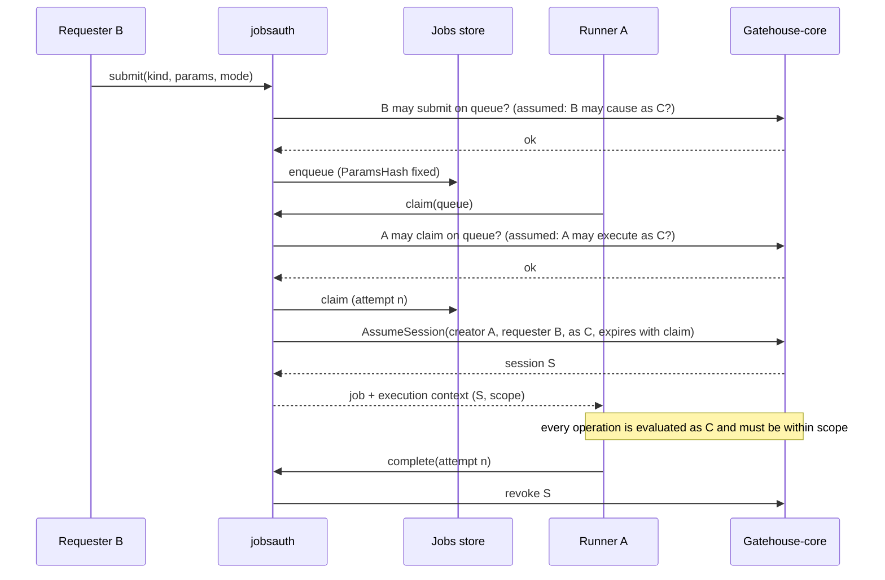

# Jobs: durable deferred work

**Status: the `jobs` base (first slice), the `jobsauth` integration and remote executors
(`jobsexec`, `jobsdirector`) are built** — see "Status" near
the end for exactly what is and is not. The rest is still design. It turns the direction
sketched in
[`19-node-roles-and-resource-governance-model.md`](19-node-roles-and-resource-governance-model.md)
into field shapes, a state machine and boundaries, and lists what is still
open. Vocabulary follows `CLAUDE.md`: a *duty* is one unit of automatic
work inside a node role, a *task* is one execution of it, and a *job* is a
task made durable.

## What a job is, and is not

A job lets an application **defer work across boundaries** — to later, to
another node, past a restart — and have it retried until it succeeds or is
declared dead.

A job is **data, never code.** It names a task kind and carries parameters
validated against that kind's schema. There is no field that holds a
script, a command line, or anything a node would interpret as instructions.
A node runs a job only if it has registered a handler for that kind; a job
for an unknown kind is not interpreted, it is left for a node that does, or
rejected.

A job is also **not an endpoint call.** Being able to perform a kind of job
does not require exposing a callable endpoint for it
([`15`](15-endpoint-advertisement-model.md)). A handler may call an
endpoint if its work needs one, but the job is a separate concept with its
own registry and its own authorization.

## Two levels: the task definition and the handler

Like permissions (a registered definition, enforced by code), a task kind
exists at two levels:

1. **`TaskDefinition`** — a record in the domain's jobs store: the kind's
   key, a description, its parameter schema, the **scope** it may
   exercise (below), a default queue, whether it is idempotent, and default
   retry, timeout and priority-cap settings.
   Submitters need this to validate parameters before enqueueing, even when
   they cannot run the kind themselves.
2. **The handler** — code on an executor node, registered at startup.
   Registering one is how a node adopts the executor node role for that
   kind, and it is the only thing that makes a node able to run it.

```go
type TaskDefinition struct {
    TaskKey               string       // dotted key, e.g. "myapp.report.render"; reserved namespaces as elsewhere
    Description           string
    Params                []ParamSpec  // see below
    DefaultQueueKey       string       // the queue context jobs of this kind go to unless the submitter names one
    Scope                 []ScopeEntry // the permissions (and context templates) the handler may exercise; see "Whose authority"
    Idempotent            bool         // true = safe to run more than once; the ONLY way automatic retry is enabled
    DefaultMaxAttempts    int          // ignored (treated as 1) unless Idempotent
    DefaultAttemptTimeout time.Duration
    PriorityCap           Priority     // the most urgent a submitter may ask for
    Metadata              json.RawMessage // opaque, never authorized on
}

type ScopeEntry struct {
    PermissionKey string
    ContextType   string // optional; with ContextIDParam, scopes the permission to a context named by a parameter
    ContextIDParam string
}

type ParamSpec struct {
    Name       string
    Definition typedvalue.Definition
    Required   bool
}
```

**Parameters are a list of named typed values, not a nested schema.**
`typedvalue` has an `object` storage type but a `Definition` describes one
value and carries no field schema, so a task's parameters are expressed as
a flat list of `ParamSpec`s, each normalized with `typedvalue`'s existing
`NormalizeValue`. Unknown parameter names are rejected. Both the submitter
(against the `TaskDefinition`) and the executor (against its own handler's
expectation) validate; neither trusts the other.

## The job

```go
type Job struct {
    JobID               uuid.UUID
    TaskKey             string
    QueueKey            string          // the authorization scope (a context ID); see "Whose authority"
    Params              json.RawMessage // validated against the TaskDefinition
    ParamsHash          string          // fixed at submission; binds the authority to these exact parameters
    State               State
    Priority            Priority        // a hint; the executor applies its own cap (19)
    TargetInstanceID    *uuid.UUID      // optional: a specific node; nil = any executor of the kind
    IdempotencyKey      string          // "" = none
    RunAt               time.Time       // earliest start, database clock
    ExpiresAt           *time.Time      // give up if still pending, database clock
    MaxAttempts         int
    AttemptTimeout      time.Duration
    Attempt             int             // incremented at each claim; doubles as the claim token
    ClaimedBy           *uuid.UUID      // an executor Instance
    ClaimedUntil        *time.Time
    Backoff             BackoffPolicy
    RequestedBy         uuid.UUID       // B: the principal who submitted, and the job's owner
    AuthorityMode       AuthorityMode   // owner | service | assumed
    RunAs               *uuid.UUID      // C: set only for AuthorityMode = assumed
    ActorPrincipalID    *uuid.UUID      // A: the executor's principal, recorded at claim
    AssumedSessionID    *uuid.UUID      // the assumed session minted for the current claim, if any
    AuthoritySourceRef  string          // optional reference, e.g. the schedule, per 09
    TraceContext        *logging.SpanContext
    ScheduleID          *uuid.UUID      // set if materialized from a recurring definition
    ScheduledSlot       *time.Time      // which slot of that schedule
    Result              json.RawMessage // bounded
    LastError           string          // bounded
    CreatedAt           time.Time
    UpdatedAt           time.Time
    FinishedAt          *time.Time
}
```

Principals are opaque UUIDs, the same discipline `vitals` follows
(`ActorPrincipalID`), so this base needs no Gatehouse-core. Timestamps are
set by the **database clock**, never a node's, which sidesteps the skew
problem `19` records for the current lease code. A job carries
`TraceContext` so its execution joins the submitter's trace, but only
inside one domain (`18`: no implicit cross-domain propagation).

### States



Transition legality is pure logic in the base's `evaluation` package,
as certstore's ceremony transitions are, so it is testable without a
database.

## Claiming: one atomic statement, with a built-in fence

Claiming follows the pattern `AcquireOrRenewLease` already uses: the
database decides, in a single statement, not a read-then-write in Go. In
Postgres terms, a claim is an `UPDATE ... WHERE job_id IN (SELECT ... FOR
UPDATE SKIP LOCKED LIMIT n) RETURNING ...`, selecting jobs that are
`pending` with `run_at` due, **or** `claimed` with an expired
`claimed_until`, ordered by priority then `run_at`, filtered to the kinds
and (optionally) target the claimer can serve. `SKIP LOCKED` lets many
executors claim concurrently without blocking each other.

`attempt` increments at each claim and is the **claim token**. Completing
or failing a job is `... WHERE job_id = $1 AND state = 'claimed' AND
attempt = $2`, so a slow earlier holder whose claim expired and was
reclaimed finds its completion refused. That is a real fence for the
*job record*. It is not a fence for the handler's side effects, so
**handlers must still be idempotent** (`19`).

When the job needs an assumed session, **the claim mints one** (below) and
the end of the claim revokes it. That extends the fence beyond the job
record: a stale executor's late operations that pass through authorization
find its session expired or revoked and are denied. It still does not
cover effects outside authorization — a file written, a message sent — so
handlers stay idempotent.

Claiming is **pull**, which gives consent for free: an executor claims only
as many jobs as its governor can admit right now, so back-pressure is "do
not claim," not "reject after receiving."



## Recurring jobs: safe with any number of schedulers

A `RecurringJob` is a durable schedule — task kind, parameters,
recurrence (interval, or a calendar expression), overlap policy and
missed-run policy from `19`, and `enabled`. It is a record in the store,
so it survives restarts and answers `19`'s catch-up question: "last run" is
the last slot materialized.

**Materializing** a slot inserts a `Job` with `(schedule_id, scheduled_slot)`
under a unique constraint. If several nodes hold the scheduling duty, they
may all try to insert the same slot; exactly one insert wins and the rest
are no-ops. So recurring jobs need no leader election, which fits the
rule that node roles should tolerate many holders.

## Submission and idempotency

1. **Submit is an enqueue.** It validates parameters, checks the kind
   exists, fixes `ParamsHash`, and inserts. With an `IdempotencyKey`, a
   repeat for the same `(task_key, key)` returns the existing job, and a
   repeat whose parameters differ is `ErrConflict`, matching
   `RegisterEndpoint`'s rule.
2. **Retry is opt-in.** Lighthouse's v1 jobs deliberately marked a lapsed
   claim `abandoned` and did not requeue, to avoid surprise duplicate
   execution. The same caution applies here: a kind is retried
   automatically only if its definition says `Idempotent`. Otherwise an
   expired claim ends in `dead`, visible and deliberate, and a retry is a
   new submission.

## Whose authority: actor, requester, effective principal

Authority comes from **contexts, with no second ACL for jobs** — the same
choice Lighthouse made, and the same pattern `aliasauth` and `vitalsauth`
already use. A job belongs to a **queue**, whose key is a context ID under
the context type `jobs.queue`. The generic permissions are `jobs.submit`,
`jobs.read`, `jobs.claim` and `jobs.cancel`, each evaluated on that queue
context. An app picks its granularity: one queue, or one per kind of work.
Listing filters to queues the caller may read. Queue contexts are optional
records but mandatory authorization scopes. (A claimant needs no separate
"update" permission: holding the current claim token is what lets it
heartbeat and complete.)

A job's execution involves four facts, defined in `09`'s "Assumed
sessions": **A** the actor (the runner), **B** the requester (the owner),
**C** the effective principal whose permissions apply, and the authority
source. `AuthorityMode` selects among the cases that matter:

| Mode | C is | Authority source (`09`) | Example |
|---|---|---|---|
| `owner` | B | `delegated_authority` | a user's own export job |
| `service` | A | `service_action` (or `scheduled_task` for materialized jobs) | refresh a cache |
| `assumed` | a third principal | `assumed_authority` | restore a backup as a dedicated principal |

1. **Effective authority** is C's *current* grants intersected with the
   task kind's declared `Scope`, checked at execution time. A handler can
   therefore never use something else the owner happens to hold, such as
   their admin rights. The submitter may narrow the scope per job, never
   widen it.
2. **Nothing credential-like moves.** The runner is not given the owner's
   secrets. Its operations are authorized by asking the authority store
   whether C holds a permission, identified by principal ID.
3. **`owner` needs no extra grant:** a principal can always run its own
   work, narrowed. **`assumed` needs both edges** from `09` — the requester
   may cause work as C, and the claimant may execute as C — checked at
   submission and again at claim.
4. **At claim, `jobsauth` calls `AssumeSession`** with A as creator, B as
   requester and C as principal, bounded by the job's attempt timeout (an
   attempt cannot legitimately run longer, and an assumed session's expiry is
   fixed, so it cannot track a heartbeat-extended claim), and bound to
   `(job, attempt)` through its metadata. The handler's execution context carries that session
   and the scope. It is never given A's own identity for that job.
5. **Ownership.** B can read and cancel their own jobs without queue-wide
   grants, so a lower-level principal stays in control of what it
   submitted. Who is credited with data the handler creates, B or C, is the
   application's decision; the framework hands the handler both.
6. **A denial at run time is terminal.** If B, C or an edge has lost the
   needed permission by the time the job runs, it ends `dead` with an
   authority-denied reason and is not retried. Retrying a permission failure
   never helps.
7. **A claimant needs `jobs.claim` on the queue it pulls from,** so a
   misconfigured node cannot start taking work it was never meant to run.
8. **The runner is trusted within the scope** of the jobs it holds. A
   compromised runner could misuse those scopes; the blast radius is limited
   by keeping each kind's declared scope narrow and claim windows short. A
   stronger setting that keeps a runner away from direct data access
   (`mediated`) is a possible later hardening and is not designed here.



## Crossing boundaries

The store interface is deliberately made of **coarse commands** — enqueue,
claim, heartbeat, complete, fail, cancel, and a few reads — each one
atomic. That is what lets a remote implementation exist
([`02`](02-package-boundaries.md): the remote-intermediary `Store`),
because a thin network call per command is feasible and a fine-grained SQL
surface would not be.

1. **A node with store access** submits and claims directly.
2. **A node without it** (`17`: no direct database access) submits through a
   node that has it. That is the remote store implementation and needs the
   Router (`11`).
3. **An executor with no store access pulls through a director.** This
   revises an earlier draft that had the director push tasks to the
   executor. A *director* is a node with store access that serves the routes
   below; an *executor* is a node with handlers and no store, which only ever
   *calls* its director. Pull keeps consent where it was (an executor asks
   for as many jobs as it can admit, so back-pressure is still "do not
   claim"), needs no listener or inbound routes on the executor (it can sit
   behind NAT), and means the director holds no per-executor delivery state.
   See "Remote executors" below.
4. **Cancellation** sets the state if pending; if already claimed it is
   cooperative — the executor learns on its next heartbeat and cancels the
   handler's context (`wire` already has a `cancel` kind for the pushed
   case).

## Remote executors: pulling through a director

All of these are `Call`s from the executor to the director, over a router
([`21`](21-router-and-handshake-model.md)), registered through `routerauth`.

| Route | The executor says | The director does |
|---|---|---|
| `jobs.pull` | its instance, kinds, queues, how many | `jobsauth.Claim` *as the executor* |
| `jobs.heartbeat` | job, attempt | extends the claim; replies whether it still holds it and whether cancellation was requested |
| `jobs.complete` | job, attempt, result | `jobsauth.Complete` |
| `jobs.fail` | job, attempt, error, whether it was an authority denial | `jobsauth.Fail` |
| `jobs.abandon` | job, attempt, retry-after | `jobsauth.Abandon` |
| `jobs.authorize` | job, attempt, permission, context | `jobsauth.Authorize` |

1. **Whose identity claims.** The actor A is the principal the executor's
   verified certificate resolves to, never a name in the payload. The
   director passes that principal, and the executor's instance, to
   `jobsauth.Claim`, so every consent check (`jobs.claim` on each queue, the
   execute-as edge for an assumed job) is evaluated against the executor,
   not against the director that is merely carrying the call. The instance
   ID in the payload is checked: the registered instance must belong to the
   caller's principal.
2. **A gate before the queue checks.** The routes require a global
   `jobs.execute` permission (registered with the other jobs permissions by
   `jobsauth.RegisterPermissions`, and so by the SDK's seed step), which
   exists so that `endpoints.list` shows the executor protocol only to peers
   meant to use it. It does not replace the
   per-queue `jobs.claim` check, which still decides what may be pulled.
3. **The director is stateless between calls.** Every call after the pull
   names `(job, attempt)`. `jobsauth.Resume` rebuilds the claim from the store
   and verifies it: the job is still claimed, under that attempt, by that
   actor. Any director node can therefore serve any call, and a restart
   loses nothing. A call whose claim is gone is told so.
4. **Retries are safe.** A `complete` or `fail` for an attempt that already
   finished with that same outcome, from that same actor, is answered as
   applied-and-replayed, so an executor that lost a reply (or got `busy`)
   can send it again. A different attempt, or a different actor, is refused.
5. **Authority is mediated.** The executor holds no credentials and no store.
   A handler about to do something that needs permission asks
   `jobs.authorize`, and the director answers from the same check a local
   handler would run: inside the declared scope, and permitted to the
   effective principal now, through the assumed session where there is one.
   A denial is distinguished from a failure, as in `jobsauth.Authorize`, so
   the executor reports a denial terminally and anything else as an ordinary
   failure. **What this protects:** the executor cannot grant itself
   anything, because the decision is the director's. **What it does not:**
   the executor remains trusted to *ask* before acting. For a node with no
   store, nothing on the executor side can enforce that, and a handler that
   skips the check can do whatever its own process can reach. The assumed
   session bounds what the *store* will let that session do, not what a
   rogue process can do to resources it reaches by other means. This is the
   same boundary `Whose authority` already states, drawn at the process.
6. **Cancellation is cooperative and rides the heartbeat.** The reply says
   whether cancellation was requested; the executor cancels the handler's
   context and hands the claim back, which turns the job `cancelled`. If the
   heartbeat says the claim is gone, the executor stops and reports nothing.
7. **A lost executor is a lapsed claim,** exactly as for a local one.
8. **Not designed here:** a wake-up hint from director to executor (a lossy
   `jobs.available` event would do, since polling remains the safety net);
   submitting through a director (the other half of "a node without store
   access"); mediating operations other than permission checks; and a
   governor on the executor (it has a plain concurrency limit until `19` is
   built).

## Observability and housekeeping

1. **Queue health is Vitals.** `vitals.queue.depth`,
   `vitals.queue.oldest_item_age` and `vitals.queue.processing_rate` already
   exist as built-in definitions; the jobs integration reports against
   them instead of inventing counters.
2. **Housekeeping is node roles**, which makes them the natural first
   consumers of `19`'s runtime: pruning finished jobs past their retention
   period, and moving a job whose last claim expired at the attempt limit
   to `dead` (otherwise it would sit in `claimed` forever, since reclaiming
   is lazy). Both are idempotent single statements, so many nodes may hold
   them at once.
3. **A dead job is surfaced,** not silently kept: as a Vitals reading and a
   structured log entry carrying its trace context.

## Module shape

1. **`jobs`** — a new base with structure / evaluation / storage / facade
   and a Postgres store. It depends on `logging` (for the span type) and
   `typedvalue` (parameter schemas) and on no other base.
2. **`jobsauth`** — `jobs` + Gatehouse-core: queue-context permissions,
   the authority modes above, and minting and revoking the assumed session
   at claim.
   Gatehouse-core's `assumed` session kind and `AssumeSession` (`09`) are
   a prerequisite for this, are **built**, and are not part of `jobs`.
3. **`noderoles` + `jobs`** — the executor node role claims through the
   governor's admission; the housekeeping node roles live here.
4. **`jobsexec` and `jobsdirector`** — the remote-executor path over the
   Router (see "Remote executors"). `jobsexec` is the executor side and
   depends on the router and nothing that touches Gatehouse-core or a
   database; `jobsdirector` is the director side, over `jobsauth` and
   `routerauth`.
5. **`sdk`** — `Stores` gains a `Jobs` pair and `Modes` gains `Jobs`. As
   with every base, a node may hold its `Reader` without its `Writer`, or
   neither.
6. `jobs` is added to the reserved-namespace list when built.

## Status

**Built (the `jobs` base, first slice):**

1. **`structure`** — `TaskDefinition`, `ParamSpec`, `ScopeEntry`, `Job`,
   `State`, `Priority`, `AuthorityMode`, `BackoffPolicy`, and the
   request/result types for the Writer's commands.
2. **`evaluation`** — transition legality, `AfterFailure`, `Delay`
   (overflow-safe), `NormalizeParams` (canonical form plus hash),
   `ResolveScope` and `ScopePermits`, and `SameTaskDefinition`.
3. **`storage/dbstore`** — migrations; reader; and a writer whose every
   state change is one SQL statement guarded by state and, for anything a
   claimant does, by the attempt number: `ClaimJobs` (`FOR UPDATE SKIP
   LOCKED`), `HeartbeatJob`, `CompleteJob`, `FailJob`, `CancelJob`,
   `ReapJobs`, `PruneFinishedJobs`, `AttachClaimIdentity`. All times come
   from the database's clock.
4. **`facade`** — `RegisterTaskDefinition`, `Submit`, `FailAttempt`,
   `Cancel`.

**What the tests establish** (against real Postgres): many concurrent
claimers never share a job; a claimant whose claim lapsed and was taken
over is refused by heartbeat, complete, fail and identity attachment — and
removing the attempt guard from `CompleteJob` makes that test fail; the
SQL failure decision agrees with `evaluation.AfterFailure` for every
combination of retryable, attempt, terminal and cancel-requested; a
lapsed claim is reclaimed only if the job is retryable, has attempts left
and has no cancel pending, and is otherwise left for `ReapJobs`; a retried
job waits out its backoff; idempotent submission returns the same job and
conflicts on different parameters.

**Behaviors worth knowing:**

1. **A lapsed claim on a job that cannot be retried stays `claimed` until
   something reaps it.** Claiming reclaims lazily and never runs such a job
   again, so its terminal state depends on a housekeeping pass (`ReapJobs`)
   — in the design, a node role. Until then it reads as claimed.
2. **A failure on a job with a cancel pending ends it `cancelled`,** not
   retried; a request to stop wins over a retry.
3. **An idempotency key is unique across all states,** not only non-terminal
   ones; it frees up when the finished job is pruned.
4. **Priority orders claiming, but there is no aging yet,** so a steady
   stream of urgent work can starve `background` jobs.

**Built (`jobsauth`):**

1. **Queue-context permissions** — `jobs.submit`, `jobs.read`, `jobs.claim`,
   `jobs.cancel` on the context type `jobs.queue`, plus the global
   `jobs.execute` that gates the remote-executor protocol; the owner can
   always read and cancel their own jobs. `jobs` joined Gatehouse-core's reserved
   namespaces.
2. **`Submit`** checks the submit permission on the queue and, for assumed
   authority, that the requester may cause work as C.
3. **`Claim`** requires an explicit list of queues and `jobs.claim` on each,
   claims, and prepares each job's identity: an assumed session when the
   effective principal is not the executor, recorded on the job. A job it
   cannot prepare is dealt with, not left claimed. If the *executor* may not
   execute as the effective principal, the claim is released without
   spending an attempt, after a delay, so another executor can take it (new
   `ReleaseJob` command). If the *requester* may no longer cause the work,
   the effective principal is gone, or the scope cannot be resolved, the job
   ends dead.
4. **`Authorize`** is the one check a handler makes: the operation must be
   inside the task kind's declared scope for this job, and permitted to the
   effective principal right now. A scope or permission denial wraps
   `ErrAuthorityDenied`; a revoked or expired session and store failures are
   returned as themselves.
5. **`Complete`, `Fail`, `Abandon`** each revoke the session, including when
   the operation is refused because the claim was lost. `Fail` treats a cause
   wrapping `ErrAuthorityDenied` as terminal.
6. **`GetJob`, `ListJobs`, `Cancel`** with the owner's implicit rights.
   `ListJobs` applies the caller's limit before filtering, so it may return
   fewer jobs than the limit.

**Tested** against real Postgres, including that an owner-mode job is
evaluated as the owner and not the executor (making the executor the
effective principal fails three tests), that a permission only the executor
holds is refused, that a declared but wrong-tenant context is out of scope,
that a stale executor is refused and its own session revoked while the live
attempt's is untouched, and that losing the cause edge after submission ends
the job rather than running it.

**Built (SDK wiring):** `Stores.Jobs` and `Modes.Jobs`; `Seed` registers
`jobsauth`'s permissions when Jobs and Gatehouse are both on;
`App.JobsAuth()` assembles `jobsauth.Deps` from the App's own stores; and
`sdkdb.OpenDB` provisions the jobs schema. A test submits, claims,
authorizes and completes an owner-mode job through nothing but the SDK's
stores, then shows a read-only node reading the result while its writes
fail clearly.

**Built (remote executors):**

1. **`jobsauth.Resume`** rebuilds a claim from the store alone, verifying it
   is still claimed, under that attempt, by that actor; a claim that is no
   longer held is `ErrClaimLost`, and carries the record only when it is the
   actor's own attempt, so a retried completion can be recognised.
2. **`jobsexec`** — the wire types and the `Executor`: `Handle` per kind,
   `PullOnce`, `Run` (pull, heartbeat, report, hand back on shutdown), and
   `Job.Authorize`. It asks for no more than its free capacity, cancels a
   handler whose claim was lost or whose cancellation was requested (the
   context's cause says which), reports nothing for a lost claim, hands a
   claim back on cancellation or shutdown, recovers a handler panic as a
   failure, and retries a call answered `busy`.
3. **`jobsdirector`** — the six routes registered through `routerauth`,
   gated by the global `jobs.execute`. Identity is the principal the
   verified certificate resolves to, and the named instance must belong to it.
4. **End to end,** `routere2e` runs an owner's job on an executor over real
   mTLS: the executor registers itself through the registry route, pulls,
   asks the director before acting, is refused an undeclared permission the
   owner does hold, and completes.

**Tested** (against real Postgres, over the in-memory pipe and, once, real
mTLS): a service job runs on an executor holding no store; an owner's job
authorizes through the director, a permission only the executor holds is
refused as the owner, a declared-but-wrong-tenant and an undeclared one are
out of scope, and a denial ends the job `dead` on the first attempt despite
the kind being idempotent, with the session revoked; an ordinary failure is
retried; the protocol refuses an executor without `jobs.execute`, without
`jobs.claim` on the queue, using another principal's instance or an unknown
one, and malformed requests; completion and failure are fenced by actor and
attempt, and a retried one is confirmed instead of applied twice; a cancel
request stops the handler and cancels the job; a lost claim stops the
handler and its late result is not written; shutdown hands claims back
without spending an attempt; `Run` returns instead of retrying a refusal;
pulls never exceed free capacity; and `endpoints.list` shows the protocol
only to executors. Mutations that fail tests: skipping the instance
ownership check, removing completion replay, ignoring a lost claim, always
allowing authorization, and not flagging a denial as terminal.

**Behaviors worth knowing:**

1. **An authorization check that cannot be answered is an `internal` error,**
   not a denial: a revoked or expired session, or a store failure, comes back
   as the director's generic error. The handler cannot tell a lapsed session
   from a fault.
2. **Replay detection is by state.** A repeated `fail` is confirmed if the
   record is `pending` or `dead` at that same attempt; a repeated `abandon`
   if it is `pending` or `cancelled`. An unrelated release that left the job
   `pending` at that attempt would be indistinguishable, and is accepted as
   harmless.
3. **The attempt timeout is enforced on the executor** as a context
   deadline; the director's claim lapse is independent of it.
4. **`Run` gives up on a refusal** (`unauthorized`, `unknown_route`,
   `version_unsupported`) and returns the error, so a misconfigured executor
   fails loudly instead of polling forever. A transient failure is retried.
5. **A job the director claimed but could not hand over** (released for
   another executor, or ended) is only logged on the executor.
6. **`jobs.execute` is registered by `jobsauth.RegisterPermissions`,** next
   to the four queue permissions, so the SDK's seed step covers it (a seeded
   app is tested to hold all five). `jobsdirector.PermissionExecute` is the
   same constant.
7. **Heartbeat failures are logged and ignored,** so an executor cut off from
   its director keeps running its handler until the claim lapses and the
   next heartbeat or report says so.

**Not built:** recurring jobs (and so the shared recurrence-math question);
the executor and director *node roles* (the governor-admitted runtime of
`19`; the executor has only a plain concurrency limit); a director-to-
executor wake-up hint; submitting through a director; housekeeping node
roles; any per-owner limit or per-job event trail.

## Decisions made here

1. Parameters are a flat list of named typed values; no nested schema.
2. Claim is pull, atomic, with `attempt` as the claim token for the job
   record; handlers remain idempotent.
3. Recurring materialization is a unique `(schedule, slot)` insert, so any
   number of nodes may do it.
4. The task registry is its own record type; a task kind is not an
   endpoint.
5. All timestamps are the database's.
6. Authorization is by queue context with generic `jobs.*` permissions; no
   per-kind permission keys and no second ACL.
7. Three authority modes — `owner`, `service`, `assumed` — realized by an
   assumed session minted per claim and revoked at its end; scope declared by
   the task kind.
8. Retry only for kinds declared `Idempotent`; authority denials are
   terminal.
9. Delegation of a *subset* to a different principal, and chained
   delegation, remain deferred.
10. A remote executor *pulls through a director* instead of being pushed to:
    it only ever calls, the director is stateless between calls, authority
    is mediated by the director, and results are requests so they can be
    retried.

## Open questions

1. **Per-owner limits.** If users can submit freely, one could flood a
   queue; a cap on a single owner's pending jobs fits the consent idea in
   `19`. Not designed.
2. **A per-job event trail.** Lighthouse kept a `job_events` table for
   debugging; here only logs and Vitals exist.
3. **Where recurrence math lives.** `scheduler` (the in-process one) and
   `jobs` both need "next occurrence after t." A small shared zero-dependency
   module would avoid duplicating it and avoid one base importing another.
   For calendar expressions a library such as `robfig/cron` is the obvious
   candidate, to be checked against its real behavior before anything is
   chosen.
4. **Reserved-namespace check — resolved for now.** `jobs` cannot import
   Gatehouse-core's unexported list, so `facade.RegisterTaskDefinition`
   takes the list as an option (default `jobs`, `archipelago`) and an
   integration passes a wider one. Moving the list somewhere shared is
   still possible later.
5. **A local outbox for submissions.** A node with conditional store access
   (`17`) might want to buffer submissions while the store is unreachable.
   That is at-least-once from the application's view and raises ordering
   and duplication questions; not designed.
6. **Target selection beyond a named instance.** By label needs the label
   type from `18`.
7. **Size limits — working defaults chosen:** 64 KiB for `Params` and
   `Result`, 1024 characters for `LastError`, 128 for keys. They are
   constants in `structure`, not a protocol. How long finished jobs are
   retained by default is still open (`PruneFinishedJobs` takes the age).
8. **Result delivery for streaming tasks** (`19` decided events by default,
   channels only for kinds that declare streaming); how that interacts with
   the stored `Result`.
9. **Fairness across kinds.** Priority orders claiming, but nothing yet
   stops one busy kind from filling every claim slot.
10. **Heartbeat cost.** How often an executor extends a claim, and whether
   the interval derives from `AttemptTimeout`.
