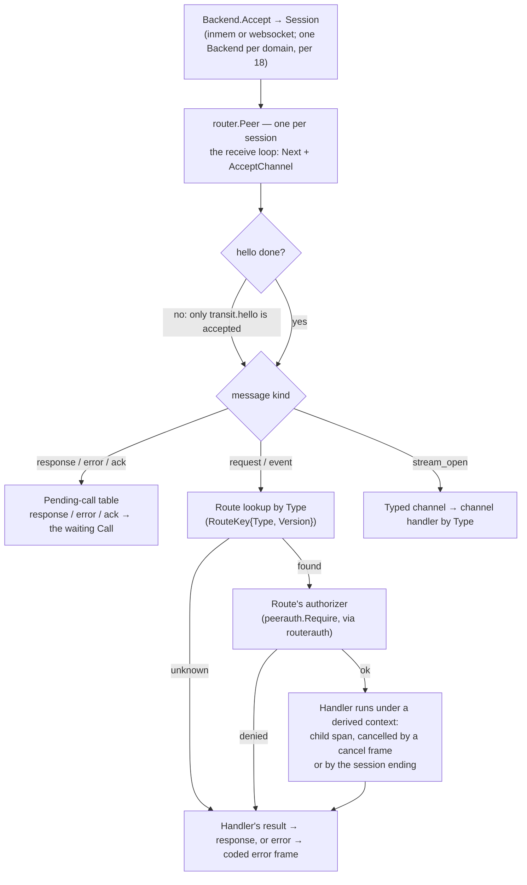
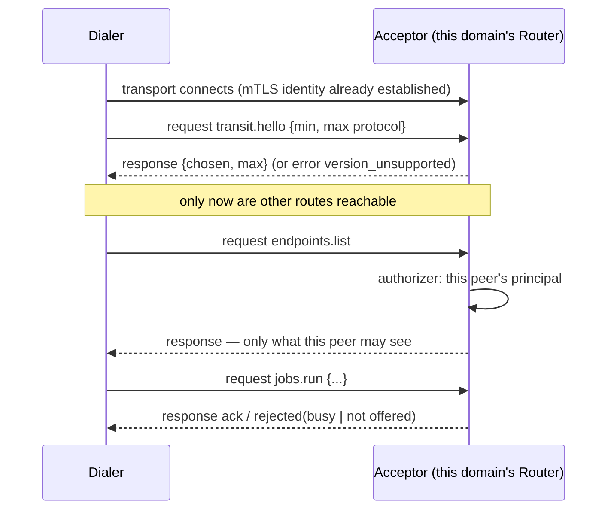

# The Router and the handshake

**Status: design draft. Nothing here is built.** It resolves the gap that
[`11-transit-model.md`](11-transit-model.md) deliberately left ("a real
router sitting above `Backend.Accept` isn't designed here") and that
`15`, `16`, `18`, `19` and `20` each name as the thing they are waiting
on. It is grounded in the transport code as it stands, which turns out to
be missing more than a dispatch loop.

## What is waiting on this

1. `AdvertiseEndpoints` ([`15`](15-endpoint-advertisement-model.md)) is an
   in-process function with no way for a peer to call it.
2. `traceagg.Collector.Ingest` ([`16`](16-trace-log-aggregation-model.md))
   takes a message "however it arrived", and nothing receives one.
3. The executor's receiving side and the director's pushed delivery
   ([`19`](19-node-roles-and-resource-governance-model.md),
   [`20`](20-jobs-model.md)).
4. The remote-intermediary store implementation
   ([`02`](02-package-boundaries.md)), which is how a node with no database
   reaches a node that has one.
5. The version `hello` that [`18`](18-peer-discovery-and-capabilities-model.md)
   needs once multicast advertises a protocol version.
6. `registry.RegisterFromSession` and SSO delivery, which today are called
   by tests that reach into a concrete backend.

## What the transport actually lacks

Read from the code, not assumed. Each of these is a prerequisite, not a
detail.

1. **`transit.Session` has no receive side.** It has `Reply`, `Push` and
   `OpenChannel` — all outbound. `Next` and `AcceptChannel` exist on the
   concrete `inmem.Session` and `websocket.Conn` and are what tests call
   directly. A Router needs an interface for them.
2. **There is no client-side call.** `Reply` answers an exchange; nothing
   sends a request and waits for the response with the matching `ID`. A
   response arriving on a connection falls into the same inbound queue as
   everything else, so something has to demultiplex responses from
   requests. That something is the Router's other half.
3. **A channel carries no purpose.** `OpenChannel` sends a `stream_open`
   frame with only `Kind` and `Channel` — no `Type`, no payload. A Router
   cannot dispatch an accepted channel to the right handler without knowing
   what the channel is for.
4. **Stream control frames fail `Validate`.** `Message.Validate` requires a
   `Type`, and those frames have none. It works today only because encoding
   and decoding do not validate. Giving `stream_open` a `Type` (point 3)
   fixes the open frame; `stream_data`/`stream_end` should carry the
   channel's type too, or the Router should not validate them as messages.
5. **There is no handshake and no version.** `11` defers versioning until
   the first peer that cannot update in lockstep; advertising a version in
   multicast arguably is that peer.
6. **A full channel inbox stalls the whole connection.** In the websocket
   backend the single read loop delivers a channel's data into a bounded
   inbox (32) and, when it is full, waits. While it waits, nothing else on
   that connection is read — including a `cancel` frame for the very handler
   that is not draining the channel. The same applies to the 64-message queue
   of non-channel messages: the Router's loop must therefore drain it
   promptly and hand work off, never run it inline, and the channel case is
   a real head-of-line hazard that per-channel flow control (below) is
   meant to remove. Until then a slow channel consumer can wedge its
   session.
7. **Nothing defines what happens to an unknown type, a failed handler, a
   cancelled request, or a peer that sends faster than a handler runs.**

## Shape



Three pieces, each in the layer its dependencies put it in:

1. **`transit` gains two small additions.** A `Receiver` interface
   (`Next`, `AcceptChannel`) that both backends already satisfy, and a
   `Type` (plus optional parameters) on `ChannelOpts`, carried in
   `stream_open` and exposed on the accepted `Channel`. No behavior of
   existing code changes.
2. **`wire` gains the protocol's own vocabulary:** the protocol version
   constants and their changelog (the contract clients need, as the
   Lighthouse plan already put it), the `hello` payload types, and the
   coded error payload and its codes.
3. **`router`, a new base** depending on `transit`, `wire` and `logging`
   and nothing else. It owns the registry of routes, the per-session
   `Peer`, response correlation, and the handshake. It knows nothing of
   principals, permissions, databases or domains.

## Routes

```go
type Handler func(ctx context.Context, req Request) (json.RawMessage, error)

type Route struct {
    Type        string
    Version     int           // 0 and unused for now; see "Versions"
    Handler     Handler
    Concurrency int           // 1 = sequential (the default); n = up to n at once
    Authorize   Authorizer    // optional; see routerauth
}

type Request struct {
    Message wire.Message
    Session transit.Session
    Peer    *Peer             // to call back, or push, on the same session
}
```

1. **A request returns a result or an error.** A returned result becomes
   a `response` with the request's `ID`; a returned error becomes a coded
   `error` frame with the same `ID`. An **event** has no `ID` and no
   reply: its handler's error is logged, not sent.
2. **The route is the ordering domain for non-channel messages.** By
   default a route handles one message at a time per session, in arrival
   order, which is the safe choice and matches Lighthouse's rule to land
   sequential dispatch first. A route opts into concurrency per route, not
   globally. A slow handler therefore blocks later messages to *the same
   route*, never other routes.
3. **A channel is the ordering domain for streamed messages,** unchanged
   from `11`: same channel in order, different channels independent. Never
   assume order across channels (`00` §7).
4. **The read loop never runs a handler inline.** It decodes, looks up,
   and hands off, so one stuck handler cannot stop a session from reading
   a `cancel` or a heartbeat.
5. **A per-session in-flight limit** bounds how many handlers run at once;
   beyond it a request is answered `busy`. This is the inbound analogue of
   the consent rule in `19`: a peer cannot make a node do unbounded work by
   sending faster than it can answer. How it ties to the node-wide
   governor is open.
6. **Cancellation.** A `cancel` frame naming a request `ID` cancels that
   handler's context; the session ending cancels all of them. Cooperative,
   as everywhere in this design: a handler that ignores its context is not
   killed.
7. **Unknown routes.** A request to an unknown `Type` is answered
   `unknown_route`. An unknown **event** is ignored (logged), because a
   newer peer may send events an older one does not know — the same
   forward-compatibility stance `18` takes for unknown core keys.

### Errors

A small closed set, on the wire as `{code, message}` in an `error` frame.
The message is for logs and humans and never carries internals.

| Code | Meaning |
|---|---|
| `unknown_route` | No route for that `Type` |
| `hello_required` | The session has not completed the handshake |
| `version_unsupported` | No protocol version in common |
| `unauthorized` | The route's authorizer refused; says nothing of *why* |
| `invalid` | The payload failed the handler's validation |
| `busy` | The in-flight limit is reached; retry later |
| `cancelled` | The request was cancelled |
| `internal` | The handler failed; details are logged on the handling side only |

`unauthorized` deliberately does not distinguish "no such grant" from "no
such thing", so a peer cannot probe what exists.

## Calling a peer

```go
func (p *Peer) Call(ctx context.Context, typ string, payload json.RawMessage) (json.RawMessage, error)
func (p *Peer) Push(ctx context.Context, typ string, payload json.RawMessage) error
```

1. `Call` sends a `request` with a fresh `ID`, registers it in the
   pending-call table, and waits for the matching `response` or `error`,
   the context, or the session ending. A coded error becomes a
   `*RemoteError` carrying the code, so a caller can branch on it.
2. **Symmetry.** Both ends of a session run a `Peer` with their own routes
   and can call each other. That is what the executor/director exchange
   needs — the director calls the executor, and the executor later pushes
   a result back.
3. A caller's context deadline is a **duration relative to receipt on the
   far side**, never an absolute time, per `19`'s decision on clock skew.

## Typed channels

`ChannelOpts` gains `Type` and optional `Params`; `stream_open` carries
them; the accepting side's `Channel` exposes `Type()`. The Router
dispatches an accepted channel to a channel handler registered under that
type, with the same authorizer and in-flight accounting as a route. A
channel handler owns the channel until it returns or the channel closes.
This is what `19` and `20` mean by "a channel only for task kinds that
declare they stream."

## The handshake

The first exchange on a session is a `transit.hello` request from the
dialer, answered by the acceptor.



1. **Before `hello`, only `transit.hello` is accepted.** Anything else is
   `hello_required`. After it, the negotiated version is fixed for the
   session.
2. **`hello` carries a protocol version range and nothing else of
   substance.** It reveals no more than the multicast announcement
   already does (`18`): that this speaks Archipelago and which versions.
   It is the pre-authorization step; nothing about the domain, the
   principal, the roles or the endpoints is exchanged in it. Those are
   learned after, through `endpoints.list` and the node-role claims, each
   filtered by the visibility policy `15` defines.
3. **Domain.** There is no domain field. Per `18`, each domain is served
   by its own listener presenting its own identity, so the handshake that
   reaches a given Router is already in that domain's context, and the
   connection's success or failure under mTLS is the domain check.
4. **Versions.** `wire` owns the version constants and a changelog.
   Following the Lighthouse plan's recorded model, routes are keyed by
   `RouteKey{Type, Version}` with `Version` left at 0 and unused, so adding
   versioned handlers later populates a field that already exists instead of
   rekeying the table. Protocol *editions* (the server-owned manifest
   mapping an edition to handler versions) stay deferred until a real
   version skew exists; what `hello` settles now is only that a mismatch
   is detected at the start and reported with a code, not discovered as
   garbled behavior later.
5. **An optional instance ID** may accompany `hello` as a logging hint
   only. It is an unverified claim, like every peer-asserted claim in `18`.

## Authorization and the endpoint registry

The Router has no notion of permissions. A route carries an optional
`Authorizer func(ctx, Session, Message) error`, run after `hello` and
before the handler; a refusal becomes `unauthorized`.

**The integration `routerauth` (router + Gatehouse-core) closes the loop
`04` opened.** Its registration function takes a route *and* the
permission it requires and does three things in one call: registers the
route, builds the authorizer from `peerauth.Require`, and registers the
matching `EndpointDefinition` ([`15`](15-endpoint-advertisement-model.md)).
Because one call registers all three, "which endpoints exist" and "what
each needs" cannot drift apart — which is the exact failure `04` records
for Lighthouse's `adminTokenMessageTypes`, now prevented structurally
instead of by discipline. `routerauth` also provides the `endpoints.list`
route itself, as a one-line handler over `AdvertiseEndpoints`, with the
visibility policy from `15`.

A node that wants raw routing with its own authorization uses `router`
alone; neither base is made to import the other's concerns.

Task kinds are **not** routed this way. Per `20`, a task kind is not an
endpoint; jobs reach an executor through a few fixed core routes
(`jobs.run`, `jobs.result`), not one route per kind.

## Domains

One `Router` per domain, per `App`. Handlers are closures over that
`App`'s stores, so a handler can reach nothing from another domain, and
the Router needs no domain concept at all. A node in two domains runs two
Routers, each over its own `Backend` (`18`'s listener-per-domain).

## Observability

For every handled message the Router derives a **child span** from the
message's trace context (`wire.Message.TraceContext`) and puts it in the
handler's context, so the handler's own logging joins the sender's trace
without the handler doing anything — the "receiving handler calls
`ContextWithSpan`" step `16` left to each caller becomes automatic.
Within a domain only: no implicit cross-domain propagation (`18`). Each
message logs the route, the peer's certificate fingerprint, the outcome
code and the duration, as structured attributes.

## What this changes in what exists

1. `traceagg.Collector.Ingest` becomes the handler of an event route; the
   tests that reach into a concrete backend for the message go through a
   `Peer`.
2. `AdvertiseEndpoints` becomes callable by peers via `endpoints.list`.
3. `registry.RegisterFromSession` and the SSO delivery become routes whose
   authorizer resolves the peer through `peerauth`.
4. The pushed half of `20` (`jobs.run`, `jobs.result`) has somewhere to
   live.

## Not designed here

1. **Binding the in-flight limit to the node-wide governor** (`19`), and
   priority for inbound work.
2. **Whether the Router sends `ack` for events.** The `ack` kind exists;
   reliable delivery is the transport's job, and nothing yet needs an
   application-level acknowledgement.
3. **Protocol editions** beyond the cheap `RouteKey.Version` anticipation.
4. **A second backend's effect.** The Router should be backend-agnostic by
   construction (it sees `Receiver` and `Session`), but the websocket
   backend is the only network one, so this is untested against, say,
   WebTransport's native streams.
5. **Per-channel backpressure and credits** — the Lighthouse plan's stage 4.
   The current backends bound a channel's inbox, and the websocket backend
   stalls its whole read loop when one is full (see above); richer flow
   control that removes that is not designed, and until it exists a slow
   channel consumer can wedge its session.
6. **Backwards compatibility of the `stream_open` change** for any peer that
   is not this code. There is none today.
7. **Reconnection and session resumption.** A dropped session cancels its
   handlers and fails its pending calls; the layer above decides whether to
   redial.

## Build order

1. **`wire`:** protocol version constants, `hello` payload types, the coded
   error payload and codes.
2. **`transit`:** the `Receiver` interface; typed channels
   (`ChannelOpts.Type`, `Channel.Type()`); both backends updated, with a
   compile-time assertion that each satisfies `Receiver`.
3. **`router`:** `Router`, `Peer`, `Call`/`Push`, the handshake, dispatch,
   concurrency and the in-flight limit, cancellation, coded errors, typed
   channels. Tested over `inmem` first, then once over the websocket
   backend.
4. **`routerauth`:** one-call registration (route + authorizer + endpoint
   definition) and the `endpoints.list` route.
5. **Move the existing consumers** (`traceagg`, `registry`, SSO delivery)
   onto routes, which is also their first end-to-end test over a real
   backend.
6. Only then: the zero-dependency discovery module (`18`), and the
   executor/director routes (`20`).
